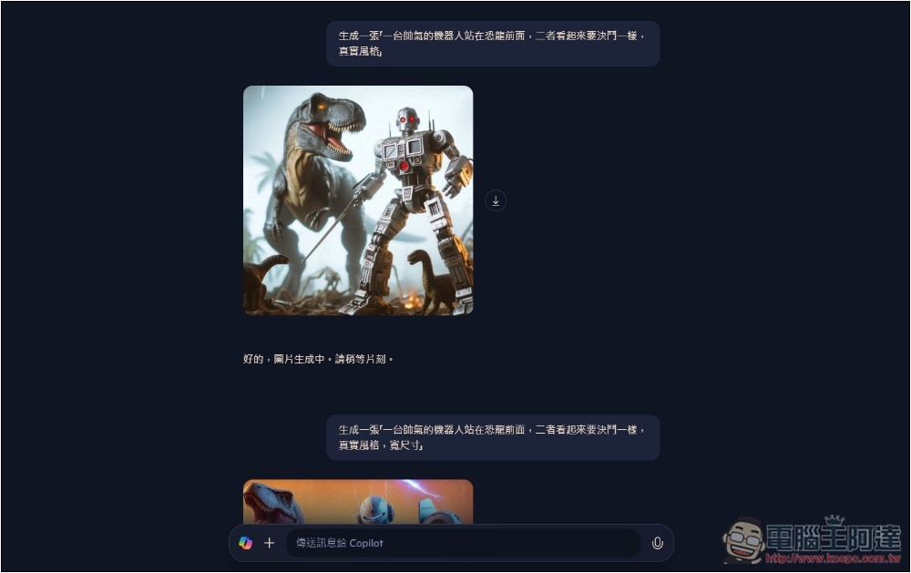
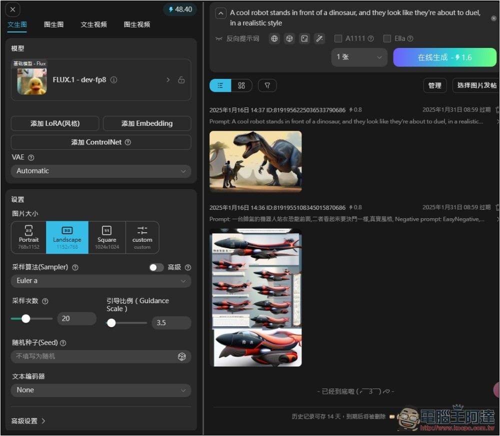
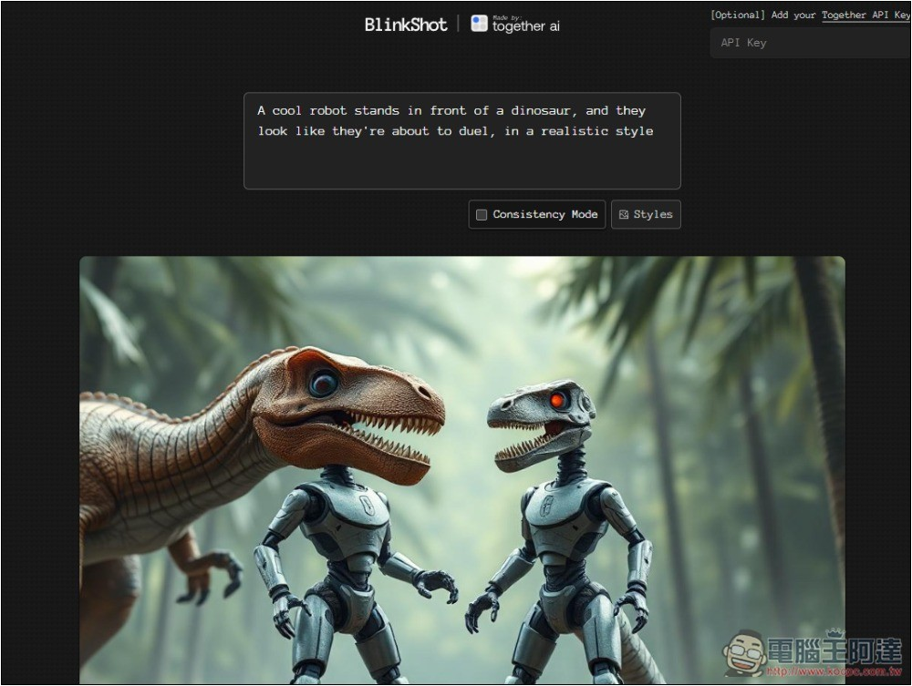
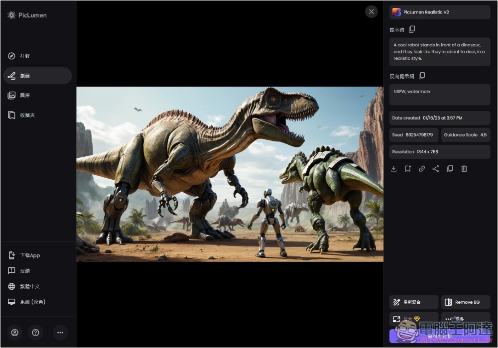
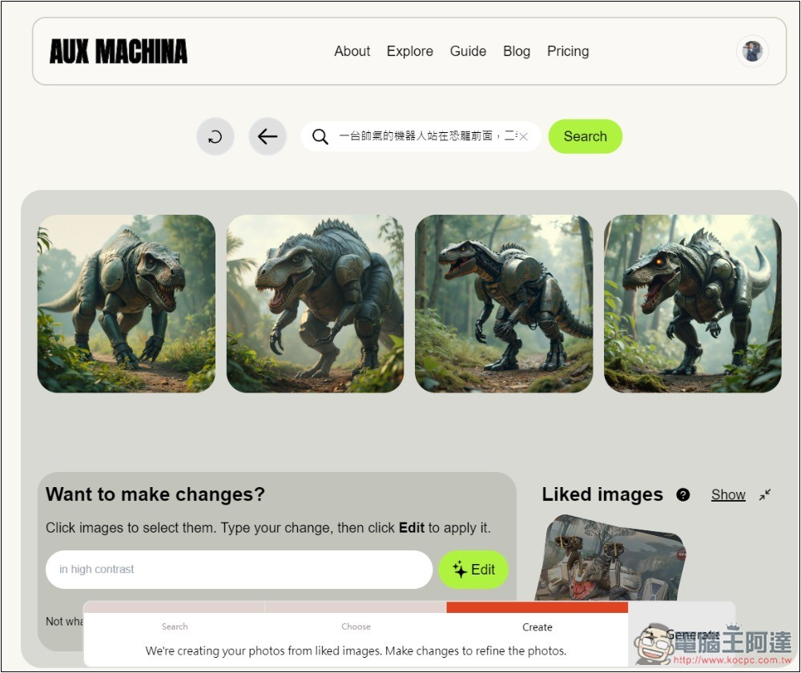
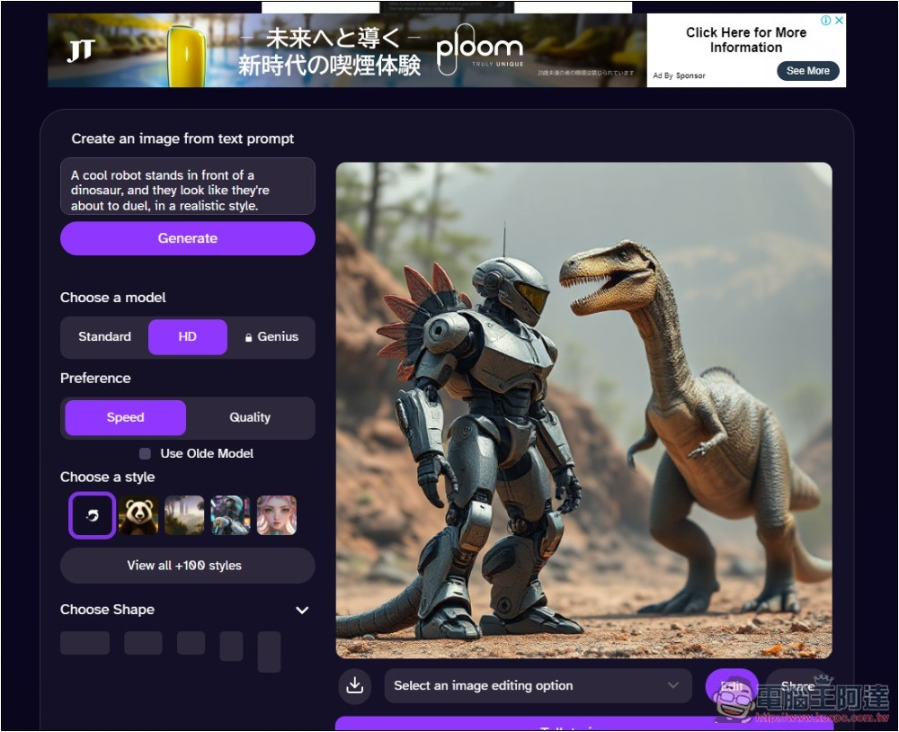
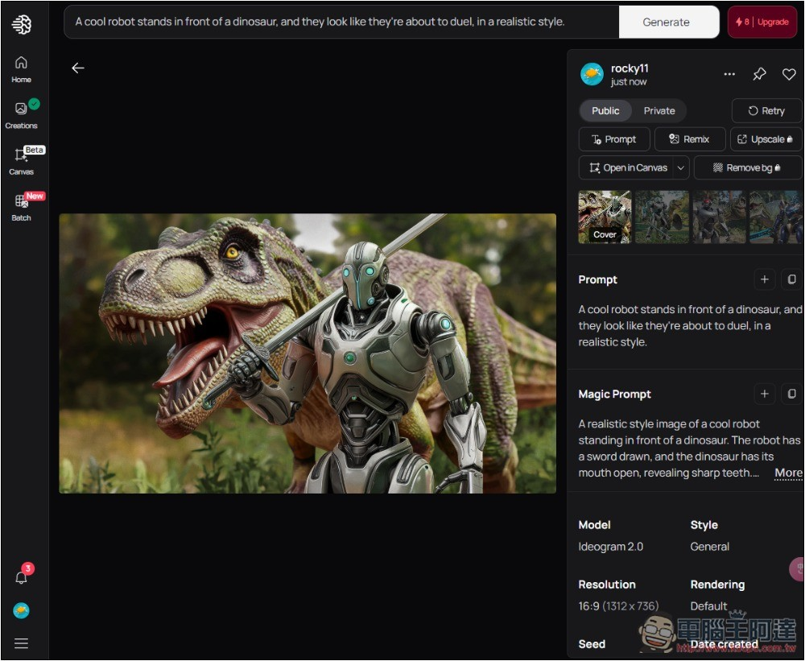
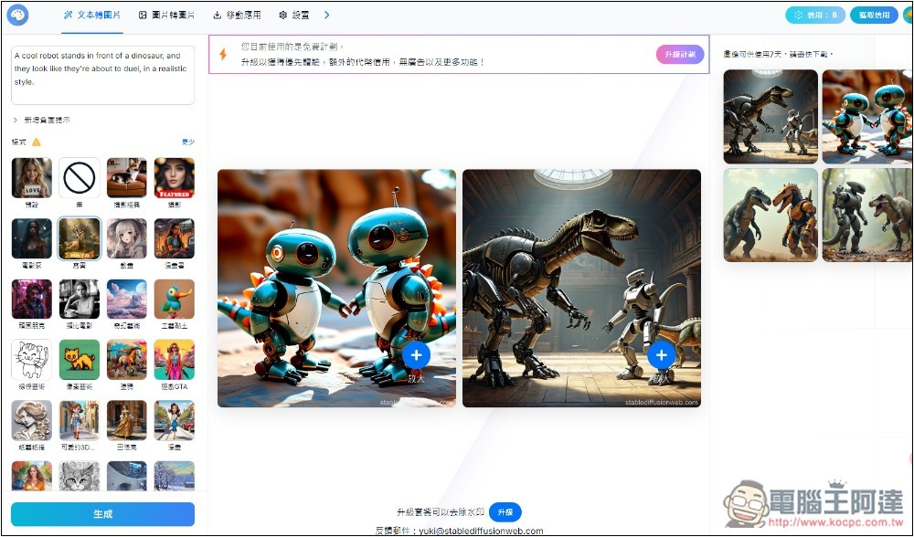

# 9 個免費 AI 圖片生成服務 2025 年總整理

> **來源**：[電腦王阿達](https://www.koc.com.tw/archives/583125)
> **作者**：電腦王阿達
> **發布時間**：2025-01-16
> **抓取時間**：2026-02-26 08:51

---

隨著 AI 模型越來越強，現在 AI 圖片的生成品質可說都相當不錯，因此需要用圖時，如果手邊沒有，都能透過 AI 來快速生成。如果你還不知道有哪些好用的，這篇就整理 9 個還不錯用的 AI 圖片生成服務，各種模型都有，包括知名 Stable Diffusion。

## 1. Microsoft Copilot

由微軟推出的 Copilot 聊天機器人，也內建 AI 圖片生成功能，而且是使用 OpenAI 的 DALL-E 最新模型。

跟其他 AI 服務不同在，Copilot 免費版幾乎可說是能夠無限制的生成圖片，代表說你可以一直修改提示詞（Prompt）來生成新的 AI 圖片，只是快速生成每日有限額。

提示詞也支援中文，你只需要有微軟帳號，就能使用 Copilot。

不過有一個明顯缺點是，免費版只能生成 1:1 尺寸的圖片，16:9 等尺寸，必須升級到 Copilot Pro。

[前往 Microsoft Copilot](https://copilot.microsoft.com)

## 2. ImageFX

[ImageFX](https://www.koc.com.tw/archives/581153) 是由 Google DeepMind 開發的一款實驗性圖片生成工具，使用 Imagen 3 模型，生成的圖片品質非常高，而且會一次生成四張，免費無限使用。

對於沒有想法的人，ImageFX 有提供自動產生提示詞功能，你可以隨意選擇來創建。另外輸入提示詞後，下方也會提供一些可以額外添加的單字。

不過目前僅支援英文，對於英文不好的人，可以先用其他工具把你的中文提示詞翻成英文，然後在丟到 ImageFX 生成。生成時可選擇你要的圖片寬高比。

[前往 ImageFX](https://labs.google/fx/zh/tools/image-fx)

## 3. Tensor Art

[Tensor Art](https://www.koc.com.tw/archives/530295) 是一個蠻特別的線上 AI 圖片生成服務，它還有提供模型託管平台，每位用戶都能上傳自己的模型讓大家使用，包括基礎模型、LoRA、Embedding 和 ControNet。

也代表說，除了基本的 Stable Diffusion，你也能選擇其他用戶製作的模型，來生成出特定風格、角色、動作的圖片。

雖然有提供簡體中文介面，但 Prompt 只能輸入英文，中文會沒辦法生成。

免費版每日會獲得 50 點的算力，每個模型耗費的算力不太一樣，最低應該是一張 0.8，代表說至少能生成 60 張以上。生成後的圖片還能進行圖生圖、局部重繪等功能。

[前往 Tensor Art](https://tensor.art/)

## 4. BlinkShot

[BlinkShot](https://www.koc.com.tw/archives/578682) 是一個免費開源工具，有提供線上版，搭配 Together API，開發者已經設定好，因此不需要填入也能用。

這款的強項是即時生成，填入提示詞後就能立即看到結果，目前還有提供風格選擇，可以指定你想要生成的圖片風格。沒有數量限制，你要生成多少張都可以。

另外開發者也有將原始程式碼分享到 [GitHub](https://github.com/Nutlope/blinkshot)，取得後就能改在本地運行，但需要填入你自己的 Together API。

[前往 BlinkShot](https://www.blinkshot.io/)

## 5. PicLumen

[PicLumen](https://www.koc.com.tw/archives/577398) 跟多數 AI 圖片生成服務不太一樣，它使用的是自家 PicLumen 系列模型，像是適合藝術風格的 PicLumen Art、真實風格的 PicLumen Realistic、動漫風格的 PicLumen Lineart 等，生成品質相當不錯，特別是真實風，細節滿滿。

不過很可惜，雖有繁體中文介面，提示詞僅支援英文，輸入中文會胡亂生成。

生成後的圖片是有提供一些編輯選項，像是放大、上色、擴展等，但大多僅限付費版使用。

免費版每日可以生成 10 張，雖然有點少，但我是覺得也夠用，畢竟很少時候會一天需要生成多張圖片。

[前往 PicLumen](https://www.piclumen.com/)

## 6. AUX MACHINA

[AUX MACHINA](https://www.koc.com.tw/archives/580867) 是一個圖生圖的 AI 服務，你可以自行上傳圖片，或是透過提示詞搜尋，會列出符合的網路圖片結果，然後從中選擇你喜歡的圖片，接著就透過 AI 生成出類似圖片。

免費版每日可以生成 100 張，數量非常多，每次都會生成 4 張結果。另外生成完後，如果還是不滿意，可選取你覺得還不錯的那張，進行再次生成和添加內容。

支援中文提示詞，這點很棒。

不過因為是圖生圖，且沒有提供局部編輯功能，想生成出完全符合你要的圖片會困難一點，比較適合用在手邊已經有圖片，但因為版權不能用的情況，才用它來生成類似圖片。

[前往 AUX MACHINA](https://www.auxmachina.com/)

## 7. DeepAI

[DeepAI](https://www.koc.com.tw/archives/538342) 無需註冊就能使用，提供多項 AI 功能，包括圖片生成、聊天、影片、以及音樂，操作介面都蠻簡單的，輸入你要的提示詞，選擇風格（超過 100 種）、比例尺寸後，即可開始生成。

品質部分還可以，但就是生成出的圖片內容稍微單調，不像前面幾個豐富。另外有一個明顯缺點是，廣告有點多，網頁滿滿都是。提示詞也僅支援英文。

根據官網介紹，免費版每日有限制，不過沒有說明次數是多少，只有寫直到你用完。

[前往 DeepAI](https://deepai.org/machine-learning-model/text2img)

## 8. Ideogram

[Ideogram](https://www.koc.com.tw/archives/565696) 應該很多人都聽過，還蠻知名的 AI 圖片生成服務，過去是免費版每日有 10 點，但現在變成每週，因此生成數量有逐漸縮水的跡象。

取決於你生成的所使用的模式和模型，10 點最多可以生成 40 張，品質越高扣的點數越多。

目前最新的 2.0 模型，基本上使用 Default 品質就很不錯。

提示詞雖然也只能用英文，但它有內建 Magic Prompt 功能，會自動豐富畫你輸入的提示詞，代表說即便你只有簡單填幾個單字，也能獲得不錯的圖片。

[前往 Ideogram](https://ideogram.ai/t/explore)

## 9. Stable Diffusion 在線

[Stable Diffusion 在線](https://www.koc.com.tw/archives/531512)剛推出時，是完全免費的 AI 圖片生成服務，但過沒多久就開始收費，不過免費版還是有扣打，每日可生成 10 次。

提供繁體中文介面，所以不用擔心功能看不懂，但提示詞還是要輸入英文。

有提供多種風格樣式，讓你可以快速選擇，長寬比也能調整，最多一次生成二張。

一個明顯缺點是，免費版生成的圖片都有浮水印，必須升級付費版才能去除。

[前往 Stable Diffusion 在線](https://stablediffusionweb.com/zh-tw)

Tags: [ai](https://www.koc.com.tw/archives/tag/ai)[人工智慧](https://www.koc.com.tw/archives/tag/%e4%ba%ba%e5%b7%a5%e6%99%ba%e6%85%a7)[圖片](https://www.koc.com.tw/archives/tag/%e5%9c%96%e7%89%87)

---

*原文連結：https://www.koc.com.tw/archives/583125*
*本文轉載自電腦王阿達（kocpc.com.tw），版權歸原作者所有。*
