# AIXPLORIA 集結超過 5,000 款 AI 工具資料庫，想用什麼 AI 來這找就對了

> **來源**：[電腦王阿達](https://www.kocpc.com.tw/archives/574061)
> **作者**：電腦王阿達
> **發布時間**：2024-11-12
> **抓取時間**：2026-02-25 23:51

---

現在網路上可說有非常多 AI 工具，各種類型都有，我們也介紹過不少。如果你有特定的 AI 工具想找，又不知道該如何找起的話，這篇就要推薦一個相當強大的網站「AIXPLORIA」，收集超過 5,000 款 AI 工具，你聽過的、你沒聽過的都有。

而且分類還超多，從常見的聊天機器人、生成圖片和影片、以及寫程式外，還有 3D 模型、音訊編輯、商業、客服支援、一直到資料分析等都有，而且網頁還沒有任何廣告。

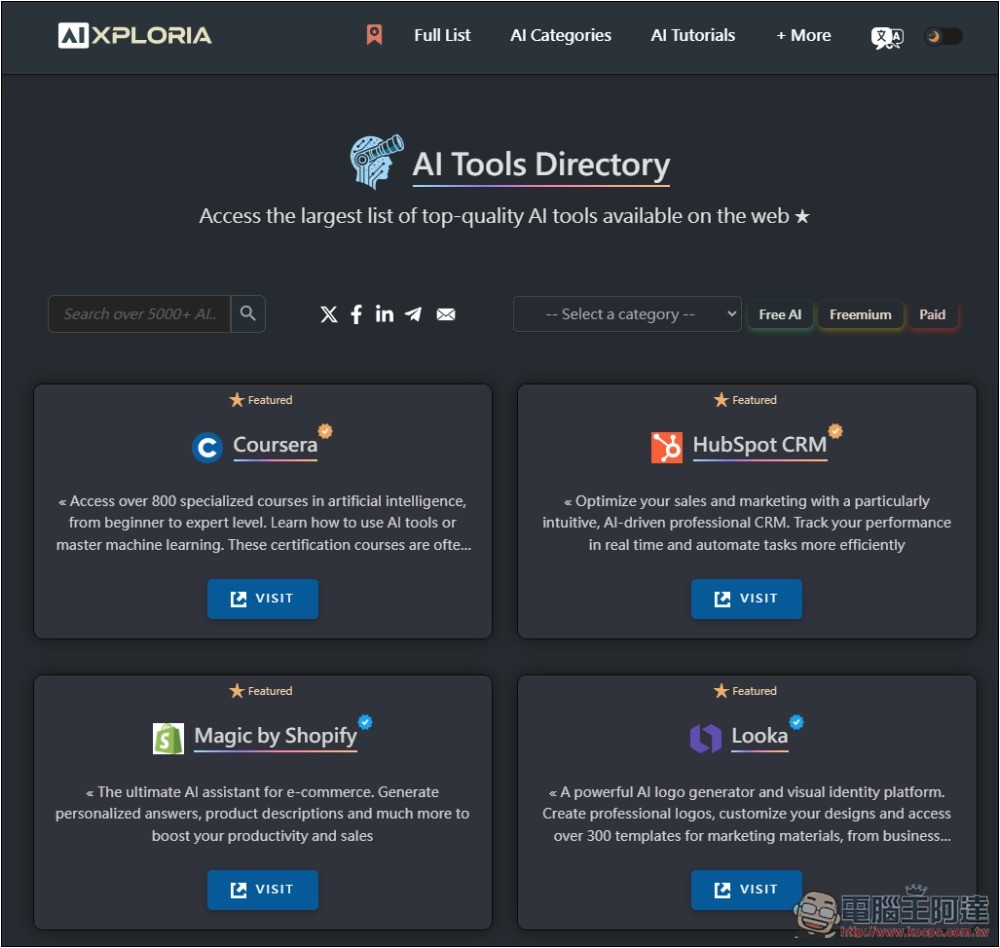

## AIXPLORIA 收集超過 5,000 款 AI 工具的強大網站

* [前往 AIXPLORIA](https://www.aixploria.com/en/)

AIXPLORIA 預設是英文介面，但有提供中文翻譯介面，有需要的話可以透過右上角來切換。

點擊上方連結進到 AIXPLORIA 後，就能開始瀏覽所有 AI 工具，左上方有提供搜尋功能，你可以直接搜尋要找的 AI 工具關鍵字，記得輸入英文，輸入中文是找不到的。每一款工具都有簡介，按下方 VISIT 可直接前往該 AI 工具：  
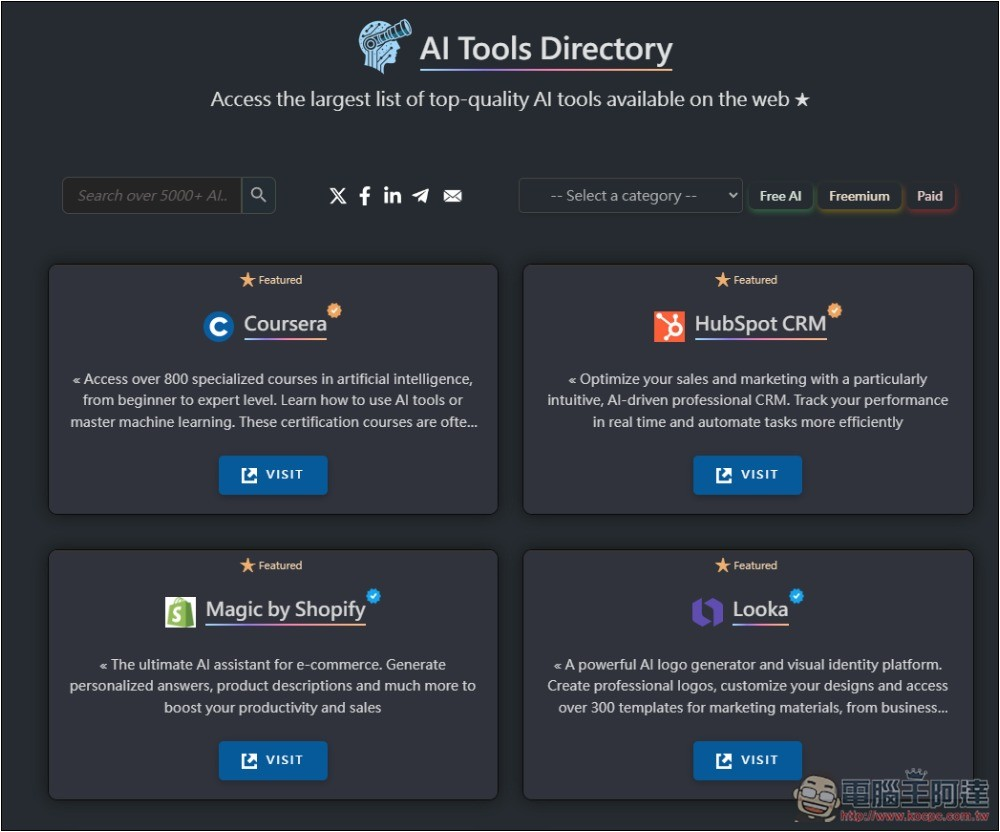

右上方有分類選項，我快速掃描一下應該有 50 個左右。每一個分類右邊也會告訴你有多少工具，基本至少都有 10 個，學習和生產力相關的 AI 工具最多，都超過 200 個，SEO 和寫作也有 100 個以上，真沒想到有這麼多：  
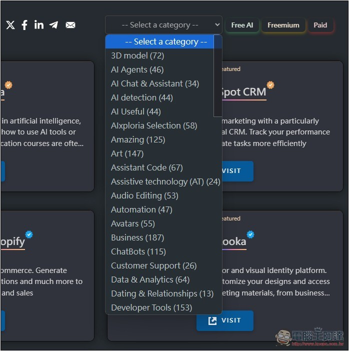

我選 Logo 建立：  
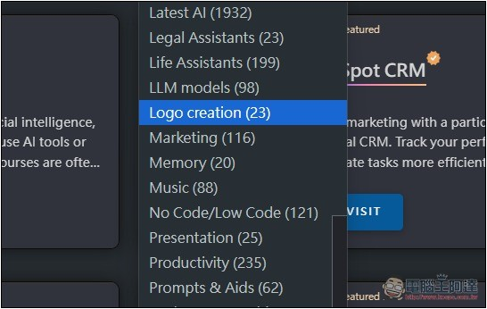

就會列出所有有提供 Logo 創建的 AI 工具，還會根據評分、熱門程度進行排名，因此如果不知道用哪個，就從第一個開始嘗試。另外要注意是，列出的 AI 工具有免費也有付費，如果你只想要找免費的，打開右邊 Popularity 選項，切換成 FREE 即可：  
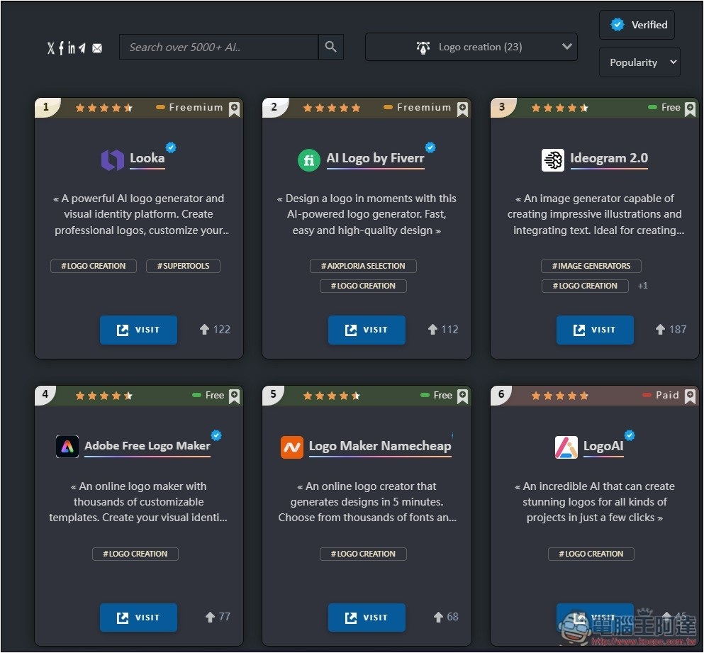

按下方 VISIT 就會開啟該 AI 工具網站：  
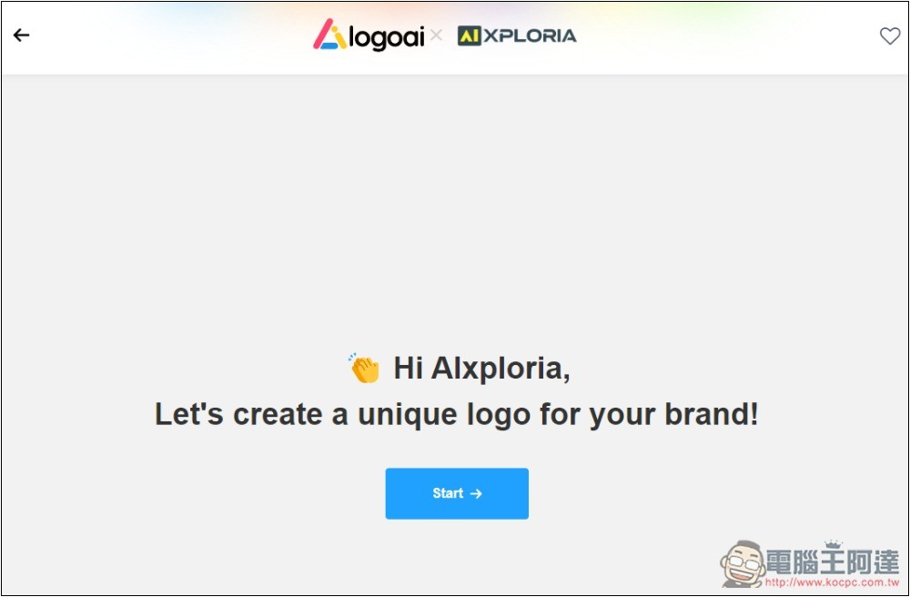

另外點首頁的 FREE AI Tools，可以查看所有免費 AI 工具，數量還蠻多的，至少有 500 個以上：  
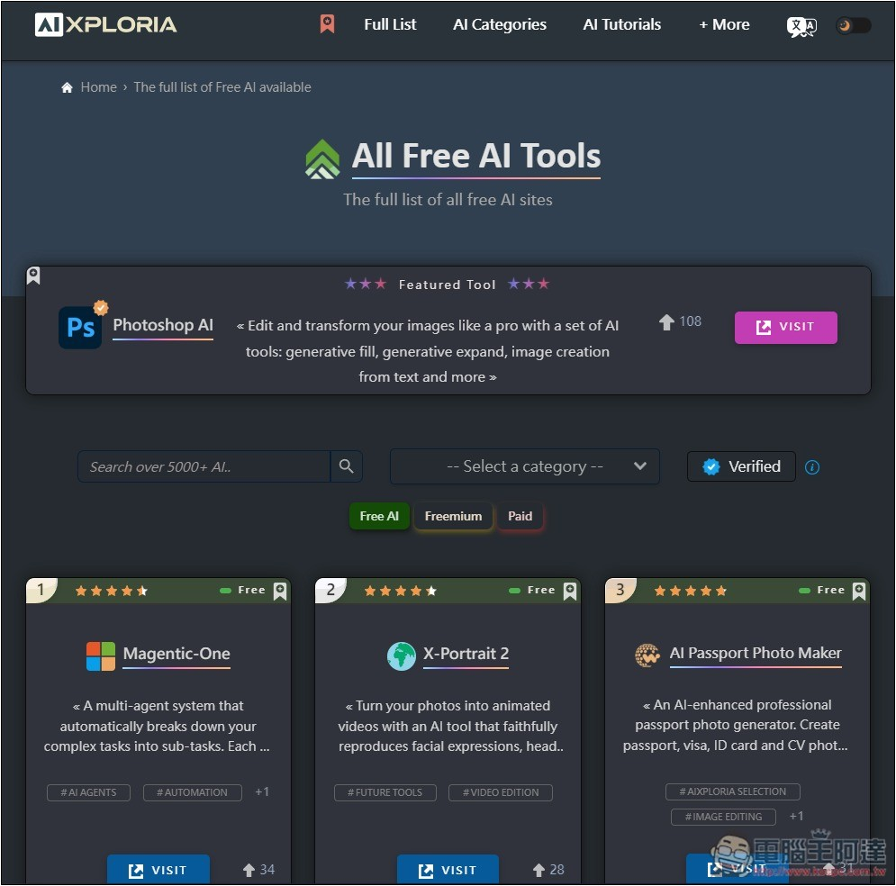

點擊該 AI 工具，可以查看完整介紹，不想花時間嘗試的人，可以先閱讀後再做決定：  
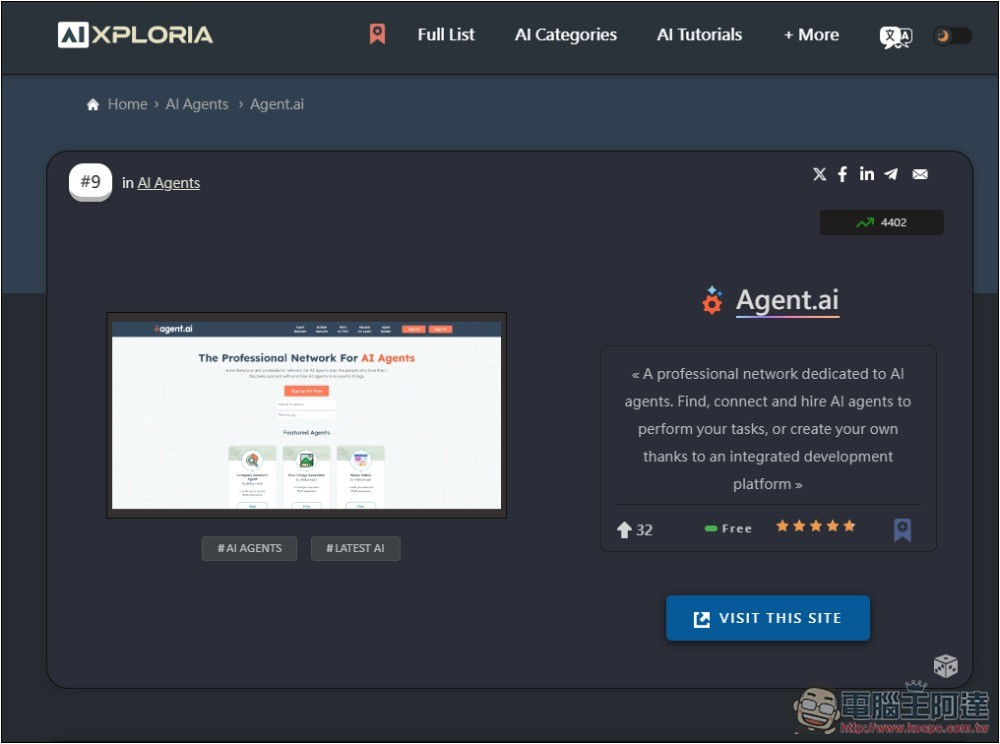

## 幫助你追蹤最新 AI 資訊的「AI News 2024」

除了收集 AI 工具，這網站也會追蹤各來源最新 AI 資訊，主要都是國外來源。

打開右上角 +More 選單，即可找到 AI News 2024：  
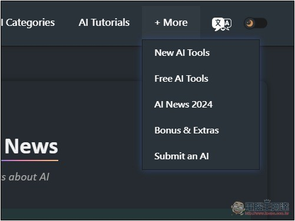

接著就會列出當前最新 AI 新聞，而且真的是超即時，隨時更新，每一則前面都有時間點，感興趣的話按一下就會打開該篇文章：  
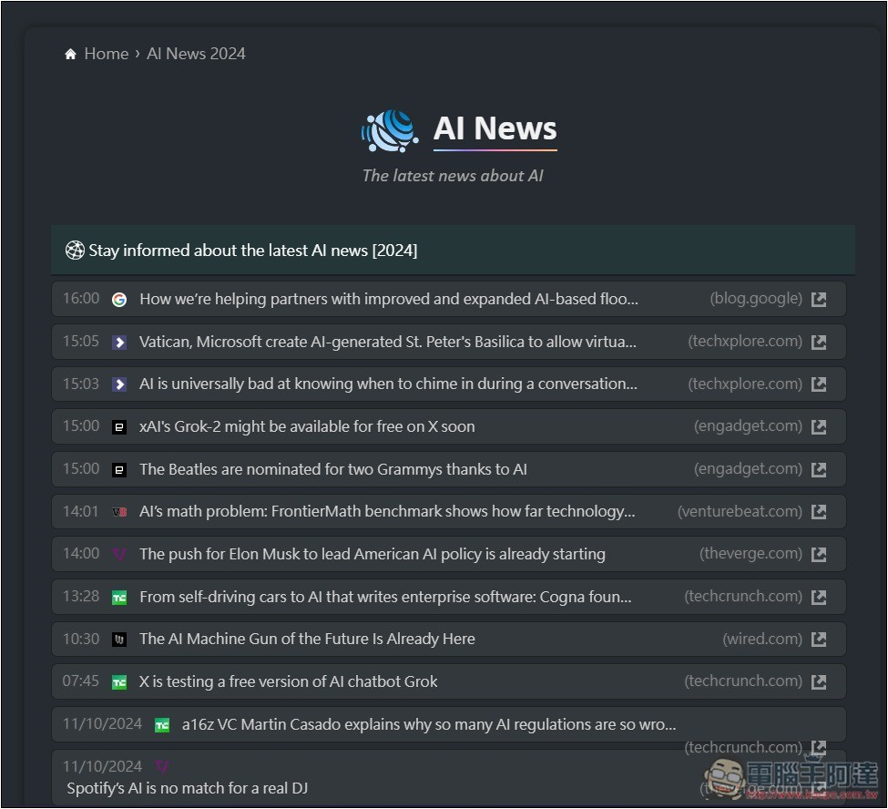

## 也提供 ChatGPT GPT 列表

對於有訂閱 ChatGPT 的人，這網站也有收集 GPT 列表，如果你有想要找特定類型的 GPT，從這邊找會比 ChatGPT 裡面更容易，而且可直接瀏覽各分類的所有 GPT。

在 Bonus & Extras 頁面中，就能看到 GPTs List：  
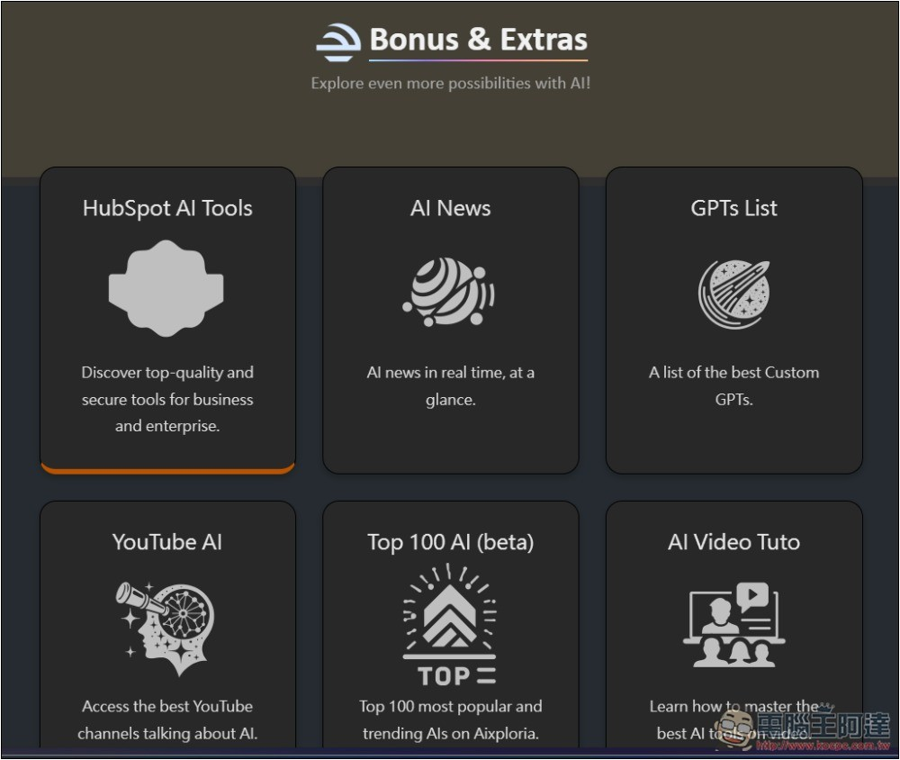

接著即可開始瀏覽所有 ChatGPT GPTs 名單，上方有完整分類標籤：  
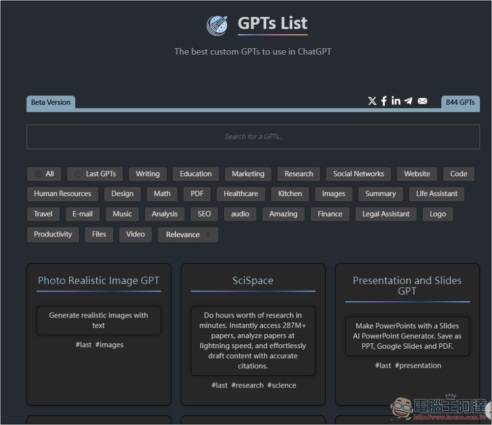

Tags: [ai](https://www.koc.com.tw/archives/tag/ai)[人工智慧](https://www.koc.com.tw/archives/tag/%e4%ba%ba%e5%b7%a5%e6%99%ba%e6%85%a7)

---

*原文連結：https://www.kocpc.com.tw/archives/574061*
*本文轉載自電腦王阿達（kocpc.com.tw），版權歸原作者所有。*
