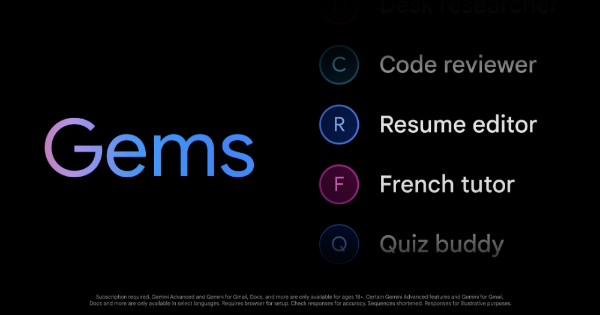
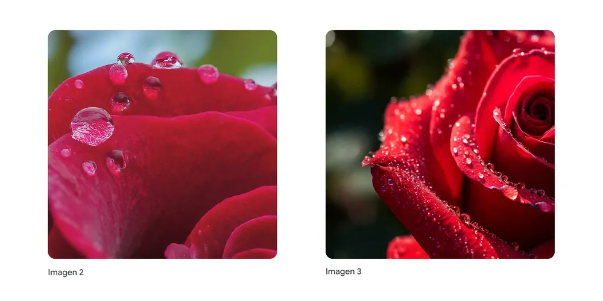
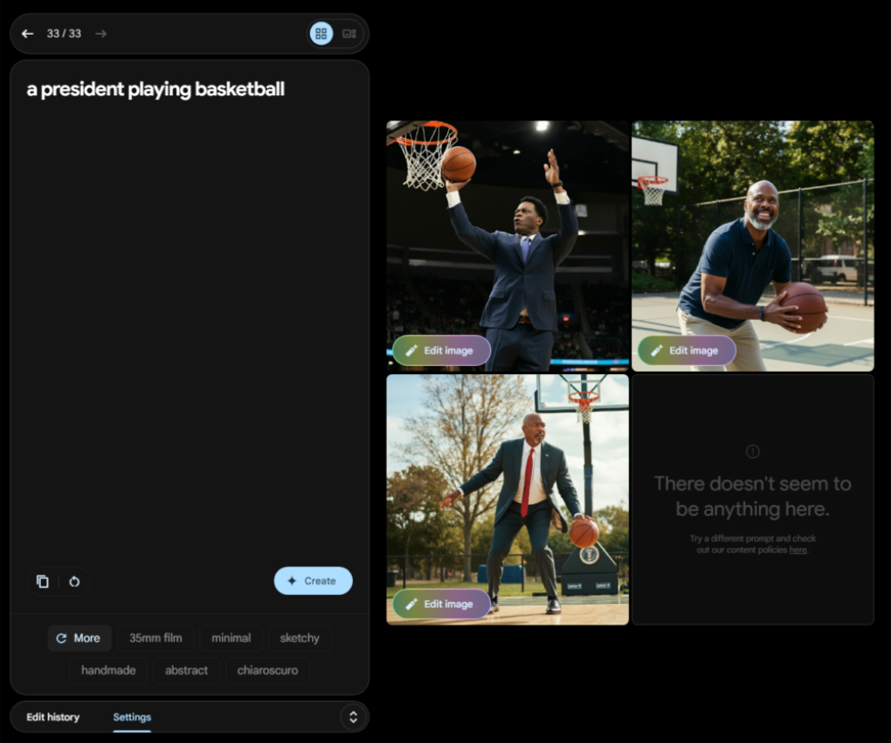

# Gemini AI「迎回」人物寫實圖片生成能力，還支援專攻特定領域的特制 AI

> **來源**：[電腦王阿達](https://www.kocpc.com.tw/archives/562368)
> **作者**：電腦王阿達
> **發布時間**：2024-08-29
> **抓取時間**：2026-02-25 23:51

---

曾經因為搞不太定「政確」問題而呈現大翻車狀態的 Gemini AI 人物圖片生成功能，現在已經確認將會在近日回到 Gemini 的 Imagen 3 的支援之中。繼續閱讀 Gemini AI「迎回」人物寫實圖片生成能力，還支援專攻特定領域的特制 AI 報導內文。   
  
 ▲本篇圖片來源：Google

## Gemini AI「迎回」人物寫實圖片生成能力，還支援專攻特定領域的特制 AI

曾經因為搞不太定「政確」問題而呈現[大翻車狀態](https://www.koc.com.tw/archives/535722)的 Gemini AI 人物圖片生成功能，現在已經確認將會在近日回到 Gemini 的 Imagen 3 的支援之中。

此外 Google I/O 2024 曾提到，可以針對生成式 AI 進行客製化微調的「custom Gems」功能也已經確認將會在新的 + New Gems 功能中提供給 Gemini Advanced、Business 與 Enterprise 使用者。並且直接提供了官方的使用範例包括：。

**．學習輔導：**協助您拆解複雜的主題，讓您更容易理解。  
**．點子發想：**為您提供簡單的靈感，從主題派對的新鮮想法到即將到來的生日禮物。  
**．職涯導師：**透過詳細的計劃來提升您的技能並實現您的職業目標，以解鎖您的職業潛力。  
**．寫作編輯：**可以透過清晰、建設性的反饋，從文法到結構，提升您的寫作水平。  
**．程式夥伴：**可以提升您的編碼技能，並幫助您建立專案和邊學邊做。

是說，在年初推出但急踩煞車的 Gemini 人物圖片生成功能，到底時隔半年能夠調整到多好境界這點。雖然就官方的宣布是要等幾天之後才會在更寫實的動植物以及其他物件的圖片生成逐步導入後才開放人物圖片生成功能。

不過這個限定 Gemini Advanced、Business 與 Enterprise 資格的功能，現在則是有外媒已經透過 Gemini Labs test environment，實測到了升級版的新世代 Imagen 3 對於人物圖片生成方面的能耐 – 大家猜猜有沒有出包？

就外媒試用的心得，可以發現 Imagen 3 的圖片生成有著極多的但書，包括不支援生成逼真／可識別的個人、未成年人的描述或過度血腥、暴力或性場景 – 先前生成「1943 年德軍」等出狀況的指令，也會用半逃避的方式希望使用者重新輸入提示指令。

  
▲圖片來源：ArsTechnica

基本上不生成可識別個人身分的規定也代表著，你不能直接透過人名來生成圖片 – 但像是用「美國總統打籃球」來取代「拜登總統打籃球」目前倒是還可以 – 可能要視之後有沒有被玩壞決定是否續存？咳，應該是說，他們會持續聆聽早期使用者的意見回饋持續改進服務。

欸，既然人物生成都回來了。不意外的 [Google AI Overview 搜尋服務](https://www.koc.com.tw/archives/549899)應該也將「再次強大」？不知道最近會不會有升級版本呢？有點期待啊。

引用來源：[ArsTechnica](https://arstechnica.com/ai/2024/08/months-after-controversy-google-ai-can-generate-images-of-humans-again/)｜經由：[Android Central](https://www.androidcentral.com/apps-software/gemini-image-3-custom-gems-update-detailed)｜參考資料：[Google](https://blog.google/products/gemini/google-gemini-update-august-2024/)

#### 延伸閱讀： [使用者回報 Pixel 9 Pro XL 發生鏡頭歪斜問題](https://www.koc.com.tw/archives/562184) [Gemini AI「迎回」人物寫實圖片生成能力，還支援專攻特定領域的特制 AI - 電腦王阿達Gemini AI「迎回」人物寫實圖片生成能力，還支援專攻特定領域的特制 AI - 電腦王阿達](https://www.koc.com.tw/archives/562184)

Tags: [Gemini](https://www.koc.com.tw/archives/tag/gemini)[Gemini AI](https://www.koc.com.tw/archives/tag/gemini-ai)[Google](https://www.koc.com.tw/archives/tag/google-2)[人工智慧](https://www.koc.com.tw/archives/tag/%e4%ba%ba%e5%b7%a5%e6%99%ba%e6%85%a7)[圖片生成](https://www.koc.com.tw/archives/tag/%e5%9c%96%e7%89%87%e7%94%9f%e6%88%90)[生成式 AI](https://www.koc.com.tw/archives/tag/%e7%94%9f%e6%88%90%e5%bc%8f-ai)

---

*原文連結：https://www.kocpc.com.tw/archives/562368*
*本文轉載自電腦王阿達（kocpc.com.tw），版權歸原作者所有。*
