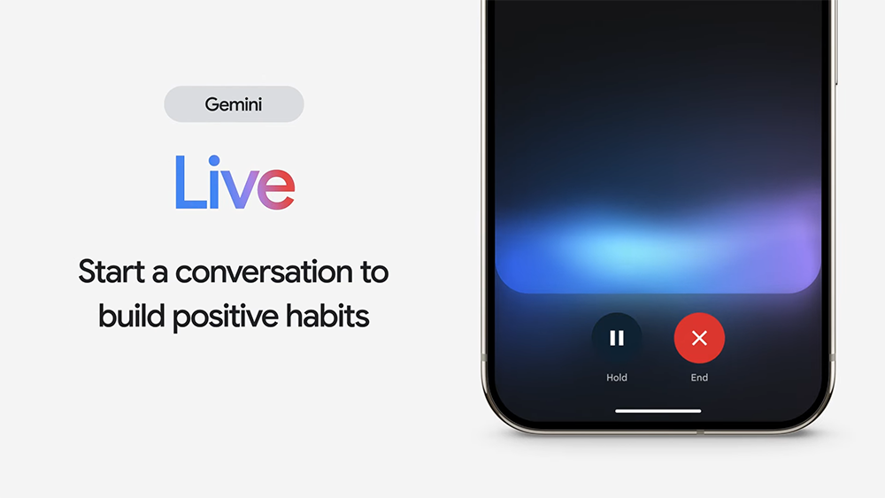

# Gemini Live 正式登場！Google 版 AI 語音聊天模式，挑戰 ChatGPT

> **來源**：[電腦王阿達](https://www.kocpc.com.tw/archives/560378)
> **作者**：電腦王阿達
> **發布時間**：2024-08-14
> **抓取時間**：2026-02-25 23:51

---

Google 終於將戰場擴展到語音聊天模式了！先前 Google 曾透露過的 Gemini Live 語音聊天，在稍早的 Google 發表會中正式推出，標榜擁有更自然語音、記憶力更強、同時還能打斷然後再繼續，類似 ChatGPT 的進階語音模式。

而在發表會中，Google 也有展示 Live Demo，整體來說看起來還不錯，而且目前已經正式提供給 Gemini Advanced 訂閱者使用。

## Gemini Live 正式登場！Google 版 AI 語音聊天模式，挑戰 ChatGPT

根據 Google 介紹，Gemini Live 是一種行動式對話體驗，用戶可以跟 Gemini 使用自然語言，進行自由流暢對話，問任何問題都可以。

而對話過程中，如果你不認同 Gemini 觀點，或是需要補充更多，也可以隨時打斷或暫停對話，不用說必須等到回答完成。

這功能目前在 ChatGPT 中，只有提供給部分搶先體驗到進階語音模式的用戶，Gemini Live 則是直接開放給所有人。

為了滿足每個人對聲音的喜好，Gemini Live 更具備多達 10 種聲音，名字部分有 Ursa、Dipper、Nova、Vega 等等，選擇時，每一個聲音都會有自我簡介，並且之後可隨時在設定中切換其他聲音：

Gemini Live 也支援免提，意味著可在後台或手機鎖定時，繼續跟 Gemini 聊天。

下方是發表會中 Google 官方的演示，聲音部分是蠻不錯的，回覆內容也令人滿意，不過回答速度，就沒有像 ChatGPT 進階語音模式這麼即時，會稍微等待個 1 秒：

比較可惜是，Google 並沒有示範打斷 Gemini 談話內容，每次都是等到回答完後，才問下一個問題。

最後狠重要的一點是，雖然 Gemini Live 即日起就開放給 Android 手機上的 Gemini Advanced 訂閱者使用，但目前只有英語版，尚未支援中文和其他語言，不過 Google 有承諾未來幾週內會加入更多語言的支援性。

iOS 版目前還無法用，幾週後才會推出。

從 Google 的簡短演示來看，Gemini Live 我是覺得可能先不要抱太大期待，就簡單的問問題、練習對話、聊聊想法等用途，應該都沒問題，但如果要進行即時翻譯之類，可能就不會太好用，畢竟翻譯需求很多用戶都有，但這次 Google 並沒有演示，感覺上他們也沒什麼把握。

另外，我是覺得 Google 應該也要下放 Gemini Live 給免費版用，推出功能精簡的 Lite 版之類，讓更多人體驗，搞不好就有人因此而升級到 Gemini Advanced 。

資料來源：[Google](https://blog.google/products/gemini/made-by-google-gemini-ai-updates/)

Tags: [ai](https://www.koc.com.tw/archives/tag/ai)[ChatGPT](https://www.koc.com.tw/archives/tag/chatgpt)[Gemini](https://www.koc.com.tw/archives/tag/gemini)[Gemini Live](https://www.koc.com.tw/archives/tag/gemini-live)[Google](https://www.koc.com.tw/archives/tag/google-2)[聊天機器人](https://www.koc.com.tw/archives/tag/%e8%81%8a%e5%a4%a9%e6%a9%9f%e5%99%a8%e4%ba%ba)

---

*原文連結：https://www.kocpc.com.tw/archives/560378*
*本文轉載自電腦王阿達（kocpc.com.tw），版權歸原作者所有。*
