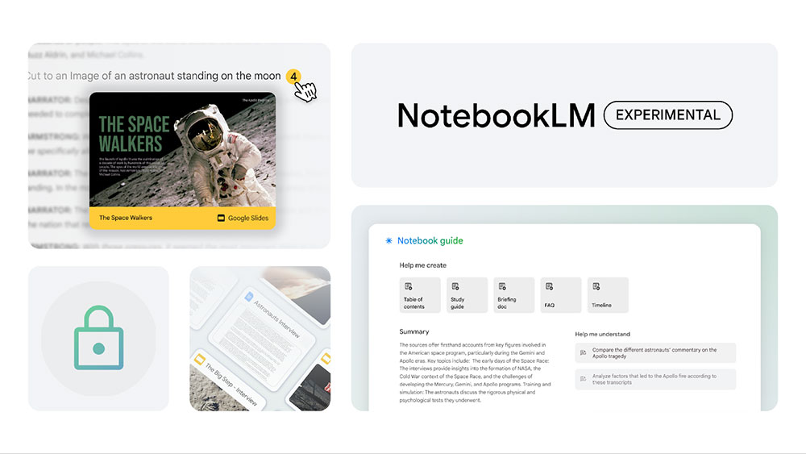
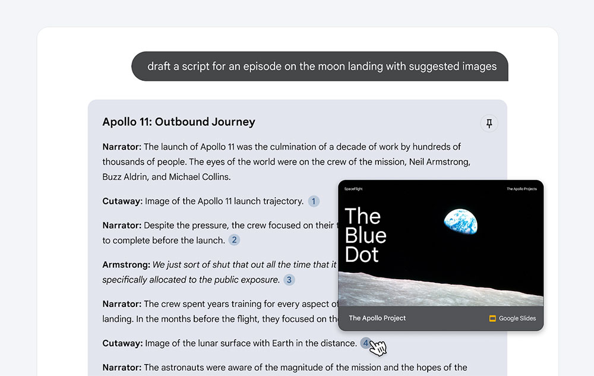

# Google AI 寫作與研究助理「 NotebookLM」在台推出

> **來源**：[電腦王阿達](https://www.kocpc.com.tw/archives/550239)
> **作者**：電腦王阿達
> **發布時間**：2024-06-08
> **抓取時間**：2026-02-25 23:51

---

在去年夏天，Google 旗下 AI 寫作和研究助理「NotebookLM」首度亮相，現在，升級版 NotebookLM 宣布在包含台灣在內的 200 多個地區和國家推出。NotebookLM 以更強大的 Gemini 1.5 Pro 為驅動核心，就想成為你的專屬資料專家。

## Google AI 寫作與研究助理「 NotebookLM」在台推出

Google 打造 NotebookLM 的初衷是希望能創造出一個工具，幫助大家更輕鬆地理解和探索複雜的資料，從海量資訊中發掘新的關聯，並且更有效率地完成初稿。你可以上傳研究筆記、訪談逐字稿、公司文件等各種來源的資料，NotebookLM 會立刻變成你專屬的資料專家。這次的最新升級，帶來多項全新的功能：

* 支援更多檔案類型  
  除了 Google 文件、PDF 和 TXT 檔案之外，還新增支援 Google 簡報和網頁連結。
* 內嵌式引用  
  現在 NotebookLM 會直接帶你調轉到相關段落，輕鬆驗證 AI 回覆的內容或是深入研究原始資料。
* 筆記指南  
  幫你把資料來源轉化成實用的問答集、簡報文件或是學習指南，快速掌握你想要的重點。

在 Gemini 1.5 Pro 的強大模態功能助力下，你現在可以針對資料來源中的圖像、圖表或示意圖提問，NotebookLM 甚至會在回答中引用相關影像作為佐證。

Google 在開發中已經和作家、學生、教育工作者密切合作，並且提供了將 NotebookLM 融入研究和寫作流程的案例。銷書作家 Walter Isaacson 就用 NotebookLM 分析居禮夫人的日記，為他的下一本著作進行研究。紀錄片和 Podcast 的研究人員也對 NotebookLM 愛不釋手，因為他們需要篩選複雜的檔案，產生腳本或是構思故事。Gemini 1.5 Pro 進階的推理能力，結合 NotebookLM 以資料為基礎的架構，更激發出許多其他的潛在應用。

> I’m using Google Notebook, thanks to [@stevenbjohnson](https://twitter.com/stevenbjohnson?ref_src=twsrc%5Etfw) and others at [@Google](https://twitter.com/Google?ref_src=twsrc%5Etfw), to sort through all of Marie Curie’s scientific notebooks and her letters and writings. The AI platform will transform research. Steven explains in this clip. <https://t.co/Ue5i9g0guI>
>
> — Walter Isaacson (@WalterIsaacson) [May 22, 2024](https://twitter.com/WalterIsaacson/status/1793094718219599908?ref_src=twsrc%5Etfw)

如果你初次使用 Notebook LM，上手非常簡單，首次登入後，你可以為特定的專案或需要交付的成果創建筆記本，並上傳文件。接著，你可以閱讀、做筆記、提問、整理想法，或讓 NotebookLM 自動為你所有的來源資料創建摘要，例如學習指南或是目錄。請放心，你上傳的來源資料，不會用來訓練模型。

Tags: [ai](https://www.koc.com.tw/archives/tag/ai)[Google](https://www.koc.com.tw/archives/tag/google-2)[NotebookLM](https://www.koc.com.tw/archives/tag/notebooklm)

---

*原文連結：https://www.kocpc.com.tw/archives/550239*
*本文轉載自電腦王阿達（kocpc.com.tw），版權歸原作者所有。*
