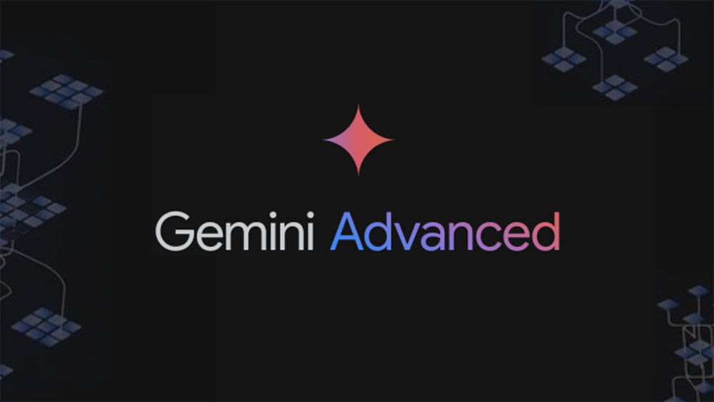
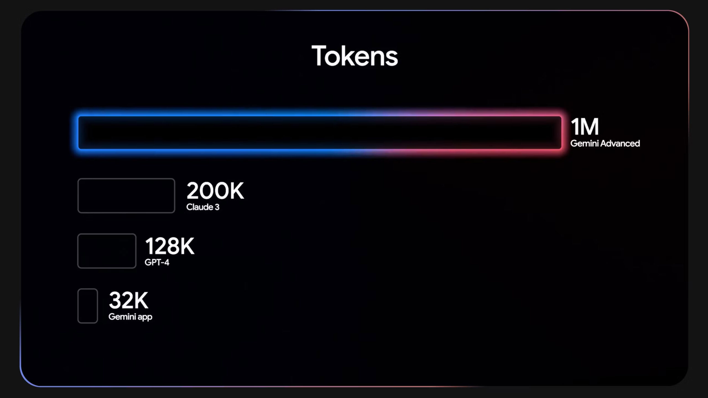
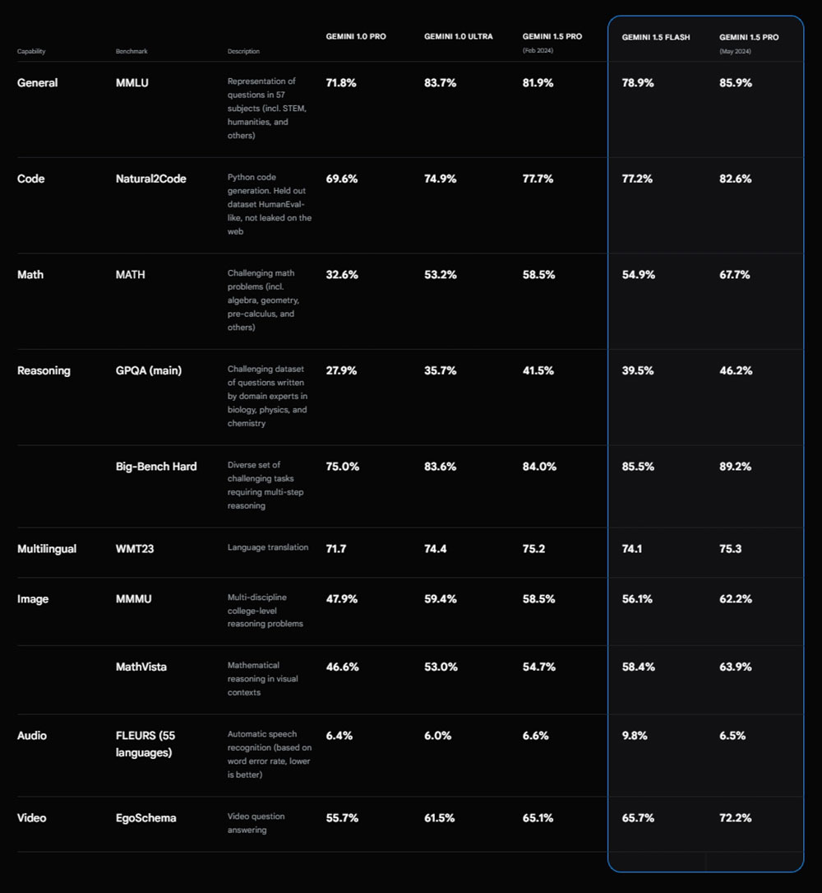
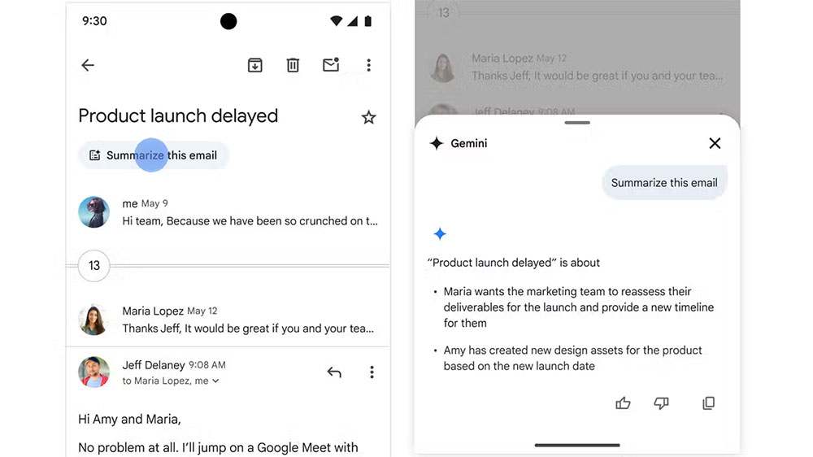
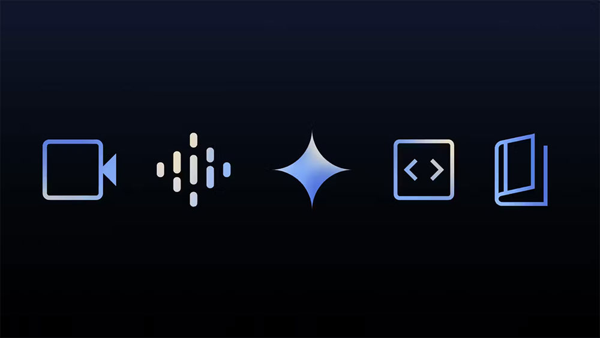
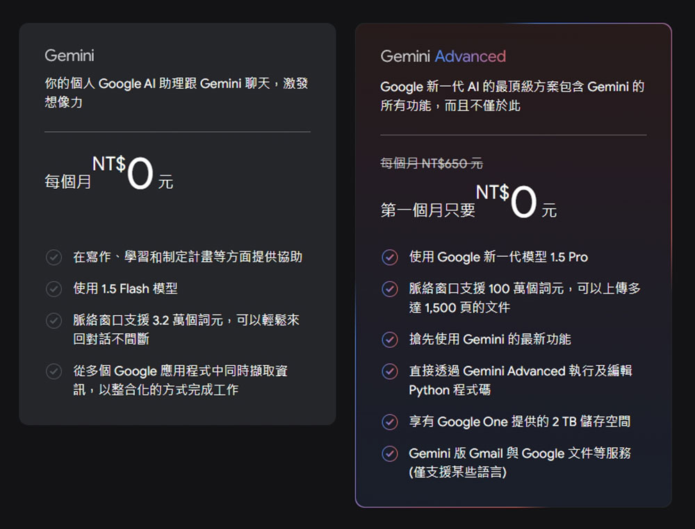

# Google Gemini 與 Gemini Advanced 的關鍵差異在哪裡？

> **來源**：[電腦王阿達](https://www.kocpc.com.tw/archives/563648)
> **作者**：電腦王阿達
> **發布時間**：2024-09-05
> **抓取時間**：2026-02-25 23:51

---

AI 是目前主導整個科技產業的主要話題，從 Made by Google 2024 中就能知道 AI 在未來的舉足輕重，Google 在這次的活動中展示了 Google Gemini 在全新 Pixel 9 系列和其他硬體上的最新功能。Gemini 是 Google 的 AI 聊天機器人，取代了 Google Bard，而且是 OpenAI 旗下 ChatGPT 的替代品，當收到指令時，它會寫詩、寫程式、規劃旅程等。Gemini 有一個功能更強大的變體，稱作「Gemini Advanced」，它可以處理更複雜的任務，並提供與 Google 產品更深入的整合，這次我們就來聊聊兩者之間的主要差異。

## Google Gemini 與 Gemini Advanced 的關鍵差異在哪裡？

### 1. Gemini Advanced 可以處理更多數據

與其他大型語言模型 AI 系統一樣，Google Gemini 處理的資訊量有限。 Gemini 為 32,000 個詞元，Gemini Advanced 為 1,000,000 個詞元。詞元（Token）是 AI 操控的資料塊，文字、圖像、影片均屬之。聊天對話的長度（包括你的輸入和機器人的回應）以詞元來計量，上下文視窗是同時處理的詞元數量，超過的話可能會使最早的詞元被忽略，因此 Gemini 的答案可能不會考量你提供的部分資訊。

1,000,000 個詞元聽起來很多，足以容納一個小時影片的對話量，使得 Gemini Advanced 更適合專業用途，例如資料分析和程式碼產生。而 32,000 個詞元足以幫助完成日常任務和較輕的工作負載，仍然可以要求 Gemini 為你簡短的程式碼，並解釋每個部分的作用。

### 2. Gemini Advanced 使用能力更強的 LLM

AI 聊天機器人的大腦就是它的 LLM（大型語言模型），Gemini 基礎版可以存取 Gemini 1.5 Flash，Gemini Advanced 則使用 Gemini 1.5 Pro。這兩種語言模型的性能相似，而且都是多模態，表示它們均可以處理文字、影像和影片。然而，Gemini 1.5 Flash 專為速度和效率而打造，而 Gemini 1.5 Pro 針對涉及較大資料庫的複雜任務進行了最佳化。

[Google 的基準測試](https://deepmind.google/technologies/gemini/pro/)顯示 Gemini 1.5 Pro 的全面性能更強，在回答一般知識問題、產生電腦程式碼以及解決需要數學和推理技能的問題時表現更好，解說更清晰明瞭；Gemini 1.5 Flash 則比較像是快問快答。

### 3. Google 應用程式具備與 Gemini Advanced 的整合

你可以在 Google 應用程式和服務中使用 Gemini Advanced。它可以在 Google 文件裡撰寫和編輯文字、生成列表並將它放入 Keep 筆記中，或是書寫電子郵件草稿，你還可以自訂主題、長度和語氣。Gemini 內建於 UI 中，提供更流暢無縫的使用體驗。

你可以要求 Gemini 的免費版本編寫文章中的每一小段和電子郵件，然後將文字貼到你需要的位置，但這不是最優雅的過程。如果你需要檢索或分析儲存在其中的資訊，基本的 Gemini 聊天機器人可以讀取你的 Gmail 或 Google Drive。

### 4. Gemini Live

正如 Made By Google 活動中所展示，Gemini Live 可讓你使用自然語言的語音指令與 Google 的 AI 互動。然後，Gemini 會用多種聽起來像人類的聲音之一進行回應，但與人類不同的是，如果你想添加一些補充內容，Gemini 不介意被打斷。Gemini Live 現已在許多 Android 裝置上運行，但只有在擁有 Gemini Advanced 的情況下才能使用。

### 5. 搶先體驗新功能

Google 承諾讓 Gemini Advanced 用戶優先體驗新功能，造訪 Gemini Live 和 Gemini 1.5 Pro 就是兩個例子。不過，清單中還有更多內容：上傳文件進行分析、摘要或視覺化，以及在 Gemini Advanced UI 中編輯和執行 Python 程式碼。

有關未來功能的詳細資訊很少，但高級訂閱者或許可以比別人都早訪問 Gemini 背後的 LLM 即將推出的版本。我們還期望首先在 Gemini Advanced 上看到新的應用程式整合和擴充。目前，擴展程式清單包括 Google Workspace、航班、飯店、地圖、YouTube 和 YouTube Music 等。

### 6. 2TB 雲端儲存

Gemini Advanced 可透過 Google One AI Premium 訂閱取得。因此，訂閱後你將獲得 2TB 的 Google 雲端儲存空間，可用於 Gmail、雲端硬碟、文件和所有其他 Google 服務。雖然這對於除了精通技術的人之外的所有人來說可能有點太多，但你可以與家庭成員中最多五個人共享該空間。

### 7. Gemini Advanced 訂閱價格並不便宜

只要你擁有 Google 帳戶就可以使用免費版的 Gemini 。作為 Google One AI Premium 計劃的一部分，升級到 Gemini Advanced 的費用是每個月新台幣 650 元。這價格並不便宜，特別是你可能已經擁有的其他訂閱項目。另一方面，如果擬打算在工作中廣泛且大量使用 Gemini Advanced，考慮到 Google 的 AI 可以節省時間，這一成本可能是值得的。

如果你想嘗試 Gemini Advanced，可以享受 1 個月的免費試用優惠，但 Pixel 9 購買者可以獲得更長的試用。2025 年 10 月 31 日之前購買的任何 Pixel 9 手機均附帶一年的 Gemini Advanced 會籍。

### 你應該付費訂閱 Gemini Advanced 嗎？

這個問題取決於你的工作方式。需要幫助編寫程式碼、處理數據或編輯大量文字和電子郵件的專業人士對於 Google 高階 AI 能力接受度會更高，讓 Gemini Advanced 每月為你節省一小時的工作量，還能擁有 Gemini Live 這項很酷的功能。對於普羅大眾來說，Gemini 免費版本應該就很夠用了，即使與 Google 服務的整合有限，它也能執行各種常見任務。如果你猶豫不決，可以[到官網上開通免費試用一個月](https://gemini.google/advanced/?hl=zh-TW)。

Tags: [ai](https://www.koc.com.tw/archives/tag/ai)[Gemini](https://www.koc.com.tw/archives/tag/gemini)[Google](https://www.koc.com.tw/archives/tag/google-2)[LLM](https://www.koc.com.tw/archives/tag/llm)[實用指南](https://www.koc.com.tw/archives/tag/%e5%af%a6%e7%94%a8%e6%8c%87%e5%8d%97)[指南](https://www.koc.com.tw/archives/tag/%e6%8c%87%e5%8d%97)

---

*原文連結：https://www.kocpc.com.tw/archives/563648*
*本文轉載自電腦王阿達（kocpc.com.tw），版權歸原作者所有。*
