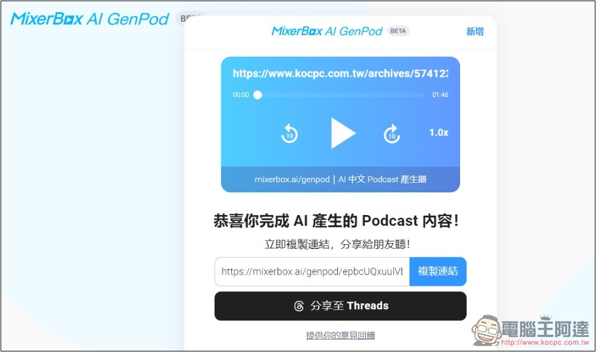
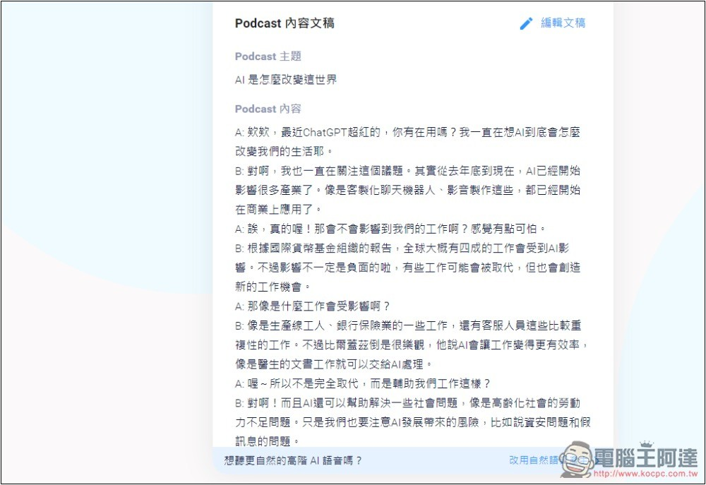
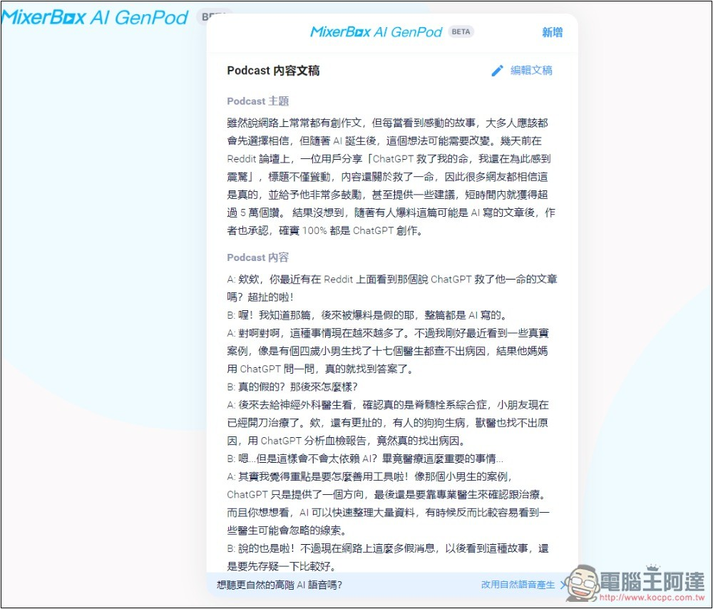

# MixerBox AI GenPod 一鍵將你感興趣的內容，生成中文 Podcast 的免費工具

> **來源**：[電腦王阿達](https://www.kocpc.com.tw/archives/574254)
> **作者**：電腦王阿達
> **發布時間**：2024-11-13
> **抓取時間**：2026-02-25 23:51

---

[Google NotebookLM](https://www.koc.com.tw/archives/571945) 能將內容生成 Podcast 對話，這可說讓人相當興奮，只不過目前還不支援中文，對於台灣用戶來說，就暫時比較沒用，雖然還有另一款 [PDF to Audio](https://www.koc.com.tw/archives/566969) 可以做到生成中文 Podcast，但需要額外付費。最近就發現到持續在 AI 市場耕耘的 MixerBox，也推出一個全新「MixerBox AI GenPod 」，主打就是能將中文內容生成中文 Podcast，而且完全免費用。

## MixerBox AI GenPod 將內容生成中文 Podcast 對話的免費工具

* [MixerBox AI GenPod](https://mixerbox.ai/genpod?hl=zh)

MixerBox AI GenPod 有網頁版，點擊上方連結就能開始使用。

另外要注意是，目前還處於 Beta 測試版，所以才完全免費，等到之後正式版沒意外應該會變成需要付費，或免費版有一些限制。

預設生成的語音聲音，是比較常見的 AI 聲音，所以聽起來就很電腦感，雖然也有提供更自然的高級語音，也是免費使用，不過我測試很多次都顯示高用量請再次嘗試。

打開 MixerBox AI GenPod 網站後，就將你想要生成 Podcast 的內容貼在輸入框，支援丟網址、丟主題、或丟你的內容，內容部份不能太長，我試過如果太長，會一直出現錯誤，接著按免費產生就會開始生成。另外如果你丟的網站網址有檔 AI，那也可能會生成失敗，會胡亂生成其他內容：  

接著就等待 AI 生成完成，大約 1~2 分鐘，速度還蠻快的，有些甚至幾十秒就完成：  

生成好後，就能線上收聽 Podcast 內容，也會自動建立網址，讓你能分享給其他人試聽。比較可惜是不能下載下來：  

往下滑可以查看文稿，也能進行編輯。生成的對話我次覺得還不錯：  

生成時有一點要注意是，生成好的 Podcast 似乎是公開狀態，在首頁下方可以看到其他人生成的 Podcast，所以記得別用於一些私人內容：  

丟內容讓它生成時，它不會只根據你的內容，來生成所有 Podcast 對話，AI 還會自己補其他內容，目前看起來沒辦法限制：  

## MixerBox AI GenPod 什麼時候測試版會結束

目前還不知道，官網也沒有透露相關消息，不過[官方](https://blog-tw.mixerbox.com/mixerbox-ai-genpod-%E9%A6%96%E5%89%B5%E5%8F%B0%E7%81%A3%E8%85%94-ai-%E4%B8%AD%E6%96%87-podcast-%E7%94%A2%E7%94%9F%E5%99%A8/)有提到「目前我們開放免費試用中，完全不用付費就能體驗所有功能喔」，因此很明顯正式版一定會收費，或免費版會受到一些限制。

## MixerBox AI GenPod 生成的 Podcast 可以下載下來嗎

官方並沒有提供下載功能，但有一些第三方工具可以做到，像是我們之前介紹過的 [Neat Download Manager](https://www.koc.com.tw/archives/566560)，就能將 Podcast 語音下載下來。

Tags: [ai](https://www.koc.com.tw/archives/tag/ai)[MixerBox](https://www.koc.com.tw/archives/tag/mixerbox)[Podcast](https://www.koc.com.tw/archives/tag/podcast)[人工智慧](https://www.koc.com.tw/archives/tag/%e4%ba%ba%e5%b7%a5%e6%99%ba%e6%85%a7)

---

*原文連結：https://www.kocpc.com.tw/archives/574254*
*本文轉載自電腦王阿達（kocpc.com.tw），版權歸原作者所有。*
