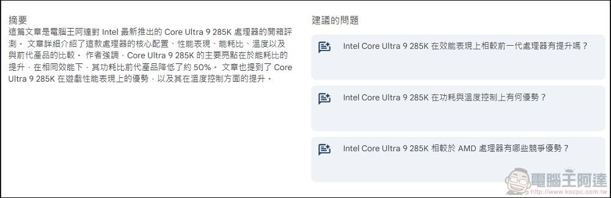
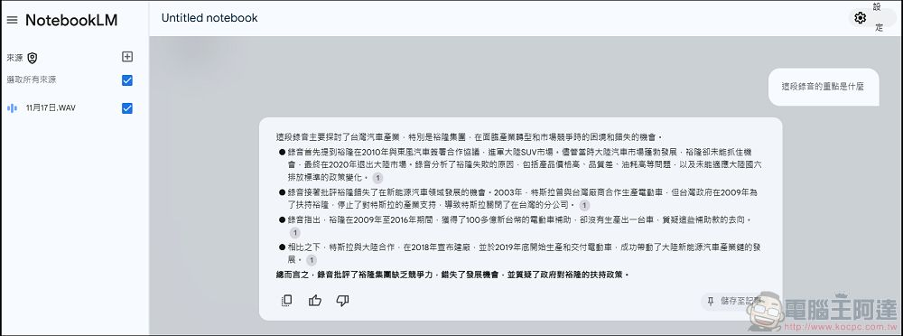

# NotebookLM 使用教學：幫你快速整理消化大量資訊論文，還可以影片錄音轉文字摘要產生Podcast

> **來源**：[電腦王阿達](https://www.kocpc.com.tw/archives/571945)
> **作者**：電腦王阿達
> **發布時間**：2024-10-28
> **抓取時間**：2026-02-25 23:51

---

為大家介紹最近很紅的服務「[**Google NotebookLM**](https://www.koc.com.tw/archives/tag/notebooklm)」，它是 Google 在 2023 年推出的 AI 筆記應用，傳言在 Google 內部屬於有點實驗性質的服務，原本並沒有太多人使用（起碼我沒注意到有太多人討論），但在今年引入了 Gemini 1.5 Pro 之後功能得到大幅度強化，在整理眾多資訊來源時相當方便，甚至前陣子還出了依照內容產生 Podcast 的功能，我個人是相當驚艷，在這邊也分享一下個人的使用心得，如果有什麼可以補充的也可以在粉絲頁加入討論。首先進入 NotebookLM 服務，使用你的Google 帳號登入後，建立一個筆記本：  
")

## NotebookLM 使用教學：幫你快速整理消化大量資訊論文，讓研究更有效率

接著可以選擇一個要進行分析的文件，可以是文字、PDF、txt、錄音檔、Google Doc、網站連結…都可用（支援格式：pdf, txt, md, 3g2, 3gp, aac, aif, aifc, aiff, amr, au, avi, cda, m4a, mid, midi, mp3, mp4, mpeg, ogg, opus, ra, ram, snd, wav, weba, wma），只要上傳檔案或連結即可：  
")")

### [NotebookLM官網（請點我）](https://notebooklm.google.com/)

實測可以用任何語言的文章、錄音檔、甚至沒有字幕的 YouTube 影片（影片不能太新）直接摘要為中文內容，同時還會提供多個該話題的延伸題目：  

您上課、開會的錄音檔也可以丟給 NotebookLM 整理重點，甚至可以要求它輸出逐字稿：  

這邊使用旅行社的行程表當作範例（最近剛好在選旅遊行程），上傳之後系統就會相當快的給出內容分析與摘要，你可以直接詢問想知道的內容或透過建議的問題發問：  
")")

舉例來說，我使用建議的「這趟旅程的行程安排有什麼特色？」，系統立刻給出了行程的特色，然後下方還可以自己繼續發問或使用其他的延伸問題，如果沒有時間詳讀文件的話 NotebookLM 的確可以幫你快速整理各種資訊：  
")")

")")

")")

NotebookLM 所提供的筆記內容都會有文件相關的引用出處，可以讓使用者自己查證是不是 AI 幻想，我自己測試了好幾次正確度都很高：  
")")

此外點擊右上角的新增來源就可以加入其他文件與連結進行研究比對（最多可以增加十組文件或連結），這邊我找了另一個旅行社的類似行程：  
")")

然後提問兩個行程有什麼差異，系統也馬上作出詳細的的比對，如果你有需要整理歸納大量內容論文寫報告做研究需求的話，NotebookLM 這個功能相當的實用：  
")")  
")")

## 超神奇！叫 NotebookLM 將相關內容做成 Podcast（音訊總覽）

除了將不同來源的內容整理成方便閱讀的內容與資訊以外，NotebookLM 我覺得最神奇的是它甚至[可以將整理好的資訊做成淺白的 Podcast 內容](https://www.koc.com.tw/archives/564691)！不過目前只能製作英文版的內容，方法也超簡單在筆記內容中點選「筆記本導覽」：  
")")

然後在筆記本導覽裡就會有「音訊總覽」，這邊就可以生成一段相當豐富的英文 Podcast：  
")")

稍等幾分鐘後就會製作完成，你可以線上收聽也可以下載到電腦中儲存：  
")")

阿達使用網路上兩間旅行社的巴爾幹旅遊的 Pdf 檔用 NotebookLM 製作了長達20分鐘的 Podcast 音檔，大家可以聽看看，成果非常的自然，完全不會覺得是AI生成的內容，對於沒時間好好閱讀大量來源內容並整理資訊的人來說相當實用，~~只可惜目前只能生成英文音檔~~，現在已經能產生中文內容了，大家可以聽看看效果（[歡迎訂閱](https://open.spotify.com/show/47nkKnOmGchanboOB5tLRA)）：

## 結語

個人覺得 Google NotebookLM 對於經常需要整理並融會貫通各種複雜資訊進行研究分析的族群來說相當好用，其實用程度甚至遠遠高於 ChatGPT，也是目前為止個人認為 Gemini 1.5 Pro 最強悍的實際應用，希望 Google 能持續在 NotebookLM 這個項目持續發力，不要像[其他服務一樣突然之間說停就停](https://www.koc.com.tw/search/Google+%E7%B5%82%E6%AD%A2)那就非常可惜了，也推薦給大家使用，如果有更多我不知道的 NotebookLM 相關應用也歡迎告訴我，我會找時間補上。

另外台灣最近也有業者推本土版的連結生成 Podcast 服務，有興趣的朋友也可以試試：

> [MixerBox AI GenPod 一鍵將你感興趣的內容，生成中文 Podcast 的免費工具](https://www.koc.com.tw/archives/574254)

Tags: [ai](https://www.koc.com.tw/archives/tag/ai)[Gemini](https://www.koc.com.tw/archives/tag/gemini)[NotebookLM](https://www.koc.com.tw/archives/tag/notebooklm)

---

*原文連結：https://www.kocpc.com.tw/archives/571945*
*本文轉載自電腦王阿達（kocpc.com.tw），版權歸原作者所有。*
