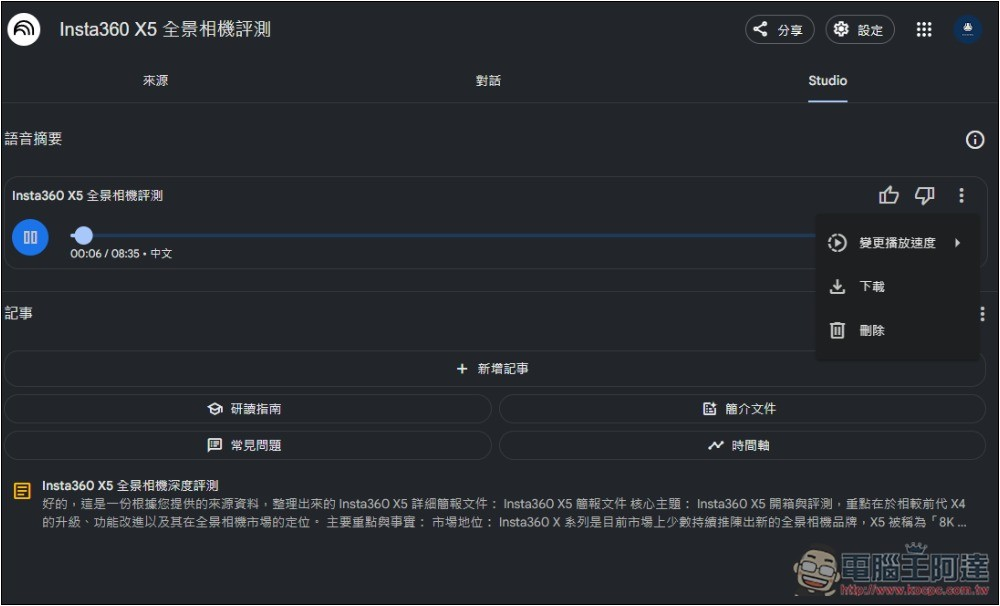
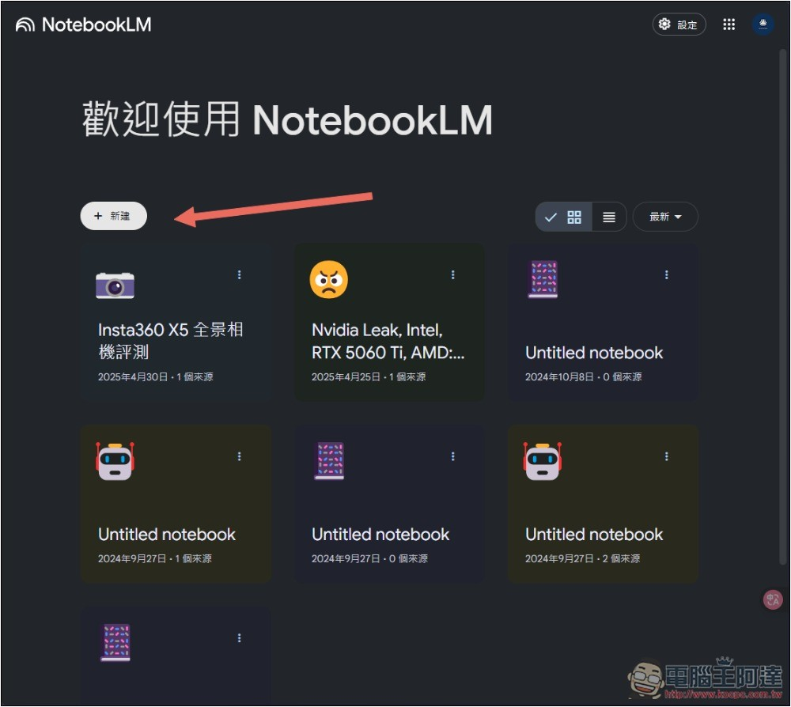
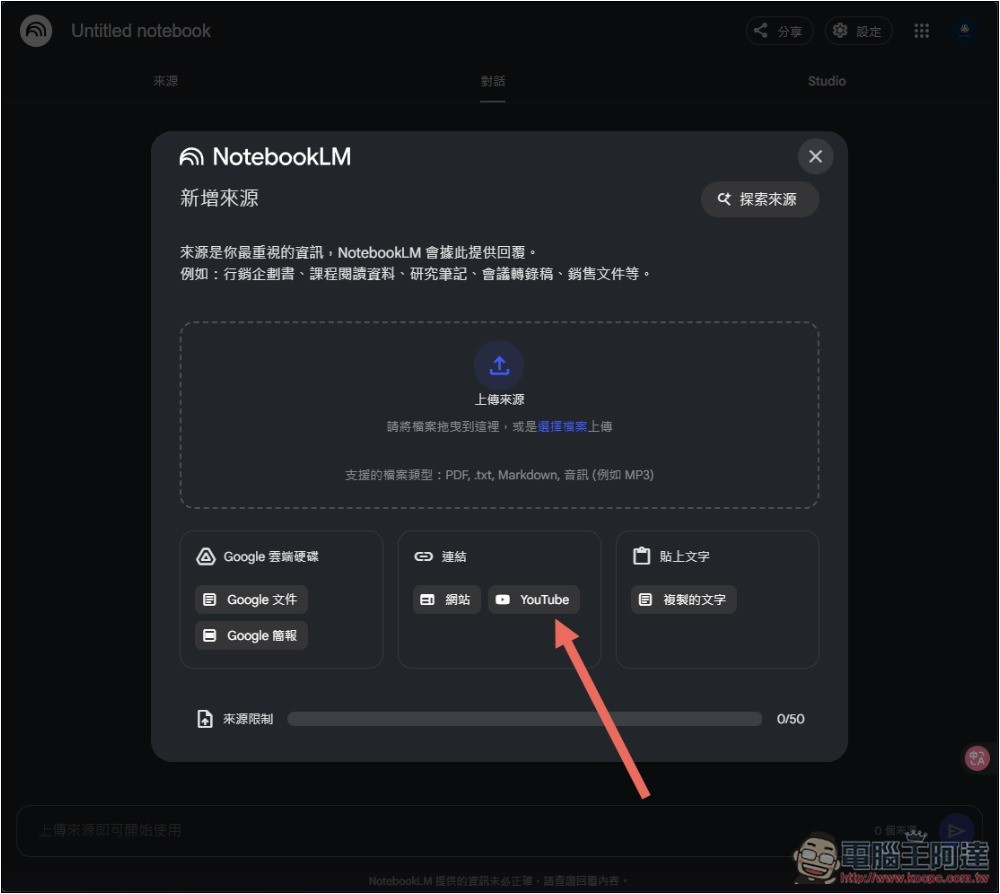
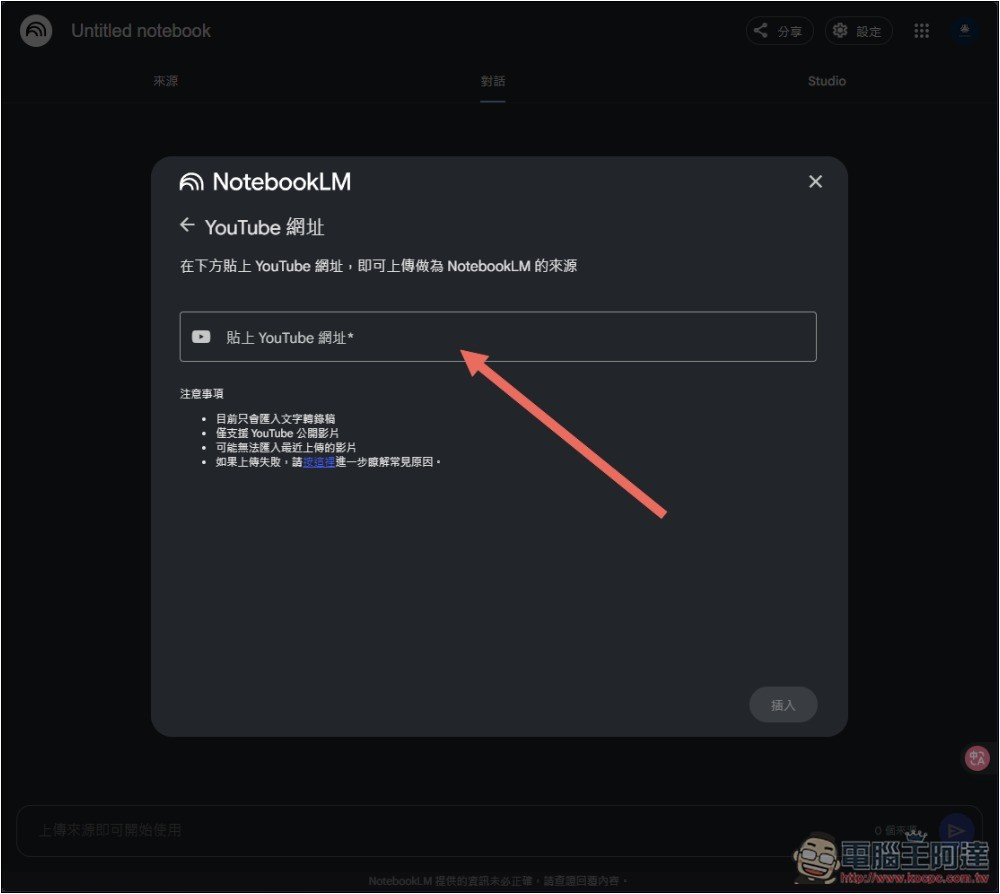
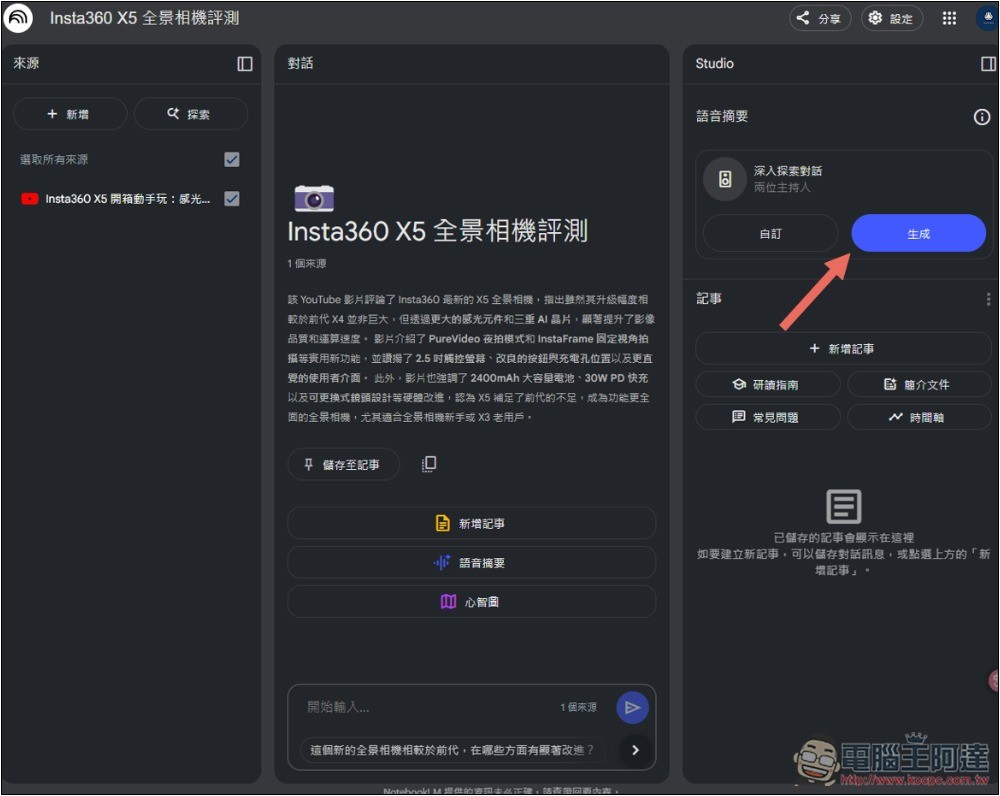
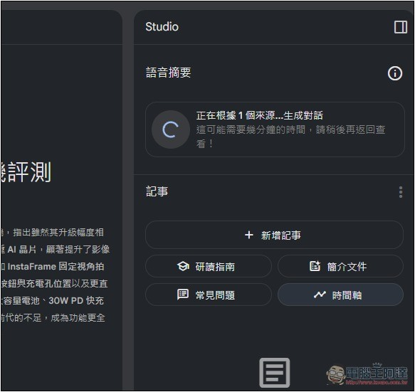
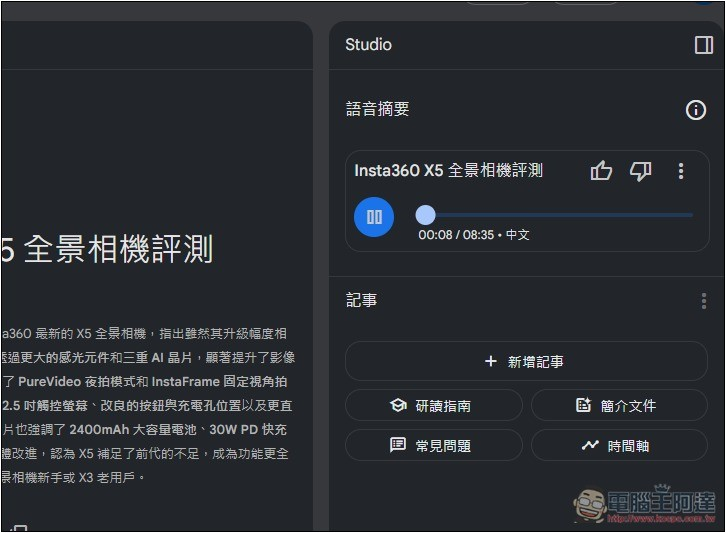
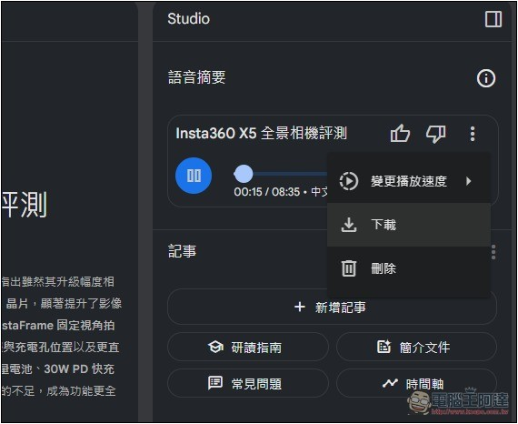
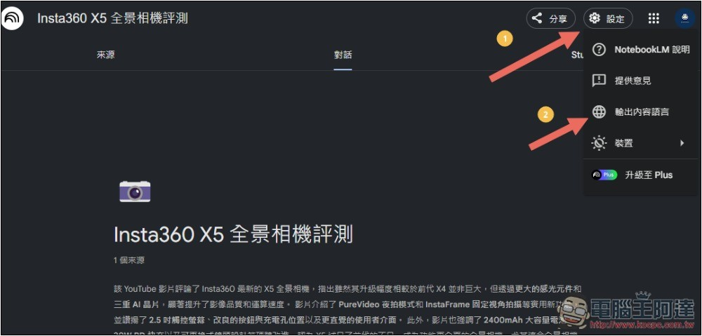
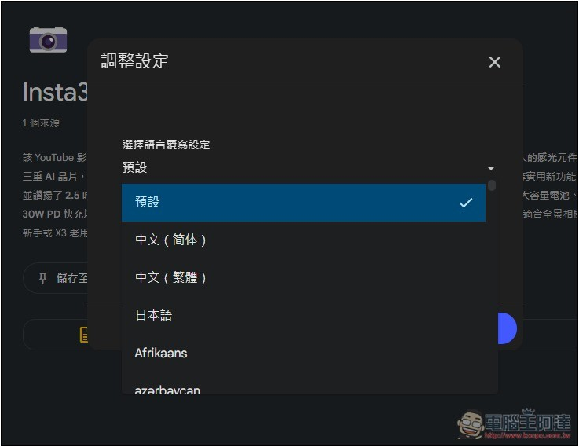

# NotebookLM 的 Podcast 對話生成功能終於支援中文了！趕快來玩玩看

> **來源**：[電腦王阿達](https://www.koc.com.tw/archives/596435)
> **作者**：電腦王阿達
> **發布時間**：2025-04-30
> **抓取時間**：2026-02-26 08:51

---

先前 [NotebookLM 推出 Podcast 對話生成功能](https://www.koc.com.tw/archives/571945)時，可說轟動市場，對話不僅自然，內容說明上也很完整，而且幾乎聽不出 AI 生成的，感覺就像是真人錄製一樣，但可惜是當時只有支援英文，對中文用戶來說沒辦法深度體驗。而好消息是，稍早 Google 宣布 NotebookLM 的 Audio Overviews 功能現已支援超過 50 種語言，其中就包括中文，我剛測試也成功用中文內容生成出中文 Podcast，聲音也同樣非常自然。

## NotebookLM 的 Audio Overviews 功能支援 50 多種語言版本

稍早在 [Google 官方部落格](https://blog.google/technology/google-labs/notebooklm-audio-overviews-50-languages/)中，宣布 Audio Overviews 添加更多語言的支援性，除了原本的英文外，還有繁體/簡體中文、法語、日文、韓文、馬來文、泰文等等，基本上主要語言都有。

Audio Overviews 可將內容轉換一些音訊概覽，其中就包括有趣生動的 Podcast 對話，每個人都能免費使用，只要你有 Google 帳號。

此外，Google 也在 NotebookLM 的設定中添加「輸出語言」，讓你可以根據需求來調整 Audio Overviews 要生成的語言。我們之前也有[NotebookLM教學](https://www.koc.com.tw/archives/571945)有興趣的朋友可以看看：

> [NotebookLM 使用教學：幫你快速整理消化大量資訊論文，還可以影片錄音轉文字摘要產生Podcast](https://www.koc.com.tw/archives/571945)

## 如何用 NotebookLM 生成中文 Podcast 對話？

首先，你必須要有 Google 帳號，然後進到 [NotebookLM](https://notebooklm.google.com/) 網站，按上方的新建任務功能：  

NotebookLM 支援多種來源，包括手動上傳檔案（文件和音訊）、Google 雲端硬碟匯入、網站或 YouTube 連結、以及手動貼上文字，我這邊以 YouTube 影片為例：  

接著就將要轉換成 Podcast 對話的 YouTube 影片網址貼上，並按下方的匯入：  

我用電腦王阿達 YouTube 頻道中最新的「Insta360 X5 全景相機評測」影片。進到主介面後，右邊語音摘要下方的深入探索對話就是 Podcast，按右邊的生成：  

這部影片大約 12 分鐘，我測試生成時間也沒太久，幾分鐘就完成了，不想等的人也可以等等再回來檢查：  

完成後按下播放按鈕即可試聽，可以看到旁邊有註明中文，真的是用中文對話，而且我覺得已經相當自然，講話都有語調，二個主持人也會互動：  

如果你對這個 Podcast 內容滿意，除了線上聽，也可以下載下來：  

下方是我測試的 Podcast 音檔，你可以先聽聽看感覺：

這是完整影片：

## 如何更改 NotebookLM 的 Audio Overviews 目標語言？

如果你想要更改別的語言，請打開右上方的設定選單，就能找到「輸出內容語言」的設置：  

將預設改成你想要生成的語言：  

Tags: [Google](https://www.koc.com.tw/archives/tag/google-2)[NotebookLM](https://www.koc.com.tw/archives/tag/notebooklm)[Podcast](https://www.koc.com.tw/archives/tag/podcast)

---

*原文連結：https://www.koc.com.tw/archives/596435*
*本文轉載自電腦王阿達（kocpc.com.tw），版權歸原作者所有。*
