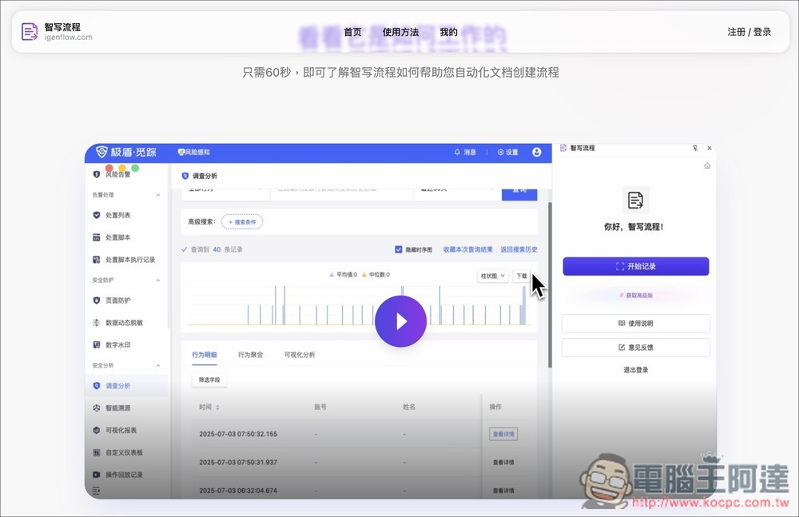
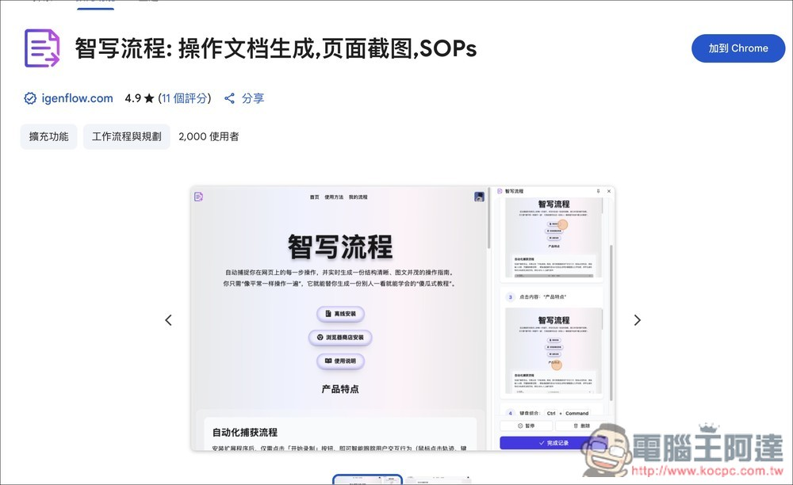
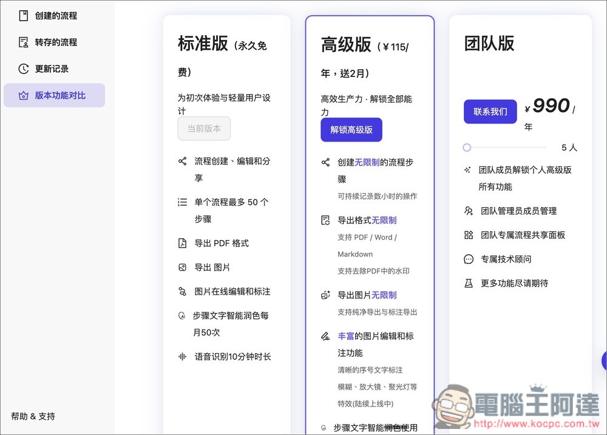
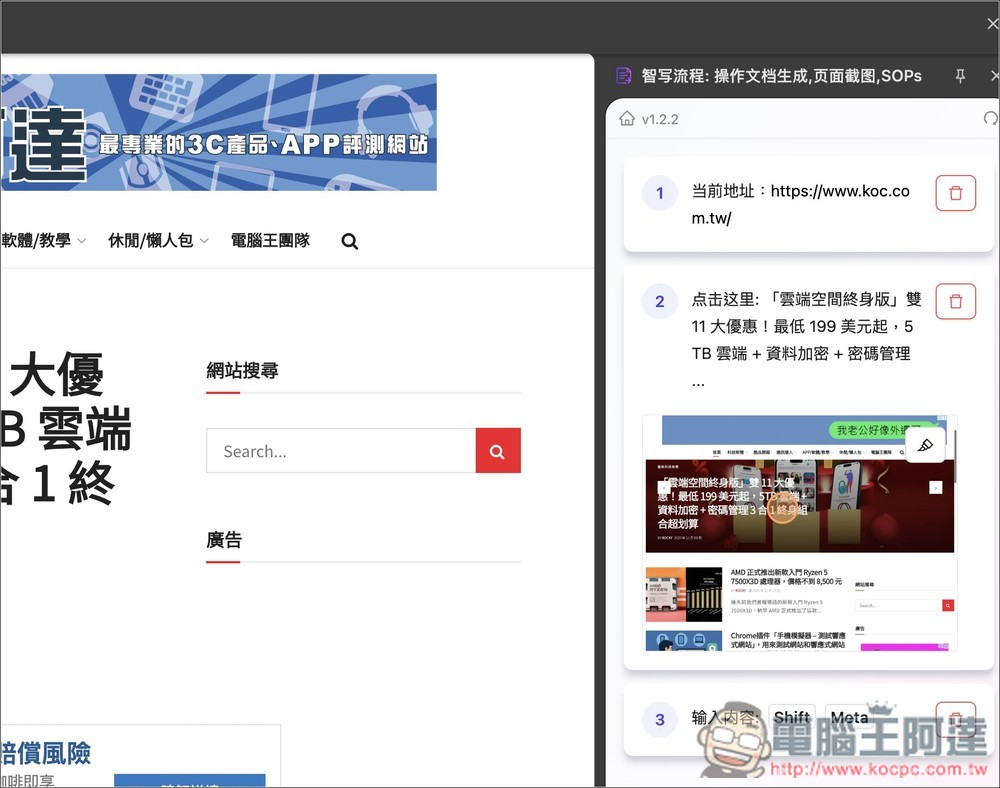
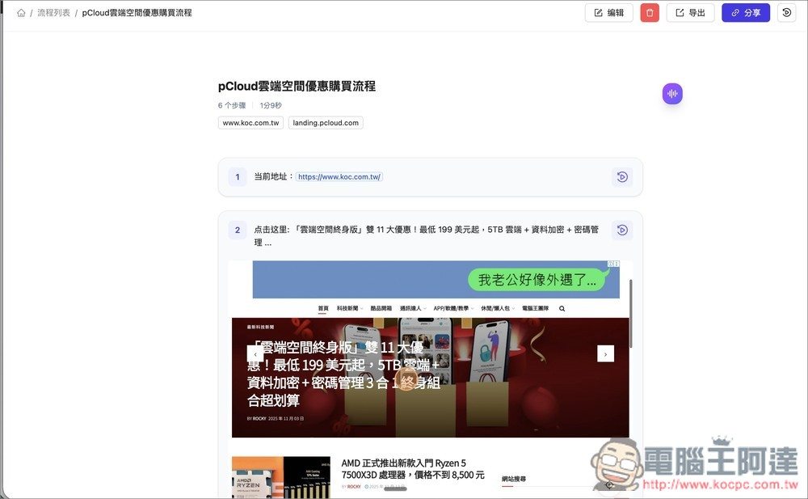
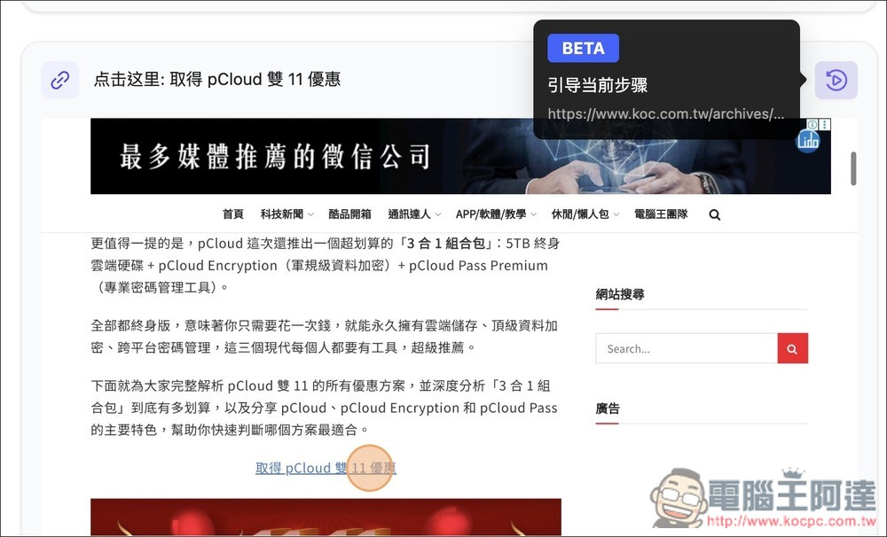
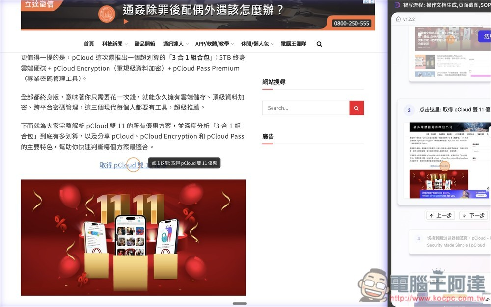
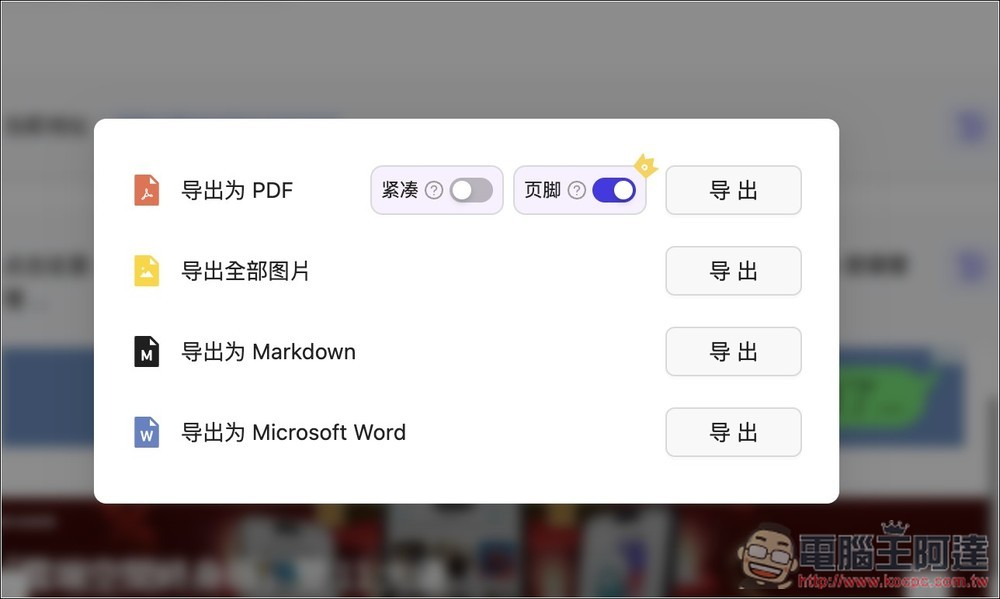
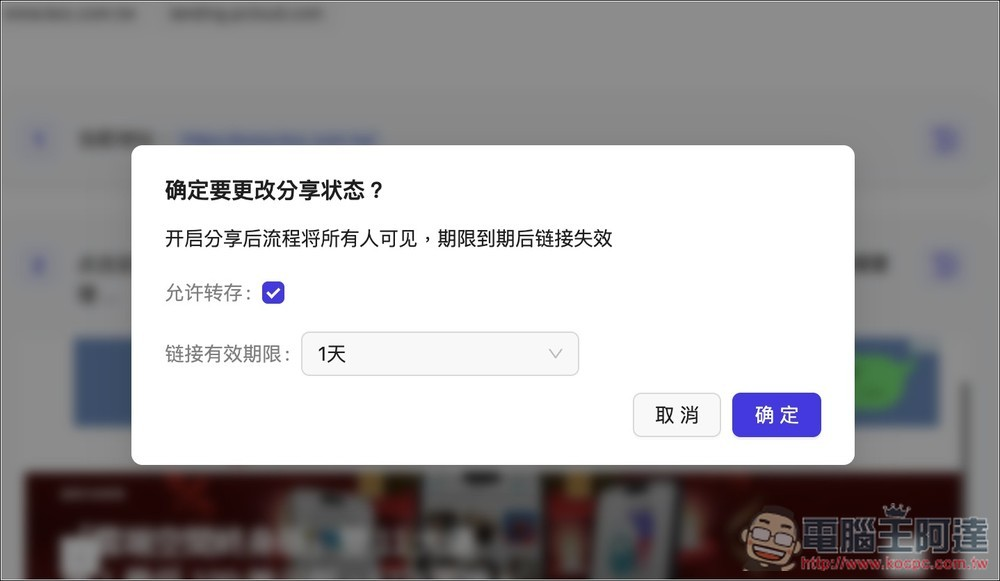

# 「智寫流程」透過 AI 自動捕捉你在網頁上的每一步操作，並即時生成一份圖 + 文的操作說明

> **來源**：[電腦王阿達](https://www.koc.com.tw/archives/620228)
> **作者**：電腦王阿達
> **發布時間**：2025-11-13
> **抓取時間**：2026-02-26 08:51

---

現在的 **[AI](https://www.koc.com.tw/archives/tag/AI)** 真的有點誇張，越來越強，就連教學文也可以。過去寫教學文總是需要花很多時間，除了嘗試之外，還需要針對各步驟截圖，最後是補上文字，而現在有了「智寫流程」這款**[工具](https://www.koc.com.tw/archives/tag/工具)**，AI 就能幫你製作好基本的教學文，而且不僅是圖文並茂，連影片演示都有。

唯一你可能會在意的是，「智寫流程」是**[中國](https://www.koc.com.tw/archives/tag/中國)**公司開發的工具，因此 AI 寫的文字會是簡體，後續你需要手動轉成繁體。

## 「智寫流程」透過 AI 自動完成教學文、影片演示介紹和操作教學

智寫流程是一款專為「製作操作教學文件」開發的 AI 自動化工具，最大的亮點在，會將你操作網站過程中的每一個動作全自動記錄下來，包含滑鼠點擊、鍵盤輸入、頁面跳轉等，接著生成出有圖片、文字的流程文件，意味著過去你需要自己截圖、貼圖、寫步驟的工作流程，現在變成只需按下錄製按鈕就能輕鬆完成。

當然，生成後的內容也能自由編輯，包括調整步驟順序、補充／修改文字、刪除不需要的步驟，或加入更清楚的說明等等。完成後可直接分享連結，或是匯出 PDF、Word、Markdown 等格式。

**主要特色**

* 自動錄製操作行為：自動捕捉滑鼠、鍵盤、跳頁動作。
* 自動生成圖文教學流程：每一步驟都有截圖與說明。
* 可編輯調整內容：支援自行增加或刪除步驟、修改文字、補充細節。
* 多種匯出格式：支援 PDF、Word、Markdown 等常見格式。
* 一鍵分享：可生成線上連結與團隊共享。
* 提升效率：官方宣稱最高可提升 85% 文件製作效率。

[前往智寫流程](https://www.igenflow.com)

按上方連結進到智寫流程官方頁面後，選擇你要用的版本，提供「離線安裝」、「Chrome 應用商店」、以及「Edge 擴展中心」，我用 Chrome 擴充功能：  

點擊就會打開商店頁面，接著就按右上方加到 Chrome：  

完成安裝後，智寫流程會顯示在瀏覽器右側，需登入帳號才能使用，要注意是，個人用戶登入目前僅支援 WeChat，沒提供其他登入或註冊方法：  

登入成功後，按右邊的「開始紀錄」，AI 就會開始錄製和撰寫說明文件，無需設定任何東西：  

另外這工具也有分免費版和付費版，就一般使用來說，永久免費的標準版就很夠了，每次錄製最多支援 50 個步驟，也能分享連結和導出 PDF 格式：  

開始錄製時，第一步都會先記下當前的網址，右邊會顯示即時錄製和生成狀態：  

像我點網頁上的 pCloud 雙 11 優惠文章，AI 就自動幫我截圖並用圓圈標示我點擊的位置，然後生成點擊這裡….的文字：  

跳轉到另一個網頁分頁時，也會記錄下「切換到新瀏覽器標籤頁」，這些文字都是 AI 自動生成：  

接著我就把全部的操作都按完，智寫流程也一一成功記錄下來，最後就按下方的「完成紀錄」：  

會打開這個畫面，顯示剛剛記錄的所有流程，如果你覺得有多餘或錯誤的，可手動刪除或編輯：  

像是把簡體中文都改成繁體中文：  

另外每一步驟右側都有一個播放圖示，按下後會用影片演示這個步驟：  

會在左側畫面演示。有了這影片演示，就算是對方看不懂文字說明，也能快速了解到到底是怎麼操作：  

支援輸出以下四種格式：  

也能直接分享這個頁面的連結給其他人，而且可以設定連結的有效期限：  

Tags: [ai](https://www.koc.com.tw/archives/tag/ai)[Chrome](https://www.koc.com.tw/archives/tag/chrome)[中國](https://www.koc.com.tw/archives/tag/%e4%b8%ad%e5%9c%8b)[人工智慧](https://www.koc.com.tw/archives/tag/%e4%ba%ba%e5%b7%a5%e6%99%ba%e6%85%a7)[擴充功能](https://www.koc.com.tw/archives/tag/%e6%93%b4%e5%85%85%e5%8a%9f%e8%83%bd)

---

*原文連結：https://www.koc.com.tw/archives/620228*
*本文轉載自電腦王阿達（kocpc.com.tw），版權歸原作者所有。*
