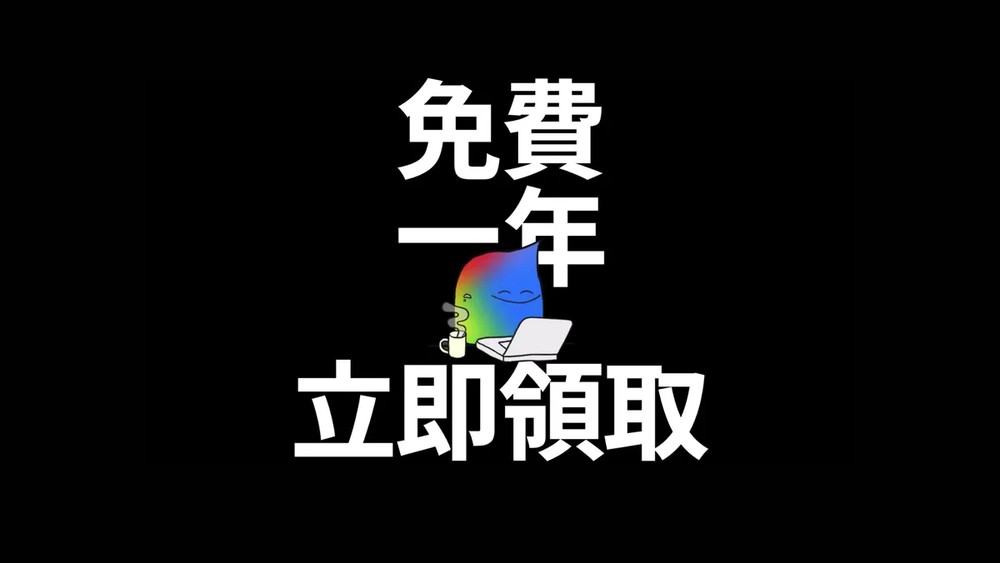
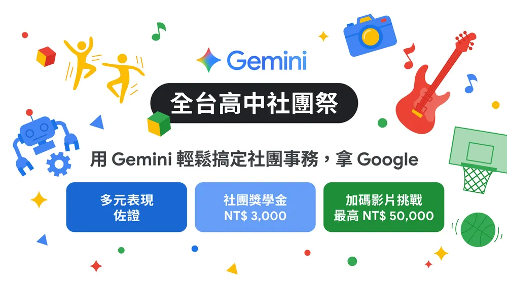

# 台灣版的學生方案 Google AI Pro 一年免費體驗來了！符合資格的快申請

> **來源**：[電腦王阿達](https://www.koc.com.tw/archives/616444)
> **作者**：電腦王阿達
> **發布時間**：2025-10-08
> **抓取時間**：2026-02-26 08:51

---

先前 **[Google](https://www.koc.com.tw/archives/tag/Google)** 就曾在美國等地區推出 **[Google AI](https://www.koc.com.tw/archives/tag/Google-AI)** Pro 學生方案免費一年，對於台灣**[學生](https://www.koc.com.tw/archives/tag/學生)**用戶來說，一定覺得可惜，為何台灣沒有？好消息是，稍早台灣 Google 官方正式宣布，台灣版 Google AI Pro 學生方案免費體驗一年來了！只要符合資格的學生，現在都能申請一年免費使用。

## 台灣版的學生方案 Google AI Pro 一年免費體驗來了！符合資格的快申請

台灣 Google 官方在部落格中宣布「從今天（10 月 8 日）起，**[Gemini](https://www.koc.com.tw/archives/tag/Gemini)** 學生方案將擴展至台灣：只要是台灣年滿 18 歲的大專院校學生，即可申請免費使用一年的 Google AI Pro 方案。活動一直到 2025 年 12 月 9 日結束」。

[獲得 Google AI Pro 學生一年免費體驗](https://gemini.google/tw/students/?hl=zh-TW)

以下是兌換資格和規定：

* 年滿 18 歲
* 居住在台灣等地區（活動官網有列出完整名單）
* 已應要求，使用 SheerID 成功驗證學生身分
* 擁有個人 Google 帳戶
* 擁有 Google 付款帳戶，且可應要求提供有效的付款方式
* 透過 **[Google Play](https://www.koc.com.tw/archives/tag/Google-Play)** 商店訂閱 Google AI Pro

這也代表說，雖然不需要 EDU 信箱，但需透過 SheerID 來驗證學生身份，因此非學生的一般用戶是無法申請的。

[獲得 Google AI Pro 學生一年免費體驗](https://gemini.google/tw/students/?hl=zh-TW)

驗證步驟：

1. 前往 Google One 頁面
2. 透過 SheerID 驗證在校生身分
3. 擁有個人 Google 帳戶
4. 擁有 Google 付款帳戶，並提供有效的付款方式
5. 完成試用期購買流程
6. 透過 Google Play 商店訂閱 Google AI Pro 方案

此外，申請時你也需要提供付款資料，意味著免費體驗一年結束後，如果沒有手動取消，Google AI Pro 會自動續訂，這點要注意。

如果怕忘記被收費，也可以於優惠期任一時間取消訂閱，取消訂閱後一樣保有會員資格，一直到優惠期結束。

而已經訂閱 Google AI Pro 的學生用戶，只要符合免費體驗的資格一樣可以換，記得在 2025 年 12 月 9 日前完成註冊，現有訂閱方案會自動取消。系統也會退還本期剩餘時間的費用。

## 學生方案的 Google AI Pro 跟一般版一樣嗎？

是的，完全一樣，你將能獲得以下特色：

* Gemini 應用程式：擁有更多權限，體驗更多強大新功能，提高工作效率並激發創意。
* Gemini 版 Google 應用程式：直接在 Gmail、Google 文件、試算表、簡報和 Meet 使用 AI 功能獲得協助。
* **[NotebookLM](https://www.koc.com.tw/archives/tag/NotebookLM)**：**[AI](https://www.koc.com.tw/archives/tag/AI)** 輔助的研究與寫作工具，搭載更多進階功能。
* 2 TB 雲端儲存空間：可供 Google 相簿、Google 雲端硬碟和 Gmail 使用的大容量空間。

## Google 推出「全國高中社團祭」

而高中生雖然沒辦法拿到這次的一年免費體驗，但 Google 還有同步推出一個「全國高中社團祭」，邀請全台灣的高中社團，一同探索 Gemini AI 如何為社團活動帶來更多火花。而完成以下步驟的社團，可拿到新台幣 3,000 元的社團獎學金。

1. 網路報名：任何學生社團、官方學生組織的幹部或成員代表，透過官方網站[報名表](https://rsvp.withgoogle.com/events/gemini-for-clubs/forms/registration)完成報名。讓 Gemini 成為高中社團的成員，協作[完成社團活動](https://rsvp.withgoogle.com/events/gemini-for-clubs/gemini)（例如：企劃活動、發想文案、設計宣傳圖等）。
2. 分享 Google Gemini 社團協作成果：在 2025 年 11 月 30 日前，透過報名成功後確認信件內的提交表單，分享社團使用 Gemini 的企劃構想與社團 Gemini 實作成果的對話連結，完成提交。

此外，只要同學們把社團與 Gemini 的合作過程拍成影片並投稿，還有機會贏得最高新台幣 50,000 元的獎金。

Tags: [ai](https://www.koc.com.tw/archives/tag/ai)[Gemini](https://www.koc.com.tw/archives/tag/gemini)[Google](https://www.koc.com.tw/archives/tag/google-2)[Google AI](https://www.koc.com.tw/archives/tag/google-ai)[人工智慧](https://www.koc.com.tw/archives/tag/%e4%ba%ba%e5%b7%a5%e6%99%ba%e6%85%a7)

---

*原文連結：https://www.koc.com.tw/archives/616444*
*本文轉載自電腦王阿達（kocpc.com.tw），版權歸原作者所有。*
