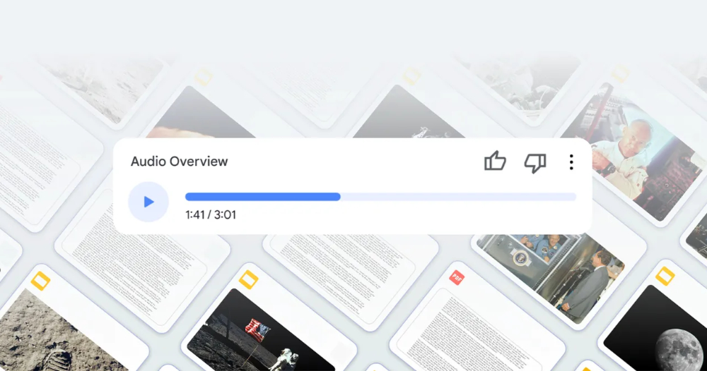
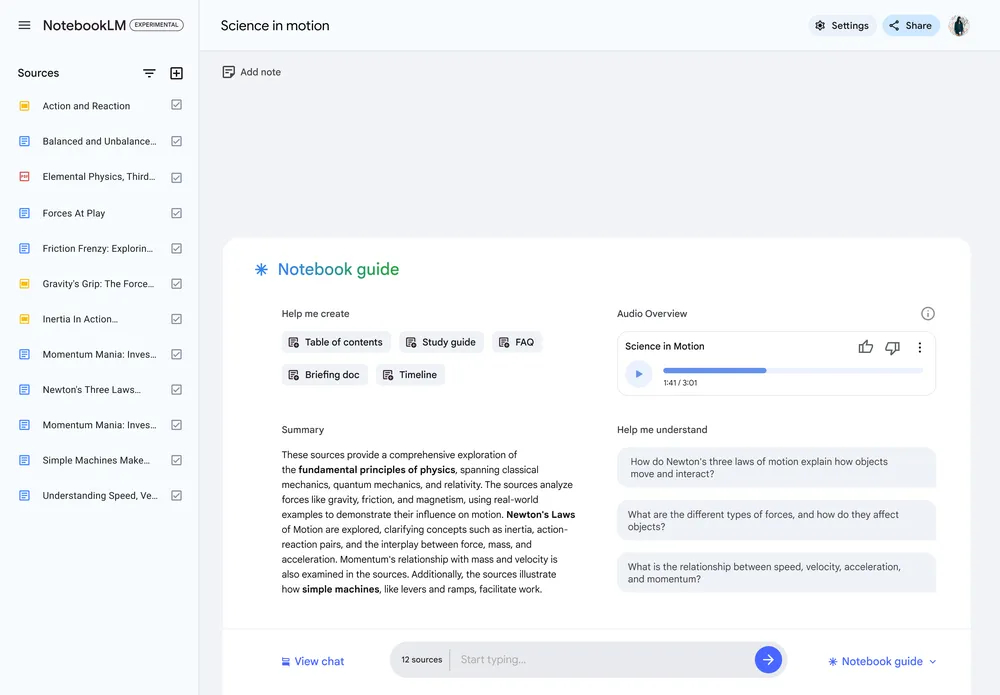

# 奇招！Google 把生硬研究轉成雙人（AI）談話節目幫助學習吸收理解！

> **來源**：[電腦王阿達](https://www.kocpc.com.tw/archives/564691)
> **作者**：電腦王阿達
> **發布時間**：2024-09-12
> **抓取時間**：2026-02-25 23:51

---

雖然實際的表現還有待驗證，不過這次 Google 針對生成式 AI 用在相對生硬要求更為精確學術與研究領域的 NotebookLM 服務應用中，所新加入的「Audio Overview」語音概述功能。個人認為，真的是把 AI 相關的應用玩出了一個新的維度。繼續閱讀奇招！Google 把生硬研究轉成雙人（AI）談話節目幫助學習吸收！報導內文。   
  
 ▲本篇圖片來源：Google

## 奇招！Google 把生硬研究轉成雙人（AI）談話節目幫助學習吸收理解！

雖然實際的表現還有待驗證，不過這次 Google 針對生成式 AI 用在相對生硬要求更為精確學術與研究領域的 NotebookLM 服務應用中，所新加入的「Audio Overview」語音概述功能。個人認為，真的是把 AI 相關的應用玩出了一個新的層次。

因為 Google 想到，與其做出另一個大家都有的摘要功能。不如「生成」出一個全新的場景，讓兩個 AI 以對話的方式「討論」你上傳到 NotebookLM 的研究筆記、訪談逐字稿、公司文件等各種來源資料。藉此達成一個更容易理解且更為有趣的概述呈現方式 – 不得不說，這概念真的是太讚了！希望快點支援中文啊啊啊！

根據 Google The Keyword 部落格的最新發文。在 NotebookLM 介面中的「Notebook guide」介面裡，將可找到新的「Generate」生成按鈕。點擊之後便可以在見面的上緣，看到一個生成完的語音播放條。在裡面，便可以聽到兩個 AI 語音在暢聊關於這則筆記的相關內容 – 你甚至還可以把語音抓下來在其他裝置上聆聽。

就外媒 The Verge 的測試，他們甚至認為這個「討論會」幾乎可以讓人誤以為是網路上的 Podcast 節目。不僅口吻還算自然有個性，更會使用一些現代常用的用語。雖然多少還是有點怪怪的地方，而且 AI 也依然有出錯的狀況。不過認真講，若是以談話節目的角度來看，好像來賓偶爾會胡言亂語一些不對的資訊，也是常常看到的事？

結論是，這樣透過對話而產生的生成式 AI 概述呈現方式，總覺得某種程度上，也算是讓人比較不去在意錯誤的一種形式。至少，對於製作這份筆記的使用者來說，應該很容易就能察覺其中的錯誤，這也是 NotebookLM 本質上可能相較於其他服務有些不同之處。

透過 Audio Overviews 這樣討論對話的形式，個人相信無論是學習或者是對於工作方面的資料整理方面來說，確實是打破了以往生硬的摘要或是條列重點等資料的呈現方式。相信只要沒有太大問題的話，真的會對於學習與工作帶來一定程度的正面幫助，真的很期待快點支援中文！~~再試試看可以把兩個主持人的對話搞得多怪（喂！）~~

引用來源：[Google](https://blog.google/technology/ai/notebooklm-audio-overviews/)｜經由：[The Verge](https://www.theverge.com/2024/9/11/24242138/google-notebook-llm-ai-fake-podcasts-research)｜參考資料

#### 延伸閱讀： [AirPods 4 藏有隱藏按鈕可配對使用，甚至可能支援無損音訊（也太以下犯上了吧！）](https://www.koc.com.tw/archives/564633) [奇招！Google 把生硬研究轉成雙人（AI）談話節目幫助學習吸收理解！ - 電腦王阿達奇招！Google 把生硬研究轉成雙人（AI）談話節目幫助學習吸收理解！ - 電腦王阿達](https://www.koc.com.tw/archives/564633)

Tags: [Gemini AI](https://www.koc.com.tw/archives/tag/gemini-ai)[MultiModal](https://www.koc.com.tw/archives/tag/multimodal)[NotebookLM](https://www.koc.com.tw/archives/tag/notebooklm)[Podcast](https://www.koc.com.tw/archives/tag/podcast)[人工智慧](https://www.koc.com.tw/archives/tag/%e4%ba%ba%e5%b7%a5%e6%99%ba%e6%85%a7)[多模態](https://www.koc.com.tw/archives/tag/%e5%a4%9a%e6%a8%a1%e6%85%8b)[生成式 AI](https://www.koc.com.tw/archives/tag/%e7%94%9f%e6%88%90%e5%bc%8f-ai)[自然語言處理](https://www.koc.com.tw/archives/tag/%e8%87%aa%e7%84%b6%e8%aa%9e%e8%a8%80%e8%99%95%e7%90%86)

---

*原文連結：https://www.kocpc.com.tw/archives/564691*
*本文轉載自電腦王阿達（kocpc.com.tw），版權歸原作者所有。*
