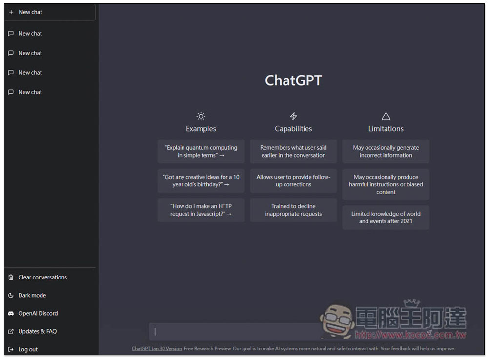
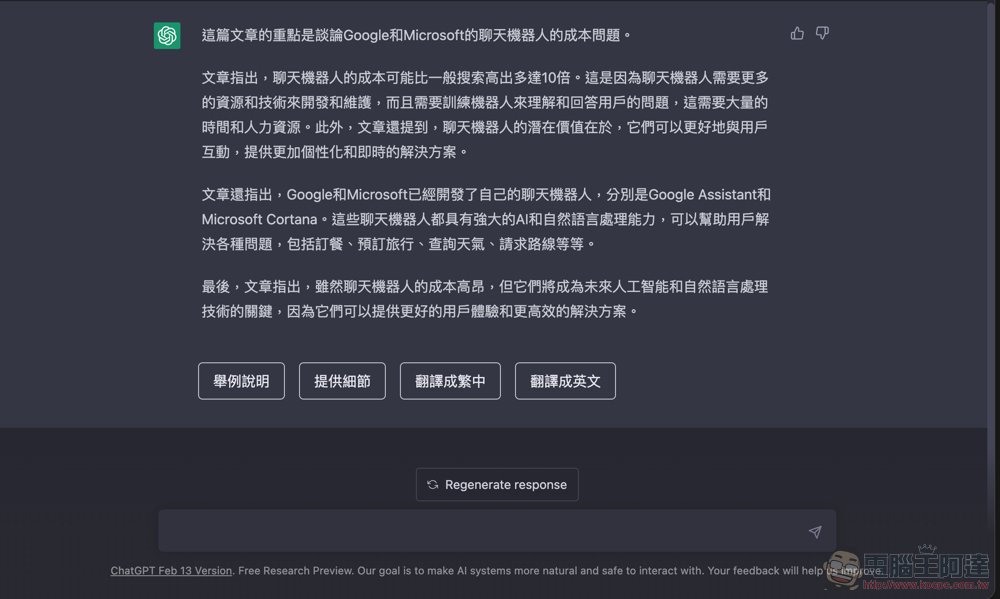
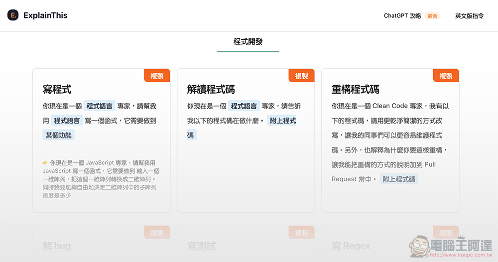
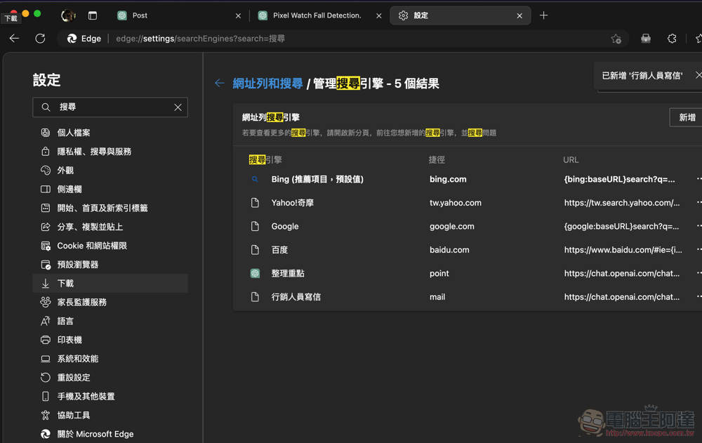
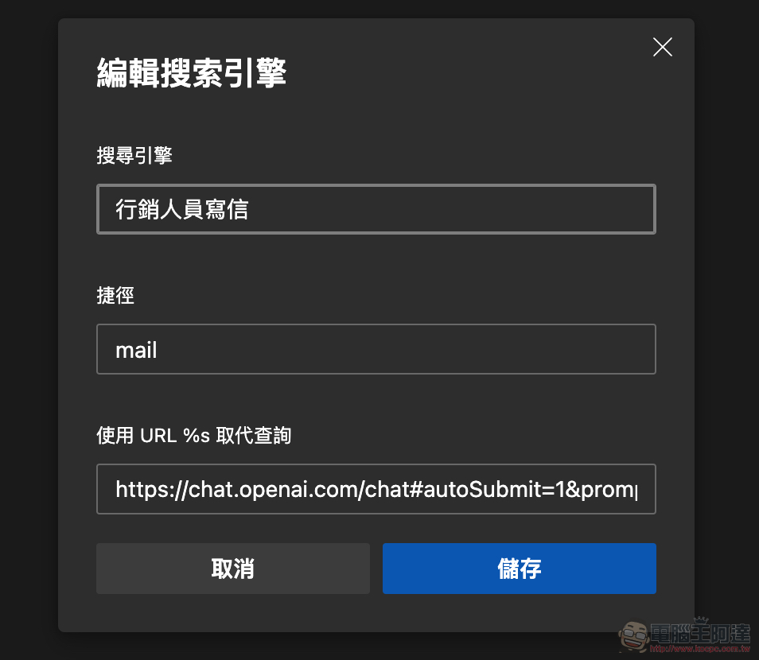
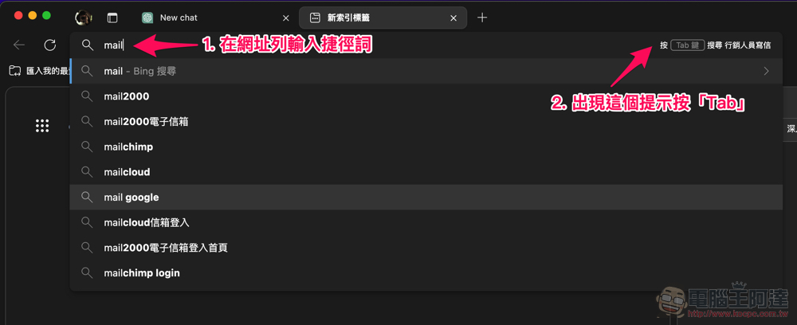
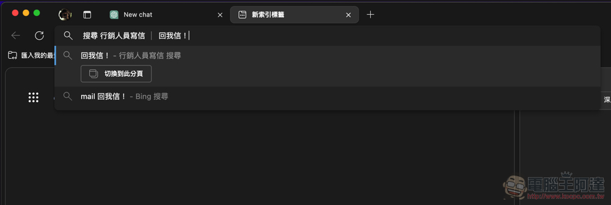
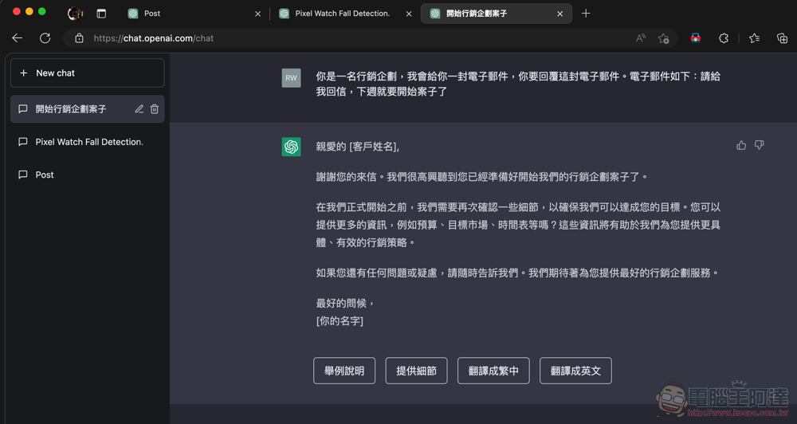

# 把 AI 變成「真 · 工具人」的 ChatGPT 萬能工具箱使用教學，只要簡單安裝 Chrome/Edge 擴充套件即可用！

> **來源**：[電腦王阿達](https://www.kocpc.com.tw/archives/482357)
> **作者**：電腦王阿達
> **發布時間**：2023-03-02
> **抓取時間**：2026-02-25 23:51

---

有些人可能會覺得，即便已經有像是「專攻 ChatGPT 的指令大全」這樣的工具出現在網路上。甚至也有很多人拍片或者是以文章的方式教你如何深度挖掘出聊天機器人的最強功能。只是，難道沒有更簡單，不用慢慢輸入所謂的「詠唱」或更精準的說是「提示技巧（Prompting Skills）」的方式。現在有啦！請繼續閱讀把 AI 變成「真 · 工具人」的 ChatGPT 萬能工具箱，只要簡單安裝 Chrome/Edge 擴充套件即可用！報導內文。   

## 把 AI 變成「真 · 工具人」的 ChatGPT 萬能工具箱使用教學，只要簡單安裝 Chrome/Edge 擴充套件即可用！

雖說像是 ChatGPT、新 Bing 甚至是 Google Bard 等方便的 AI 聊天機器人，基本上只要可以申請帳號都可以用文字聊天的方式，非常簡單的藉由這些大型機器模型技術，替你撈取資訊並歸納整理給你。不過，有些人可能會覺得，即便已經有像是「[專攻 ChatGPT 的指令大全](https://www.koc.com.tw/archives/481251)」這樣的工具出現在網路上。甚至也有很多人拍片或者是以文章的方式教你如何深度挖掘出聊天機器人的最強功能。

只是，難道沒有更簡單，不用慢慢輸入所謂的「詠唱」或更精準的說是「提示技巧（Prompting Skills）」的方式。甚至也希望 ChatGPT 也能夠提供像是 Bing 那樣的自動提示回應「接話按鈕」體驗？現在，透過簡單安裝 Chrome/Edge 擴充套件再加上簡易的搜尋引擎設定，你也可以把 AI 體驗簡化成更方便工具的 ChatGPT 萬能工具箱來使用了。

> **提升 ChatGPT 網站的使用體驗，提供一些好用功能。像是自動從 URL 填入提示、在回應的地方出現自動提示按鈕、以及更多好用功能陸續推出。**
>
> **ChatGPT 萬能工具箱提供 ChatGPT 網站一些好用的額外功能，可以提升 ChatGPT 網站的使用體驗，目前提供的功能有兩種：**
>
> **1. 自動從 URL 填入提示：這可以讓你把常用的提示詞(Prompt)透過「書籤」的方式保存下來，並在需要的時候可以快速填入。**  
> **2. 在 ChatGPT 回應的地方出現自動提示按鈕：有時候 ChatGPT 沒辦法顯示完整的內容，我們會輸入「繼續」讓 ChatGPT 繼續完成，這些常用的提示詞可以透過按鈕自動輸入。**
>
> **以後會陸續推出好用功能，歡迎大家提供想法與建議。**

以上是這次要介紹的「ChatGPT 萬能工具箱」的官方簡介。你可以在 Chrome 線上應用程式商店找到這個功能（[下載點我](https://chrome.google.com/webstore/detail/chatgpt-%E8%90%AC%E8%83%BD%E5%B7%A5%E5%85%B7%E7%AE%B1/fmijcafgekkphdijpclfgnjhchmiokgp?hl=zh-TW)，Microsoft Edge 使用者也可以在此商店安裝）。

基本上就如同上面介紹的那樣，雖說目前僅有兩個主要功能／工具。但其實光是讓「ChatGPT 回應的地方出現自動提示按鈕」就已經非常好用。而且完全不需要設定，只需要安裝 ChatGPT 萬能工具箱就可以在產生完文字內容之後，看到相應的「舉例說明」、「翻譯成繁中」、「繼續」等時常用到的接續提示詞。

至於 ChatGPT 萬能工具箱的天字第一號功能，雖然設定起來有點麻煩，不過一旦設定好了真的超級好用！變成只需要在網址列上輸入搜尋引擎的「捷徑」關鍵字，再按下鍵盤的「Tab」即可執行你設定好的提示詞。

像是「你是一名 職業，我會給你一封電子郵件，你要回覆這封電子郵件。電子郵件：附上內容」這類在 ChatGPT 指令大全裡的字串，都可以依據需要先設定好，直接在網址列上使用。非常方便！推薦給已經時常利用 ChatGPT 做特定用途，也就是時常輸入重複 Prompt 指令的朋友利用。以下提供簡單的使用教學。

### 如何用 ChatGPT 萬能工具箱在網址列直接搜尋常用提示詞

首先，建議大家先上「[ChatGPT 指令大全](https://www.koc.com.tw/archives/481251)」等網站來找找，自己準備把 AI 聊天機器人化身「真 · 工具人」進行的完整指令 – 不用擔心，在這次設定完之後，你將可以不用再重複跑到這個網站複製了。而如果你已有常用的指令可以輸入的話，那就可以跳過這個步驟（是說，你也可以參考一下搞不好有更準確的詢問方式就是了：  

進入下一個步驟前，建議大家先上 ChatGPT 試著貼上你所複製的文字，看看它的回覆是否符合你的需要。個人簡單以郵件寫作的指令為例「你是一名行銷企劃，我會給你一封電子郵件，你要回覆這封電子郵件。電子郵件如下：哈哈哈這是一封電子郵件快回我喔」。

上面這個是 ChatGPT 指令大全「你是一名[職業]，我會給你一封電子郵件，你要回覆這封電子郵件。電子郵件：[內容]」的範例。我只是隨意代換框框中間的文字之後的指令。基本上只要丟進去 ChatGPT 看看它有沒有像是「我不是ＯＯＯ，無法ＸＸＸ」之類的抗拒回覆，應該都可以正常拿來使用。

接下來，你只需要在一個空白文件上，把剛剛複製的指令貼在「https://chat.openai.com/chat#autoSubmit=1&prompt=」這串指令之後，然後針對最後的「內容」部分改為「%s」這個代換程式碼。

像剛剛那樣就會變成「https://chat.openai.com/chat#autoSubmit=1&prompt=你是一名行銷企劃，我會給你一封電子郵件，你要回覆這封電子郵件。電子郵件如下：%s」- 大家也可以直接複製這段去用。

接著我們再來到 Chrome「設定」裡的「搜尋引擎 > 新增 > 新增搜尋引擎」（Edge 的比較難找，設定網址的[傳送門放在這](//settings/searchEngines)）。即可將剛剛的字串以類似搜尋引擎的方式加入網址搜尋體驗之中。

在這個頁面，除了這個「工具」的名稱可以輸入在「搜尋引擎」裡。重點在於「快捷字詞／捷徑」這個東西，會需要你設定很短的字串成為未來的捷徑詞；底下的「…取代查詢」你就貼上剛剛的「https://chat.openai.com/chat#autoSubmit=1&prompt=你是一名行銷企劃，我會給你一封電子郵件，你要回覆這封電子郵件。電子郵件如下：%s」

之後再選擇「儲存」就搞定了一個工具（聊天機器）人了。

### 如何使用這個「工具（聊天機器）人」

既然主打的是簡化體驗，自然完成了設定之後就一切超 · 簡 · 單。

基本上只要在 Edge / Chrome 瀏覽器的網址列，輸入剛剛設定的捷徑詞之後，右側就會出現「按 Tab 搜尋」你剛剛設定的工具，按了 Tab 鍵就可以喚醒這位「工具（聊天機器）人」了：  

接著就貼上你想要它執行的字串或網址等內容：  

輸入完之後按 Enter 便會跳轉至 ChatGPT 的頁面產生回覆，底下也會馬上出現 ChatGPT 萬能工具箱方便的接話按鈕：  

## 結語

雖說目前 ChatGPT 萬能工具箱僅有兩項主要功能。但基本上透過後面的提示指令捷徑設定，相信大家很容易就能從這次的示範教學延伸發揮出各種快速「工具」給自己使用 – 光是替換掉各種職業或扮演角色就可以有很多變化了。

是說，如果想要更進一步利用這套工具箱的指令的話，可以參考一下引用來源 [The Will Will Web](https://blog.miniasp.com/post/2023/02/28/Useful-tool-ChatGPT-Toolkit) 的詳細指令介紹 – 目前基本上是差在 autoSubmit 自動送出表單這個部分，可以改為「0」來讓你確認完整的指令再正式讓 ChatGPT 執行。不過相信開發這個 ChatGPT 外掛的他，應該陸續還會提供更多的功能與說明。推薦大家如果想要更活用這套工具的話，可以深入研究一下囉。

#### 延伸閱讀： [Gogoro 多車款直降最高 7,180 元！Delight TCS 全黑化新色 + 配備升級也降價！](https://www.koc.com.tw/archives/482256) [把 AI 變成「真 · 工具人」的 ChatGPT 萬能工具箱使用教學，只要簡單安裝 Chrome/Edge 擴充套件即可用！ - 電腦王阿達把 AI 變成「真 · 工具人」的 ChatGPT 萬能工具箱使用教學，只要簡單安裝 Chrome/Edge 擴充套件即可用！ - 電腦王阿達](https://www.koc.com.tw/archives/482256)

Source:
[The Will Will Web](https://blog.miniasp.com/post/2023/02/28/Useful-tool-ChatGPT-Toolkit)

Tags: [ChatGPT](https://www.koc.com.tw/archives/tag/chatgpt)[Chrome](https://www.koc.com.tw/archives/tag/chrome)[Edge](https://www.koc.com.tw/archives/tag/edge)[OPENAI](https://www.koc.com.tw/archives/tag/openai)[人工智慧](https://www.koc.com.tw/archives/tag/%e4%ba%ba%e5%b7%a5%e6%99%ba%e6%85%a7)[工具](https://www.koc.com.tw/archives/tag/%e5%b7%a5%e5%85%b7)[捷徑](https://www.koc.com.tw/archives/tag/%e6%8d%b7%e5%be%91)[擴充](https://www.koc.com.tw/archives/tag/%e6%93%b4%e5%85%85)[聊天機器人](https://www.koc.com.tw/archives/tag/%e8%81%8a%e5%a4%a9%e6%a9%9f%e5%99%a8%e4%ba%ba)

---

*原文連結：https://www.kocpc.com.tw/archives/482357*
*本文轉載自電腦王阿達（kocpc.com.tw），版權歸原作者所有。*
