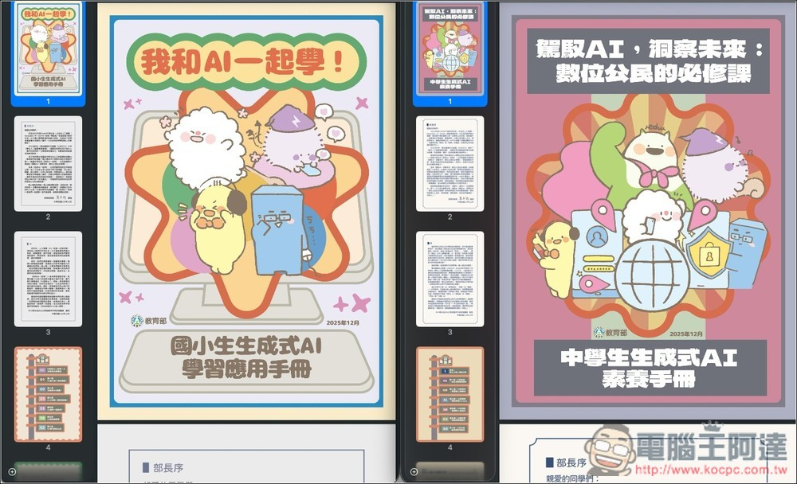
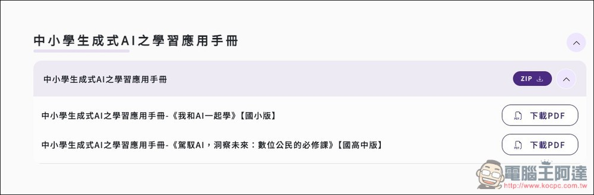
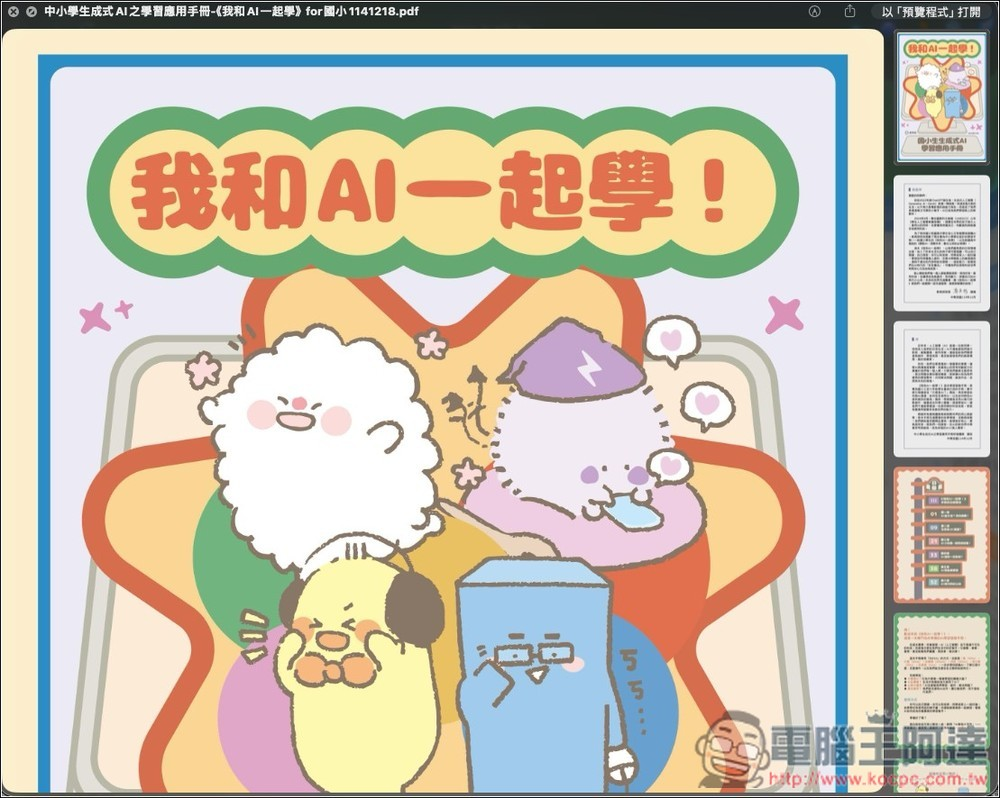
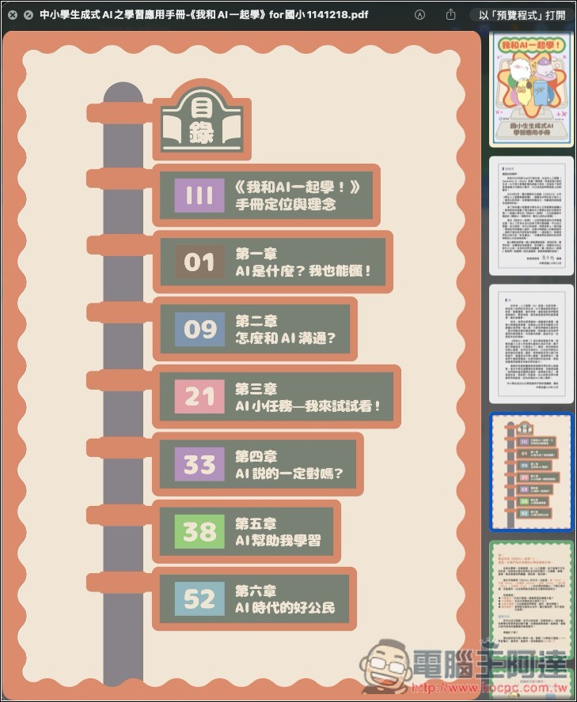
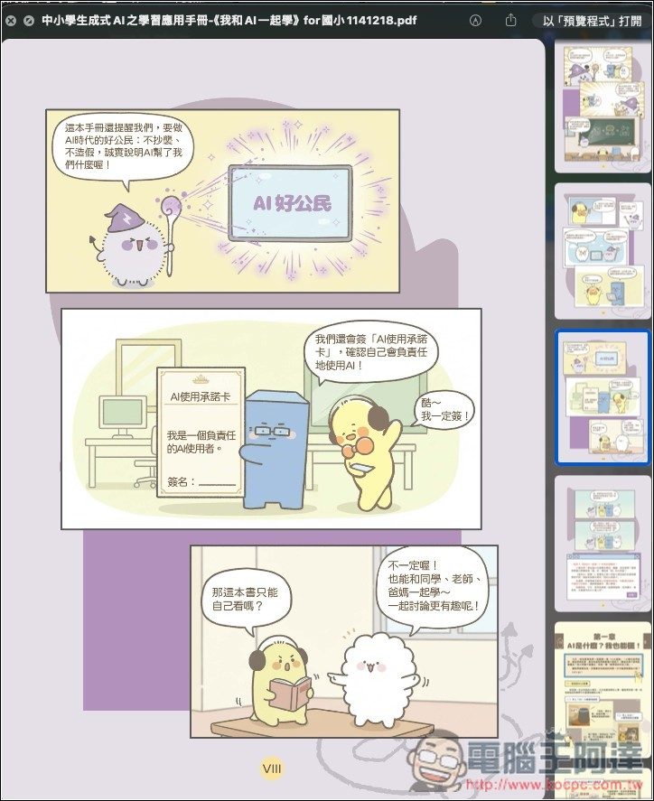
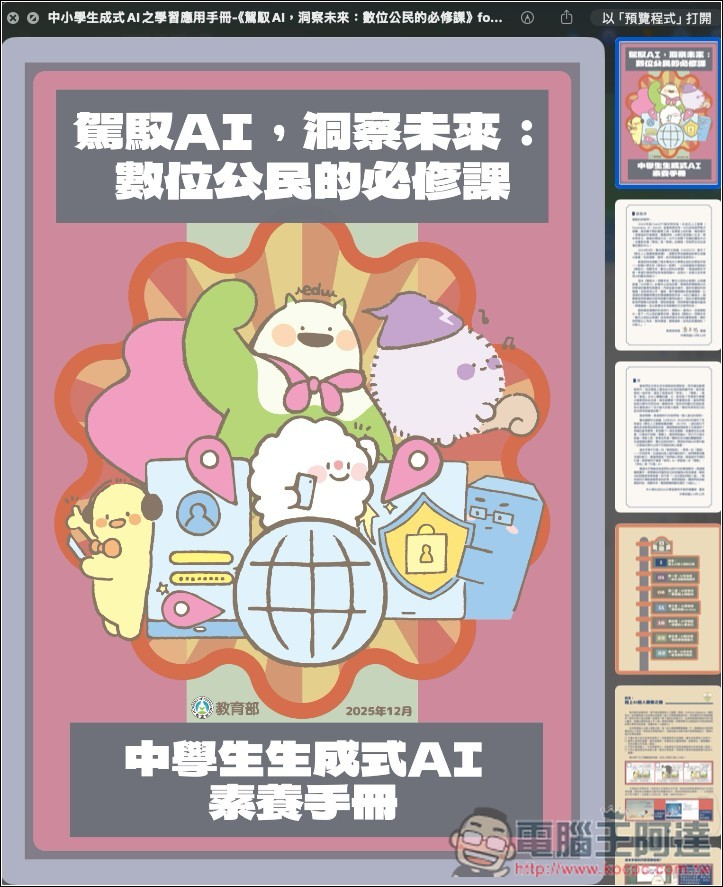
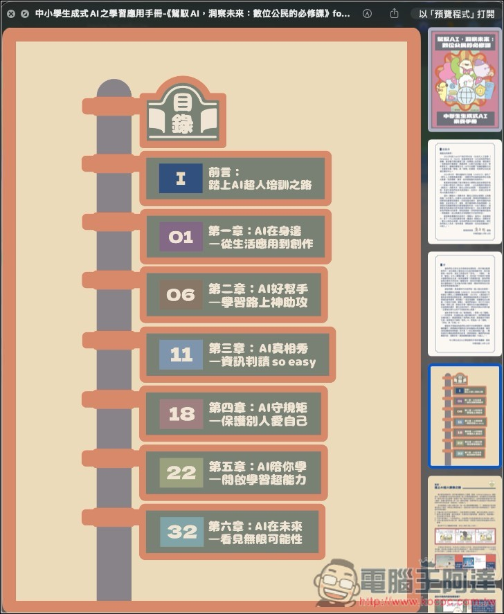
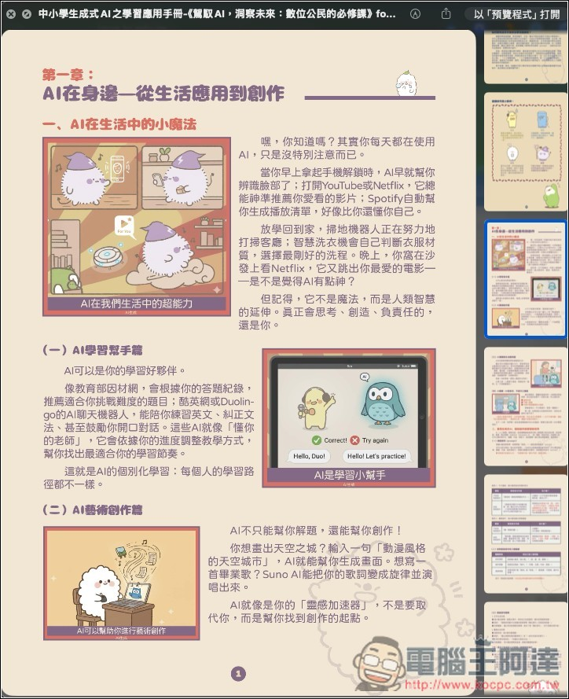
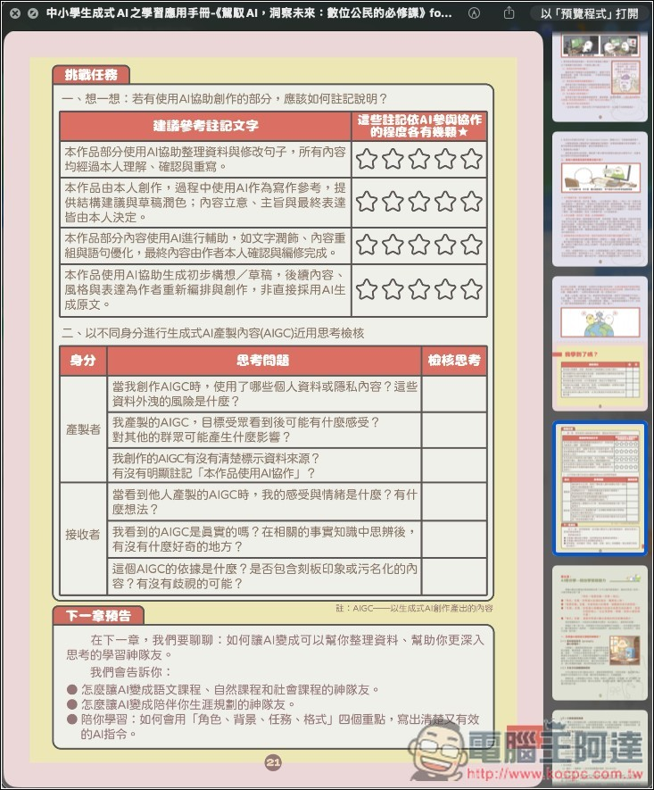

# 教育部專為國高中、小學生設計的「AI 教學手冊」免費下載，透過可愛插圖快樂學習 AI 應用

> **來源**：[電腦王阿達](https://www.koc.com.tw/archives/627315)
> **作者**：電腦王阿達
> **發布時間**：2026-01-15
> **抓取時間**：2026-02-26 08:52

---

隨著 **[AI](https://www.koc.com.tw/archives/tag/AI)** 快速發展，很多爸爸媽媽一定都會希望讓小朋友能早點接觸和學習，不過目前市面上絕大多數的 AI 教學，都是針對成年人設計，對小朋友來說太困難了。

好消息是，教育部有推出兩本專為國高中生和小學生設計的「免費 AI 教學手冊」，所有人都可以免費下載，讓家中的小朋友透過插畫和淺顯易懂的內容來快樂學習最新 AI 應用。

## 教育部推出兩本「免費 AI 教學手冊」，透過可愛插圖讓國高中、小學生快樂學習 AI 應用

根據說明，為了讓國小和國高中生能夠安心且有智慧地接觸 AI，教育部就規劃兩本專為中小學學生設計的學習手冊，分別是給國小學生的《我和 AI 一起學》，以及給國高中階段的《駕馭 AI，洞察未來：數位公民的必修課》。

手冊內的教學不以技術操作為導向，而是強調 AI 作為學習輔助工具的定位，透過貼近課堂與生活的實例，引導學生理解生成式 AI 的功能、限制與風險，並培養正確的使用態度。

[取得教育部「免費 AI 教學手冊」](https://pads.moe.edu.tw/download.php)

點擊上方的連結進到教育部下載網站後，往下滑動頁面，找到「中小學生程式 AI 之學習應用手冊」的項目，點擊右側 ZIP 旁的箭頭圖示展開，就能找到《我和 AI 一起學》和《駕馭 AI，洞察未來：數位公民的必修課》的 PDF 載點，你可以根據自家小朋友的年齡來下載，或是兩本都學習也可以，內容不一樣。不過適合國高中生的那一本，難度會稍微高一些：  

《我和 AI 一起學》是專為國小學生設計的生成式 AI 入門學習手冊，共有 74 頁，內容超級豐富，整體風格以生活化、故事化與任務導向為核心，協助孩子在沒有技術壓力的情況下，逐步理解 AI 是什麼、可以做什麼，以及該如何正確使用：  

共有七個主題，分別是一開始的說明，接著依序進入各個章節，如：第一章的 AI 是什麼、第二章怎麼跟 AI 溝通、第三章有許多 AI 小任務可以玩玩看、第四章告訴小朋友 AI 說的內容不一定正確、第五章是 AI 能如何幫助學習、最後第六章則是在 AI 時代該怎麼當一個好用戶：  

內容有很多可愛插畫，避免小朋友學到一半覺得無聊：  

而《駕馭 AI，洞察未來：數位公民的必修課》是為國中與高中學生量身打造的生成式 AI 學習手冊，內容提升至「理解、分析與反思」的層次，除了教學生怎麼用 AI，還進一步探討 AI 對學習、社會與個人判斷力的影響：  

同樣有七個章節，分別為前言、第一章關於 AI 的生活應用與創作、第二章是如何透過 AI 來學習、第三章則是非常重要，關於判斷 AI 與資訊的真假、第四章會說明如何正確地使用 AI，第五章同樣是關於如何透過 AI 來學習，第六章則是探討未來：  

相較於小學生版，這個版本的內容明顯更加困難，而且插圖沒有這麼多：  

每一個章節後面基本上都有挑戰任務，讓小朋友在學完之後可以進行反思與複習：  

Tags: [ai](https://www.koc.com.tw/archives/tag/ai)[人工智慧](https://www.koc.com.tw/archives/tag/%e4%ba%ba%e5%b7%a5%e6%99%ba%e6%85%a7)[教育部](https://www.koc.com.tw/archives/tag/%e6%95%99%e8%82%b2%e9%83%a8)

---

*原文連結：https://www.koc.com.tw/archives/627315*
*本文轉載自電腦王阿達（kocpc.com.tw），版權歸原作者所有。*
