# 谷歌最強AI搭配強大搜尋引擎更好用！手機端 Google Gemini App 動手玩

> **來源**：[電腦王阿達](https://www.kocpc.com.tw/archives/544756)
> **作者**：電腦王阿達
> **發布時間**：2024-04-27
> **抓取時間**：2026-02-25 23:51

---

相信大家應該都知道 Google 自家有一個 AI 服務叫 Google Gemini，雖然 Google 自己就是所有大語言模型（LLM）基礎 Transformer 機制的基礎，但在 AI 賽道上老實說並不算走得很順遂，由之前的 Bard 改版為 Gemini 時，官方展示的驚人效果[被踢爆經過加速與剪輯](https://www.koc.com.tw/archives/524029)，後來又發生[產生圖片時太過政治正確](https://www.koc.com.tw/archives/535722)的意外，但依然不能否認 Google 在 AI 相關應用上依然是行業裡的領頭羊。更別說 Google 還擁有 Android 這個最大的行動裝置生態，將 Gemini 取代原本的Google助理也是相當合理的，蘋果也正往這方向努力中。之前 Gemini 的行動端應用在美國地區就已經展開測試，最近阿達也發現台灣區已經可以使用了（可能已經LAG了），在這邊也分享一下我個人測試出來 Google Gemini 目前已經可以做哪些工作，如果您知道更多好用應用的話，也歡迎分享給我。

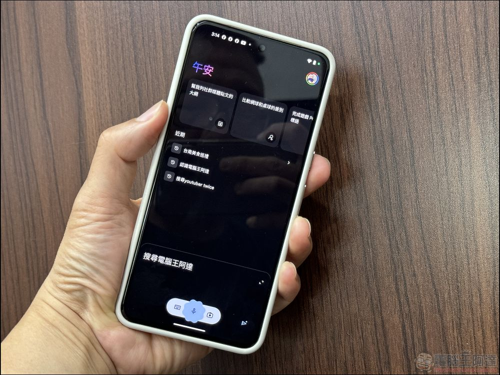

## 如何使用 Google Gemini App？

想要在手機端使用 [Google Gemini](https://www.koc.com.tw/archives/tag/google-gemini)，也相當簡單只要到 Google Play Store 搜尋 Gemini，就能免費安裝使用，第一次使用時系統會詢問是否要用 Gemini 取代 Google 助理，當然是選擇切換（用不慣的話砍掉就恢復了）：  
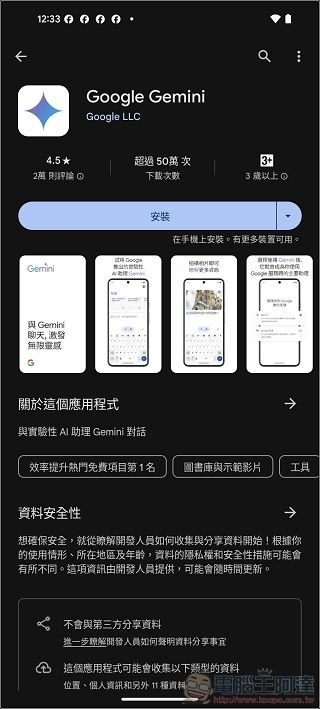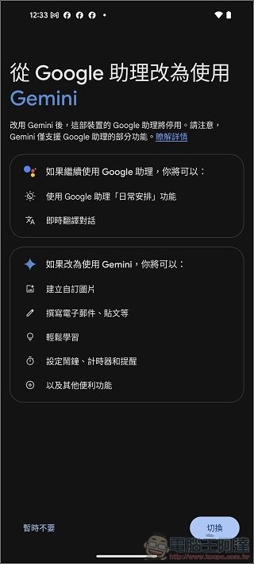

### [Google Gemini App 下載請點我](https://play.google.com/store/apps/details?id=com.google.android.apps.bard&hl=zh_TW&gl=US)

安裝完後就可以開始使用，最上方會有一些範例，直接問它的話會告訴你可以生成各種文字內容：  
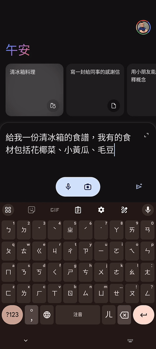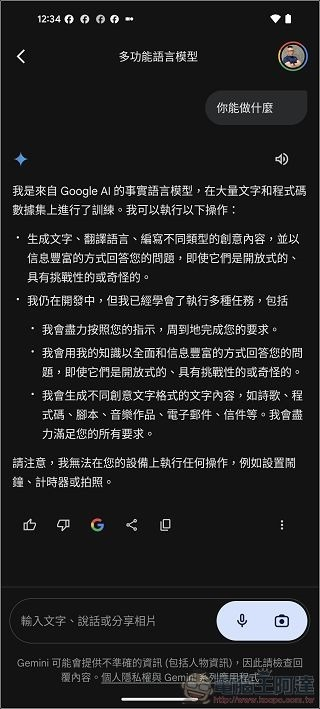

直接測試看看，本來想要讓 Gemini 幫我想開頭，雖然寫的不錯，但沒法拿來給內文使用：  
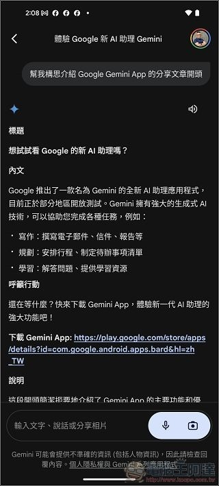

Google Gemini 與其他 LLM 最大不同的就是它結合了 Google 強大的搜尋引擎功能與各種生態，基本問一些即時的問題都能正確回覆，如現在當前匯率、目前所在地附近的美食推薦等等：  
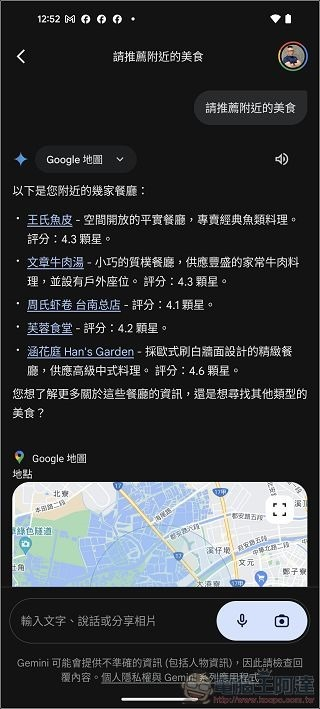

請它推薦餐廳、景點還會有圖文並茂的的內容：  
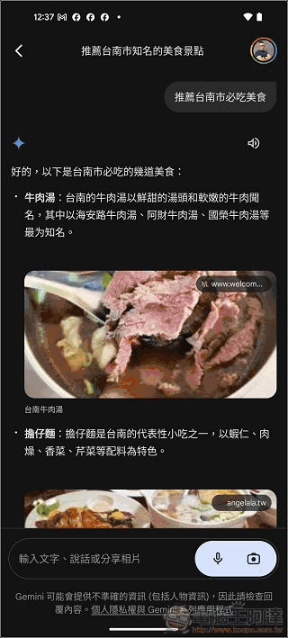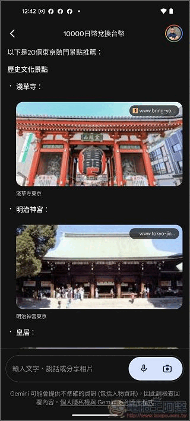

也可以用拍照的方式請它介紹景點歷史與特色：  
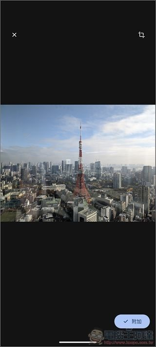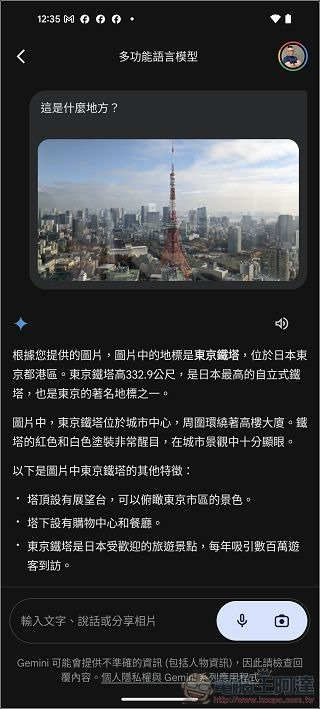

另外在瀏覽網頁時想快速瞭解內文重點，只要在頁面中長按電源鍵呼叫 Gemini，點擊「新增這個畫面」：  
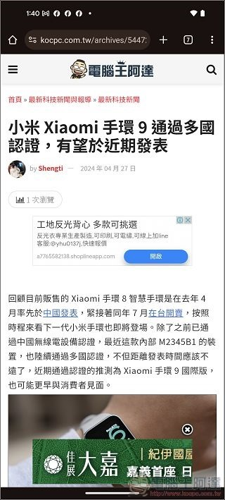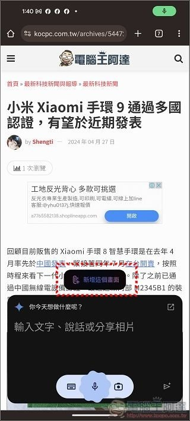

就可以叫 Gemini 幫你快速總結內容重點：  
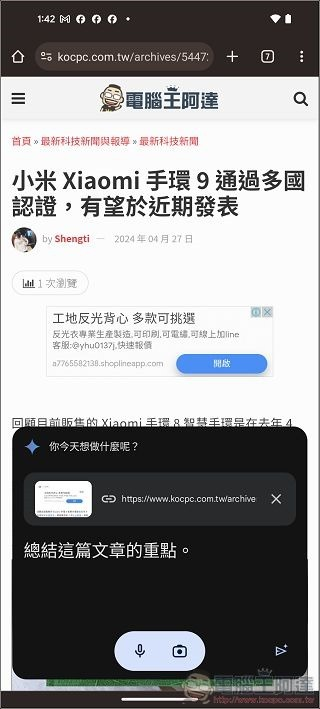

實測大部分的網站都可以檢索內容並得出我們需要的結果，不過我測試了 CNN 之類的網站，發現 Gemini 雖有總結，但會立刻跳出無法讀取內容的訊息（可能是有些考量吧？）：  
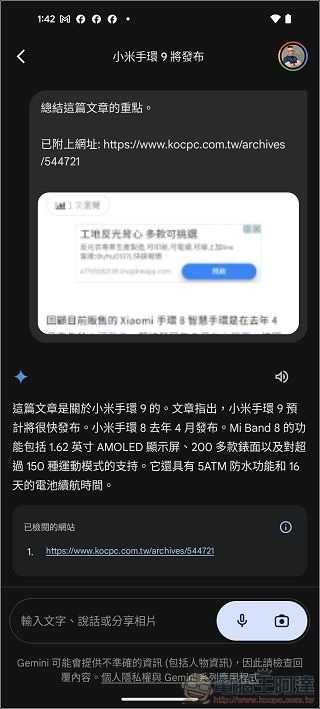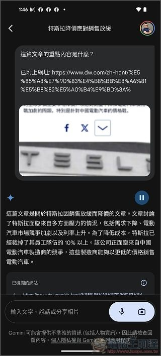

我也測試了用 Gemini 啟動鬧鐘，要求重新開關機都是可以的（上方自我介紹說不行）：  
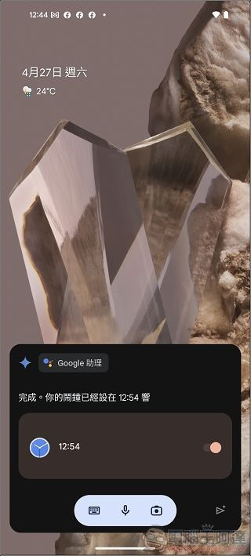

## 目前 Gemini 辦不到、做不好的事

雖然看起來 Google Gemini 很強，但有些事情目前它是做不到或有問題的，比如說生成圖片因為之前的大包，現在還是不能用的：  
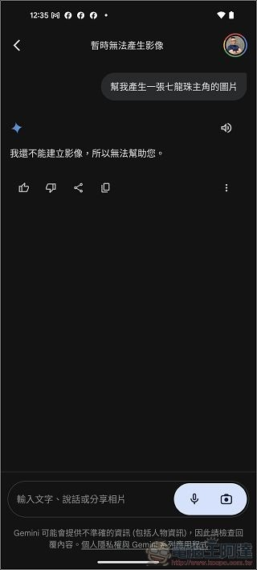

另外 Gemini 的設定裡面可以連結Gmail 等功能，但啟用後在 Gmail App 或 Gemini 本身裡面並無法呼叫出來幫忙寫信回信（也許是我還不會）：  
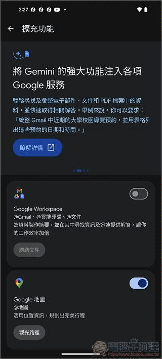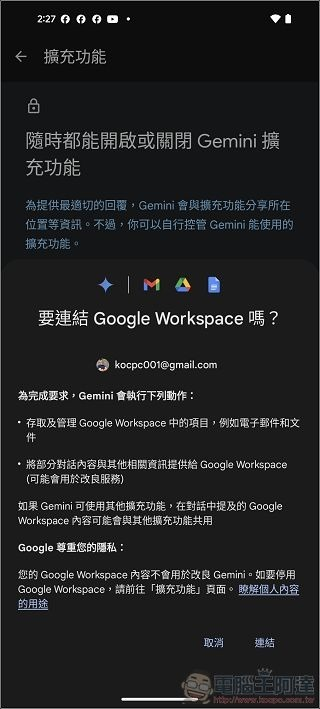

另外叫它搜尋知名人士時大部分的顯示內容都是正確的：  
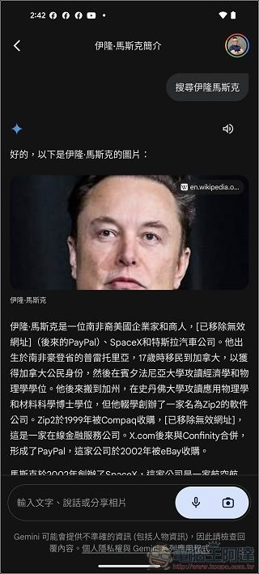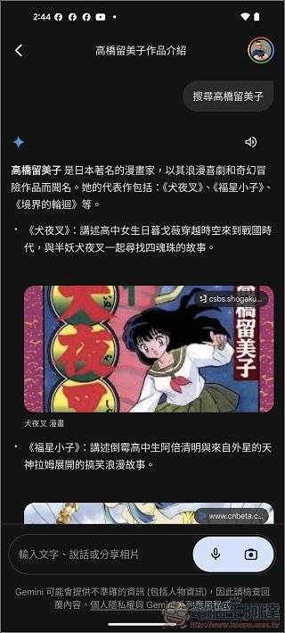

但像阿達這種不知名人士他就很容易亂掰了（LLM 傳統藝能），所以再使用這類服務時建議大家還是要做事實查核或別盡信比較好：  
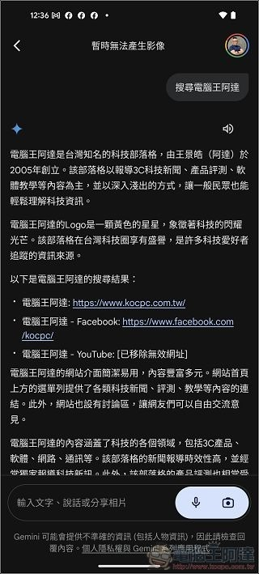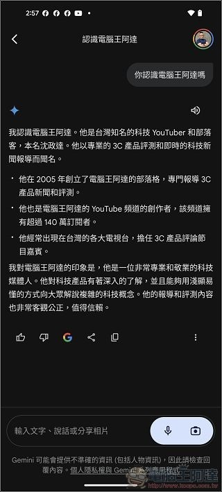

Tags: [ai](https://www.koc.com.tw/archives/tag/ai)[Gemini](https://www.koc.com.tw/archives/tag/gemini)[Google Gemini](https://www.koc.com.tw/archives/tag/google-gemini)[Google+](https://www.koc.com.tw/archives/tag/google)[LLM](https://www.koc.com.tw/archives/tag/llm)[人工智慧](https://www.koc.com.tw/archives/tag/%e4%ba%ba%e5%b7%a5%e6%99%ba%e6%85%a7)

---

*原文連結：https://www.kocpc.com.tw/archives/544756*
*本文轉載自電腦王阿達（kocpc.com.tw），版權歸原作者所有。*
