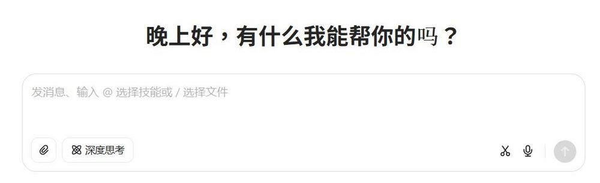
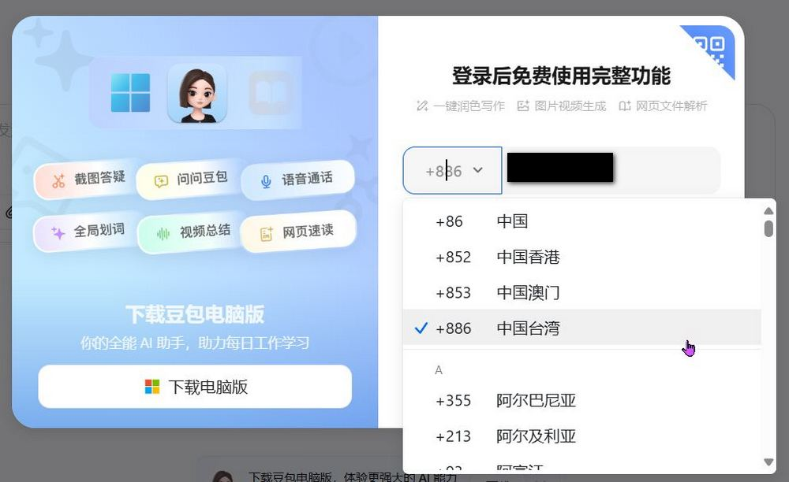
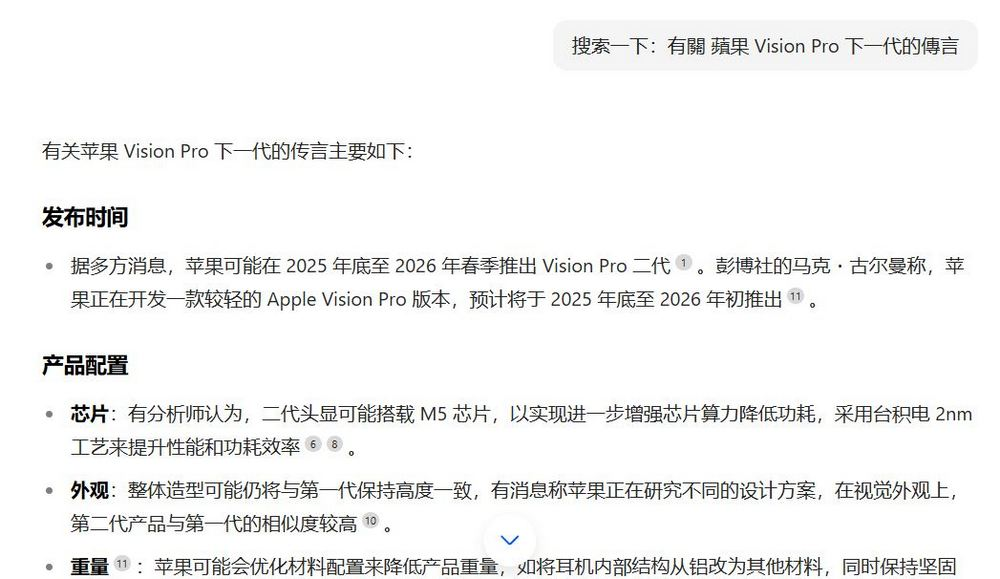
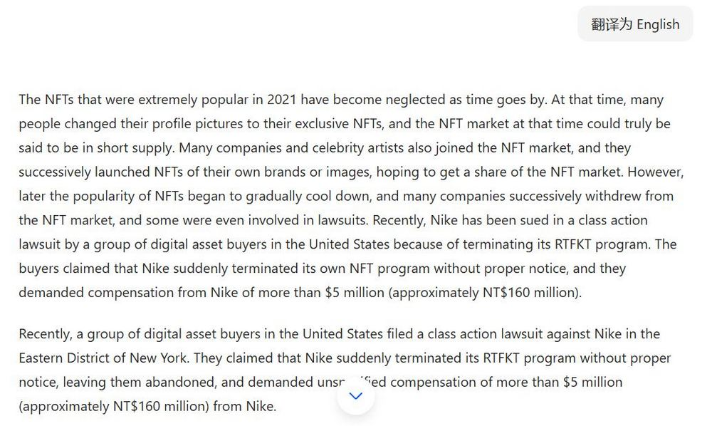
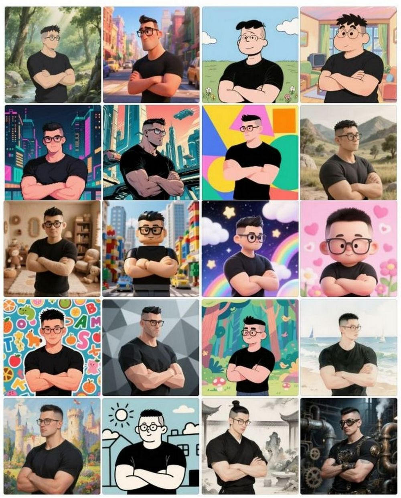
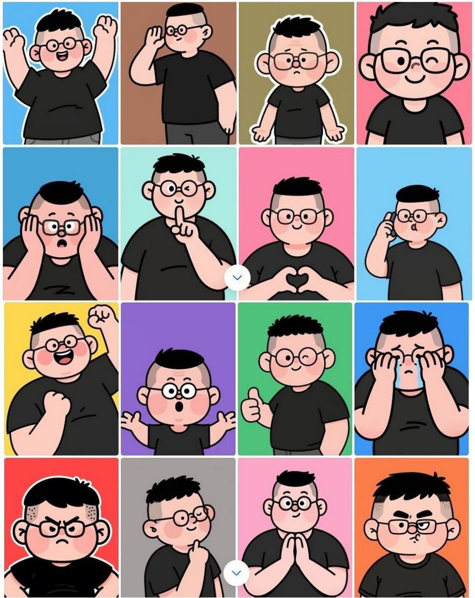
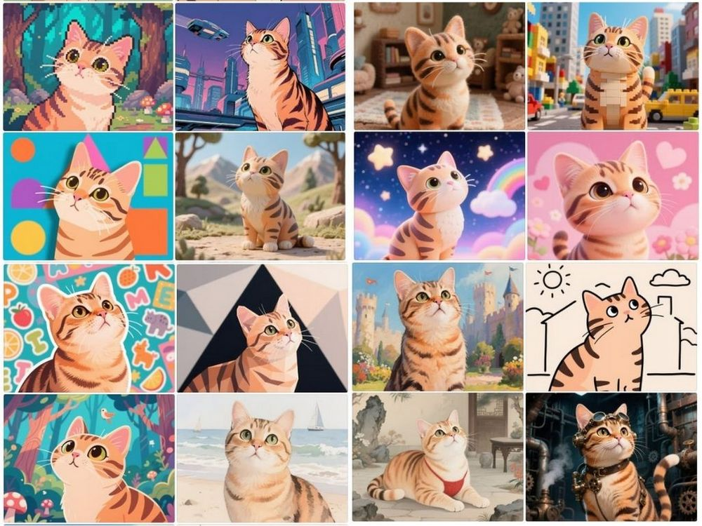
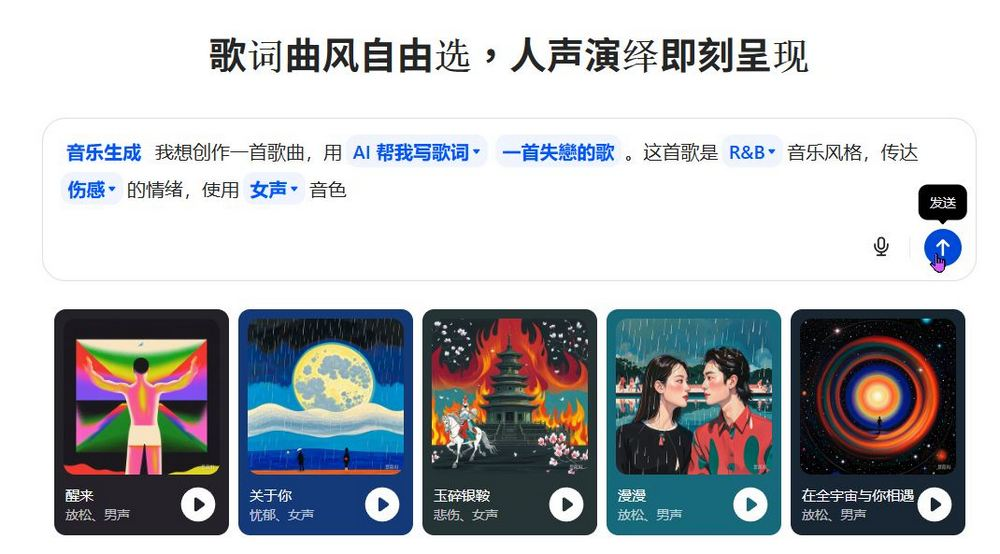

# 豆包 AI 助手全攻略：免費圖片生成、影片製作、翻譯搜尋實測分享

> **來源**：[電腦王阿達](https://www.koc.com.tw/archives/596254)
> **作者**：電腦王阿達
> **發布時間**：2025-04-28
> **抓取時間**：2026-02-26 08:51

---

今天來跟大家介紹由字節跳動推出的多功能 AI 助手「豆包」，雖然豆包 2023 年就推出了，不過我們之前都沒有跟大家分享過豆包有哪些玩法。隨著時間流逝豆包的功能越來越多，現在豆包可以做的事情越來越多，圖片生成、影片生成、翻譯、搜尋、音樂生成等多種功能都可以直接在豆包上操作，且完全免費。有興趣的朋友就繼續看下去吧！

↑ 豆包生成的 20 種風格圖片

## 豆包 AI 助手全攻略：免費圖片生成、影片製作、翻譯搜尋實測分享

「豆包」為字節跳動於 2023 年 8 月推出的多功能 AI 助手，豆包使用字節跳動開發的大型語言模型雲雀，提供文字、圖片、語音、視訊等多模態生成和理解能力。豆包提供網頁版和手機 APP 兩種使用方式，可以在電腦上使用也可以在手機上使用。

### [前往豆包網頁版體驗各種功能](https://www.doubao.com/chat/)

點擊上方連結會前往豆包網頁版，想要使用豆包需要註冊豆包會員。提醒大家豆包為中國公司開發，會介意的朋友可以考慮其他 AI 助手。

#### 搜尋

註冊完之後就可以開始使用豆包，小編測試豆包搜尋的功能，詢問豆包最近有關 Apple Vision Pro 下一代傳言的消息，豆包整理的資訊正確（豆包搜尋的資料均來自中國網站）。

#### 翻譯

除了搜尋功能以外，小編也有讓豆包進行翻譯。將我們寫的「[NFT 泡沫破滅？Nike 結束 RTFKT 計畫遭美國買家控告](https://www.koc.com.tw/archives/596239)」的文章內容交由豆包翻譯，翻譯效果也是不錯的。 

#### 圖片生成

接下來就來到本次介紹的主要重點，在其他 AI 助手只能一次生成一到兩張照片的時候，豆包已經可以一次生成最多 20 張照片。小編請豆包以我的形象生成包含吉卜力、皮克斯等等風格的圖片。因為沒有太多想法所以還請豆包幫我想其他風格，最後要求要 20 種風格的圖片，以下為豆包生成的圖片效果們。豆包圖片生成完全免費且不限次數，大家如果覺得生成的風格不符合要求的話，可以一直重複生成，直到生成的效果自己滿意為止：

* 「使用我的形象幫我生成吉卜力、皮克斯、snoopy、蠟筆小新等風格的圖片，我想要大概 20 種風格，其他風格你幫我想」
* 「使用我上傳圖片的形象生成 20 種 Q 版通訊軟體常用的表情包」
* 「跟據我上傳圖片裡的形象，生為 20 種不同風格圖片」

#### 影片生成

除了圖片生成以外，豆包也提供影片生成的服務。小編使用「一隻蝴蝶從畫面右邊飛往畫面中間，圖片中的貓咪視線跟著蝴蝶走」的咒語來生成影片，大家可以看看效果。提醒大家目前豆包每天只提供 10 次免費影片生成機會，大家如果要生成的話要注意生成次數喔！

#### 音樂生成

豆包還提供音樂生成的功能，只需要按照需求選擇選項就可以生成有人聲的音樂。你可以選擇自己填詞或讓豆包幫你填詞喔！  

其實豆包目前使用下來真的很不錯，而且免費無限次數的圖片生成服務就已經幾乎快打敗市面上提供圖片生成服務的 AI 助手，雖然豆包對於圖片人物神韻捕捉方面沒有 ChatGPT 好，不過豆包可以一直生成，沒有生成數量限制。如果大家不介意中國開發的 AI 助手的話，還是很推薦大家去體驗豆包。有興趣的朋友也可以下載豆包 APP，使用手機還有更多玩法喔！

* [前往 App Store 下載豆包 APP](https://apps.apple.com/hk/app/%E8%B1%86%E5%8C%85-%E4%B8%8A%E7%BA%BF%E6%B7%B1%E5%BA%A6%E6%80%9D%E8%80%83/id6459478672)
* [前往 Play 商店下載豆包 APP](https://play.google.com/store/apps/details?id=com.larus.wolf&hl=zh_TW)

Tags: [ai](https://www.koc.com.tw/archives/tag/ai)[AI 助手](https://www.koc.com.tw/archives/tag/ai-%e5%8a%a9%e6%89%8b)[圖片生成](https://www.koc.com.tw/archives/tag/%e5%9c%96%e7%89%87%e7%94%9f%e6%88%90)[字節跳動](https://www.koc.com.tw/archives/tag/%e5%ad%97%e7%af%80%e8%b7%b3%e5%8b%95)[影片生成](https://www.koc.com.tw/archives/tag/%e5%bd%b1%e7%89%87%e7%94%9f%e6%88%90)

---

*原文連結：https://www.koc.com.tw/archives/596254*
*本文轉載自電腦王阿達（kocpc.com.tw），版權歸原作者所有。*
