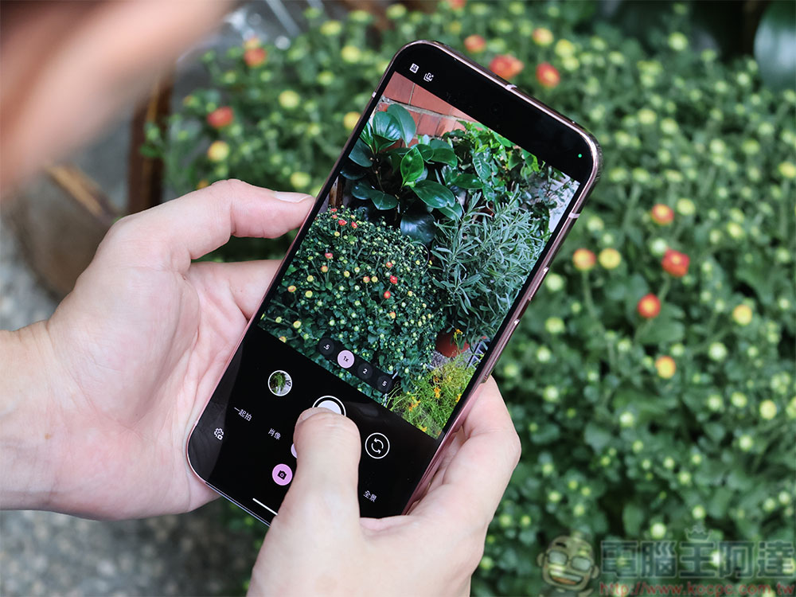
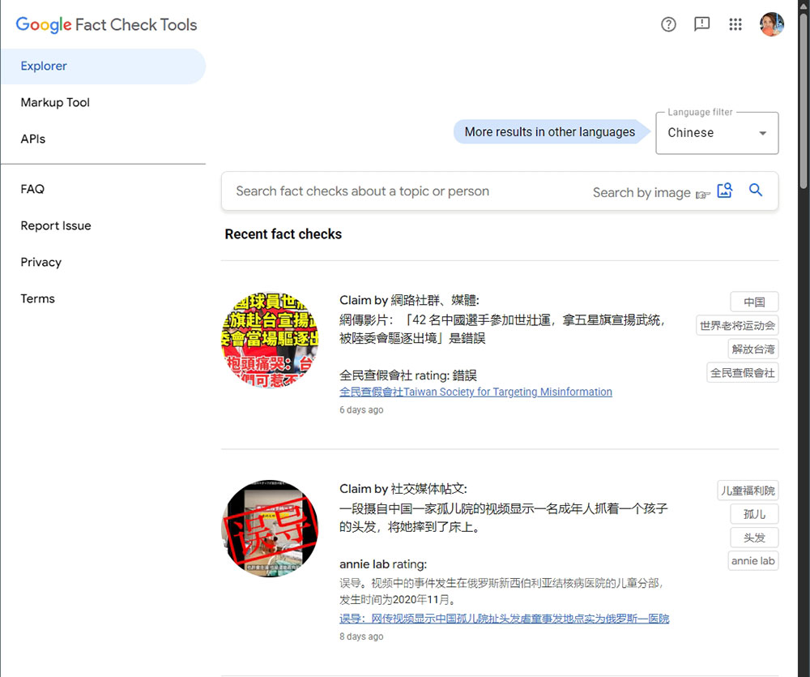
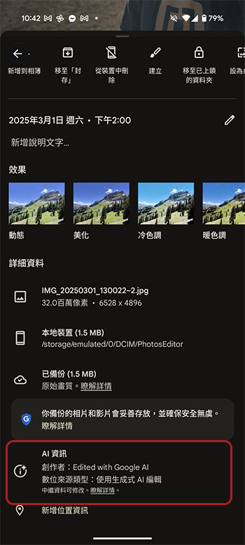

# 難以判斷 AI 圖片？Google 的這些工具可以幫助檢視

> **來源**：[電腦王阿達](https://www.koc.com.tw/archives/601306)
> **作者**：電腦王阿達
> **發布時間**：2025-06-05
> **抓取時間**：2026-02-26 08:51

---

隨著 **[AI](https://www.koc.com.tw/search/AI)** 的進步，普羅大眾想要分辨那些影像是用 AI 生成越來越困難。Google 近年來積極投入開發 Gemini、Imagen、Veo 和 Lyria 等運用 AI 生成文字、影像、影片和音樂，但他們也花了大量時間開發可用來判斷哪些內容是 AI 生成的方法。

## 難以判斷 AI 圖片？Google 的這些工具可以幫助檢視

上個月，[Google 為新的 SynthID Detector 開展了測試階段](https://blog.google/intl/zh-tw/company-news/technology/google-synthid-ai-content-detector/)，該工具可讓用戶確定一段內容是否由 AI 生成。SynthID 利用 2023 年首次開發的一種直接嵌入到 AI 生成內容的圖像中的浮水印，這些肉眼看不到的浮水印不會影響到影像品質與畫面，這就是 SynthID Detector 的用武之地。上傳檔案後，如果發現浮水印，SynthID 將提醒你。

目前測試以[等待名單](https://docs.google.com/forms/d/17AiEqHpgnp7GwsIfQNFLCB-5nSr7YxnLI_4jmm7kBGU/viewform?edit_requested=true)方式候位，有興趣的新聞工作者、媒體專業人士和研究人員可以去排看看，然而 SynthID 也有限制。最大的限制是這只有在 AI 內容是使用 Google 或其 SynthID 合作夥伴之一（如 Nvidia）製作的工具生成時才有效。嵌入 SynthID 浮水印的技術也可以作為開放軟體使用，但不太可能所有 AI 生成平台都採用專用的 AI 識別浮水印。由於 SynthID Detector 尚未正式推出，你還可以用一些現有的 Google 工具，這些工具可能會幫助你發現 AI 生成的圖像。

## 你還可以用 Fact Check Tools 來核查

如果你對在網上找的的照片來源持懷疑態度，Google 的 Fact Check Tools 讓你有機會瞭解是否有任何經過驗證的事實核查組織已經調查過。想要使用它，請進入 [Fact Check Tools 網頁](https://toolbox.google.com/factcheck/explorer/search/list:recent;hl=zh)，上傳照片或黏貼 URL，接下來該工具會編譯來自世界各地的檢查結果，並提供有關影像在不同來源和時間點內的使用和說明的見解。這用在突發新聞中會非常有幫助，因為舊照片或不相關的圖片經常會反覆出現，並且在附帶誤導性說明的情況下傳播。你可以輕鬆瞭解 AI 生成的影像。

如果你在 Google 圖片或智慧鏡頭上搜尋照片，還可以用「關於這張圖片」選項瞭解更多資訊。要使用此功能，請在 Google 搜尋上傳照片搜尋後，點擊「關於這張照片」，你可以看到特定影像在網路上已經流傳多久的時間，藉此，你可以簡單粗暴地以時間判斷照片是不是由 AI 生成，像是下面這張圖片已經使用至少 5 年以上，很明顯就不會是 AI 機器人所創造。

## 從 Android 手機檢查照片

你可以使用的另一種現有工具就是 Google 相簿裡面的照片詳細資料。儘管這些資訊之前都是記錄在後台，但 Google 在去年進行了一些變更好讓用戶更容易找到這些資訊。現在在詳細資料中包含了檔案名稱、位置和備份狀態，此外還多了一項「AI 資訊」。如果你在手機上使用 Google 的照片 AI 功能，例如魔術橡皮擦、重新構圖、魔術編輯等，詳細資料裡面會將照片標記為 Edited With Google AI，並且看到是以哪種方式進行編輯。

想要查閱此資訊，只需點開照片、按住並且往上滑動畫面即可看到詳細資訊面板。

但這還是有些侷限性，你可以在自己的手機上在你編輯過的照片中輕鬆驗證，但是當把照片分享出去或在社群平台上發表時，這些資訊就會遺失，這裡並不表示標示沒了，AI 資訊只是從詳細資訊部分中隱藏起來，讓你更難找到，如果打算完全隱藏原始資料的人可以試著這樣迂迴的動作。

Tags: [ai](https://www.koc.com.tw/archives/tag/ai)[Google](https://www.koc.com.tw/archives/tag/google-2)[工具](https://www.koc.com.tw/archives/tag/%e5%b7%a5%e5%85%b7)

---

*原文連結：https://www.koc.com.tw/archives/601306*
*本文轉載自電腦王阿達（kocpc.com.tw），版權歸原作者所有。*
