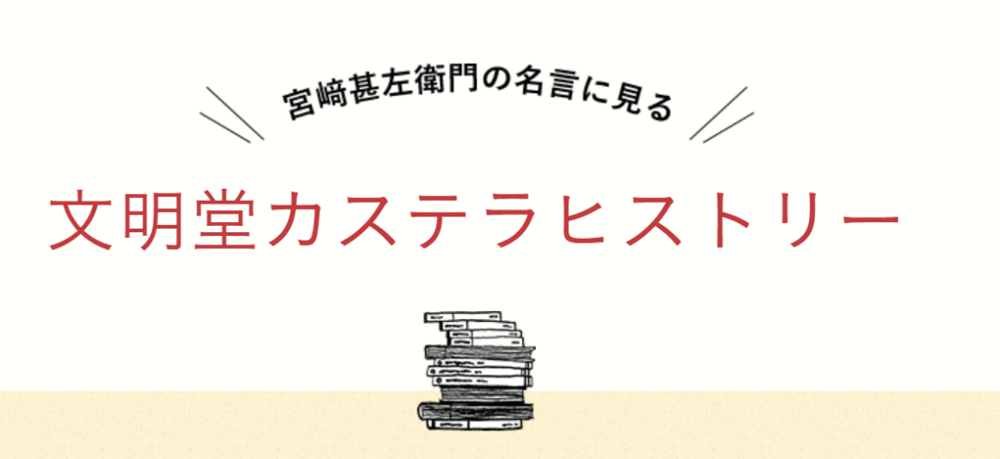
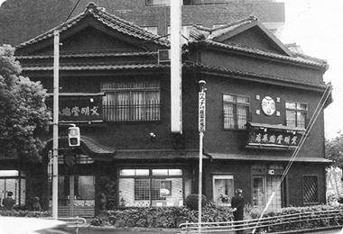
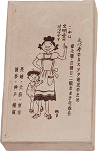
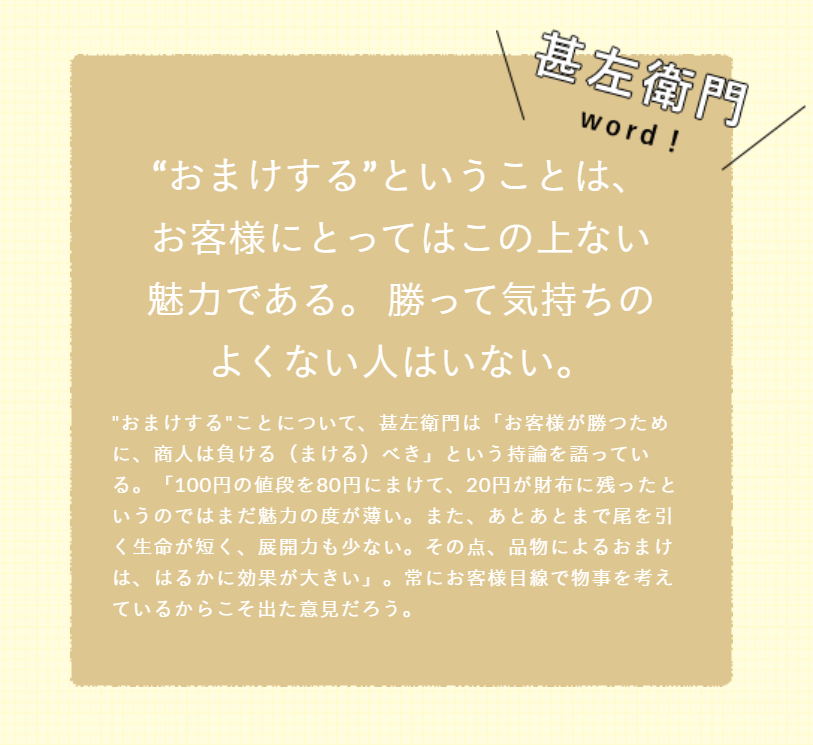
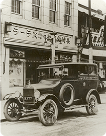
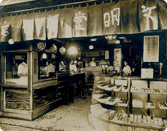
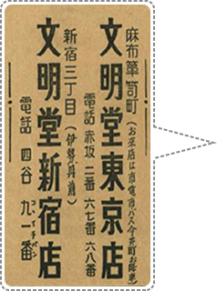
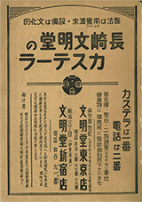
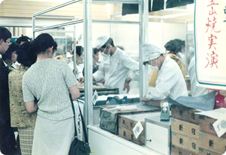

# カステラの文明堂（一）文明堂的历史

> **作者**：小蜜
> **發布時間**：未知
> **轉發時間**：2024-02-25 09:26（by ShawnCH）
> **原文連結**：[點擊查看原文](http://mp.weixin.qq.com/s?__biz=MzAwMzMyODQ2OQ==&mid=2247483891&idx=1&sn=9a86e0d3e2128007a5dc4cda7869f72a&chksm=9b3d9149ac4a185f6a504f64383bc562ba0a3bbd5812a9eef2de58d868211134ddd2f1394fba&mpshare=1&scene=1&srcid=0225e7rE2nCCwOXxxX8XEgda&sharer_shareinfo=00938c0dcc0c0b8c60bbad5ce088e0e7&sharer_shareinfo_first=00938c0dcc0c0b8c60bbad5ce088e0e7#rd)
> **標籤**：生活其他

---

说起我对【文明堂】的印象，还是十几年前在大阪的时候。一日，与朋友结伴而行去梅田的百货店，偶然看到这款“卡斯泰拉”（日文名的谐音）蛋糕。柜台上摆放着整整齐齐、颜色鲜明的卡斯泰拉蛋糕，金黄色的胚体、茶褐色的表皮、精美的包装，瞬间吸引了我。后来有一次在老师家做客，老师请我们吃卡斯泰拉蛋糕，我一看，正是刚才所说的“文明堂カステラ”，与老师谈话中，我才知道文明堂的和果子在日本人心目中的重要位置。

今天我（大家也可以叫我小蜜，喜欢甜蜜的蜜哦）来给大家讲讲文明堂的发展历程吧，希望能够为在炎炎夏日工作的大家，带来一份干劲儿与甜蜜。

文明堂的故事是这样开始的~

1900年（明治33年），宫崎甚左衛門的哥哥中川安五郎在长崎县创建了文明堂。

1908年（明治41年）的时候，18岁的甚左衛門离开故乡岛原到了长崎，开始到哥哥的店里工作，从长崎店面的扩大到进军东京，不论风雨、不分昼夜的热心于这份甜蜜的事业。

1922年（大正11年）甚左衛門正式在东京的百货店设店，采用新颖的想法，最先开始在日本百货店里进行现场制作、展示，当时轰动一时。在得到现场展示的好评后，甚左衛門又推出【增量服务】，所谓的“增量服务”是指购买卡斯泰拉后，会免费赠送给客人相当于购买量的2成的卡斯泰拉。给人以高价印象的卡斯泰拉可以得到实物赠品的服务，一下子引起了很大的反响。

昭和30年頃、カステラ2割増量のおまけに使われたサザエさんの箱

“赠送”-我想没有比更有魅力的了。没有人是不想赢的。---宫崎甚左卫门

1923年（大正12年）在百货店的店铺开业后一年半，正在店铺踏上轨道的时候，一场突入其来的关东大地震，将整个百货店全部烧毁，当然也就包括自己在百货店里的店面。被迫无奈，甚左衛門全家只能搬回长崎，但是这次他并不想在长崎久待，于是在16天的修正后，甚左衛門又带着全家再次返回东京，在百货店找到合适的位置，业绩也慢慢开始展开。

1925年（大正14年）以实际演出和增加量服务等革命性的销售方法为契机，文明堂的业绩不断上升，在这一年里，他被任命为当时商人中最有名誉的“宫内省御用达”，相当于天皇宫内省的御用承办商，这是一份很高的殊荣。

1926年（大正15年），甚左衛門又想出一个新颖的方法，购买了一辆汽车，为和果子进行配送。在当时那个年代，用这种稀有的汽车来进行和果子的配送，是一件非常令人轰动的事情。

麻布店と配達用自動車

1928年（昭和3年）因为某原材料厂“挖墙脚”将当时开在百货店里的文明堂匠人花了两倍的工资挖走，这给文明堂带了损失，这让甚左衛門产生了强烈的危机意识。单单只在百货店有店铺的知名度还是太低，必须要拥有属于自己的门店，让街上人来人往的客人也能够注意到他们才可以。

1933年（昭和8年），于是从这一年开始甚左衛門先后在新宿、神户、横滨、银座开设了自己的门店。

新宿店

1937年（昭和12年）文明堂的标语诞生了→【卡斯泰拉1号、电话2号】。并将各区域电话局的2号统统买下，并在电话簿上用非常大的页面刊登了文明堂的标语，这也是甚左衛門的一个名案，被当时广为流传。

1941~1945年，因为战争带来的影响，文明堂卡斯泰拉的“增量服务以及生产”先后被破停止，更令人想不到的是1945年东京大空袭，将文明堂银座店、新宿店、麻布店全部烧毁。甚左衛門并没有放弃，从零开始，重新启程。3年间他开着汽车穿梭在东京的大街小巷，也得到大家的多方援助，最终得以重建。

1950年（昭和25年）因为过度疲劳，甚左衛門生病入院，但是这并没有让他退却，次年他在日本桥设店，因战争影响持续停止的现场制作演示终于得以开始。另外，着眼于“东京的名产什么都能买到”这一点，甚左衛門埋头于日本第一个百货地下“门帘街”的实现化。为了尽力显示出效果，在各百货公司的邀请下，各系列店也纷纷开业。

                                               百貨店での三笠山の実演

就这样，经历了明治、大正、昭和时代的甚左衛門通过不懈努力跨越了许多苦难，最终给人以高级品印象的卡斯泰拉，作为一种亲切的国民点心，在全国普及开来。那种热情至今仍作为文明堂的教训深深地渗透着整个企业。

大家在看过了宫崎甚左衛門经营的文明堂历史后，是不是更想一览文明堂的和果子呢，下一篇小蜜（Miya）将会带大家看一下，运用了100多年传承下来的长崎制法，制作的【文明堂の特撰五三卡斯泰拉蛋糕】及和果子的魅力吧！（→カステラの文明堂（二）文明堂のお菓子）

图片来源：日本文明堂

 -END-

   

更多讯息请扫描下方👇二维码关注公众号哦~

---

*本文由 ShawnCH（何智翔）轉發，透過微信聊天記錄自動提取並整理。*
*原文連結：http://mp.weixin.qq.com/s?__biz=MzAwMzMyODQ2OQ==&mid=2247483891&idx=1&sn=9a86e0d3e2128007a5dc4cda7869f72a&chksm=9b3d9149ac4a185f6a504f64383bc562ba0a3bbd5812a9eef2de58d868211134ddd2f1394fba&mpshare=1&scene=1&srcid=0225e7rE2nCCwOXxxX8XEgda&sharer_shareinfo=00938c0dcc0c0b8c60bbad5ce088e0e7&sharer_shareinfo_first=00938c0dcc0c0b8c60bbad5ce088e0e7#rd*
