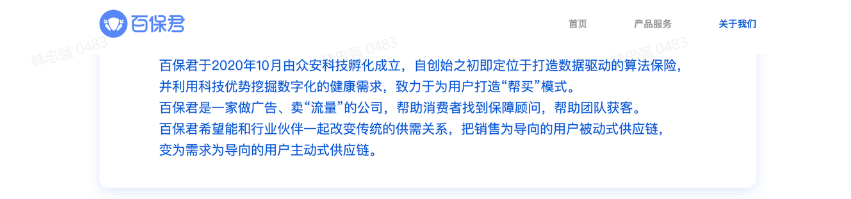
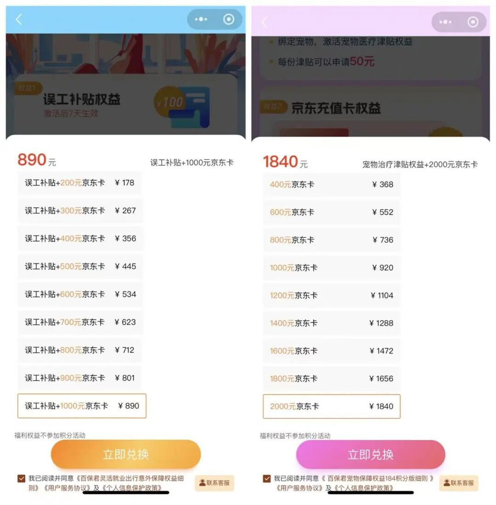
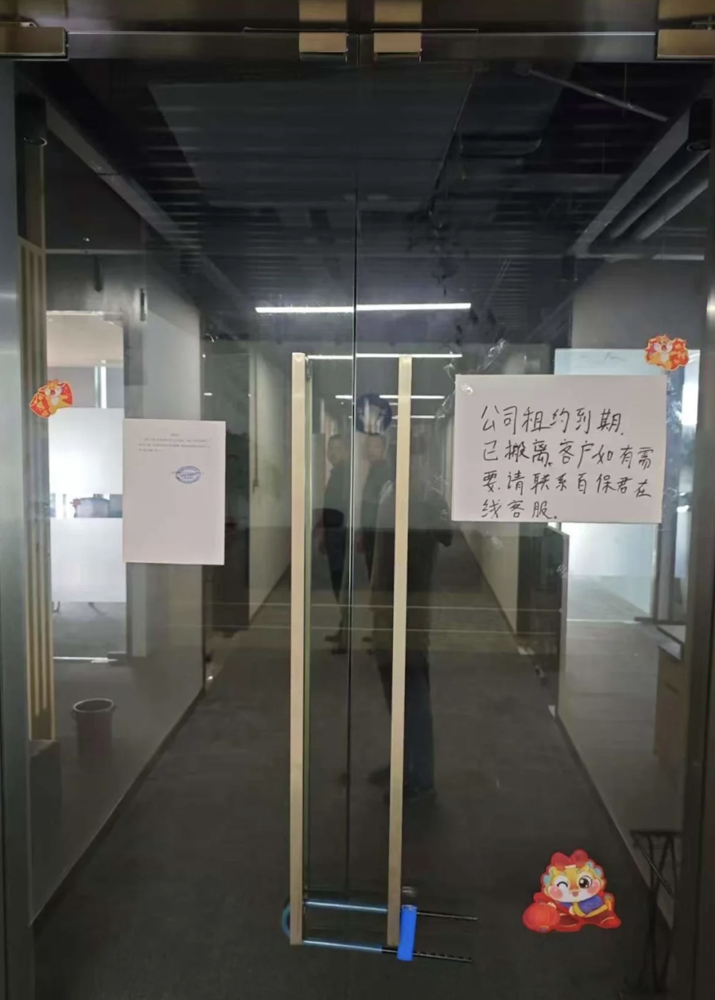
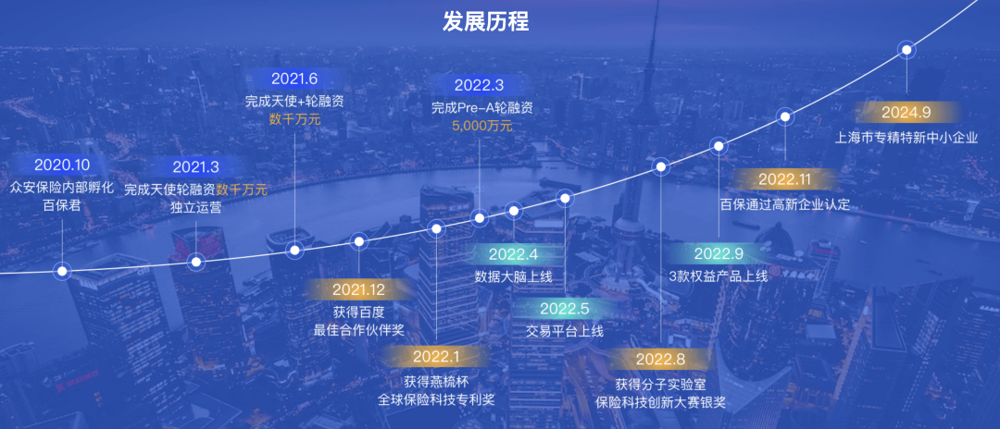
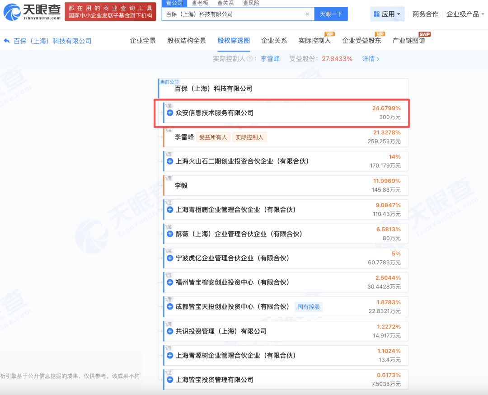

# “保险界明星”百保君翻车，殃及众安保险

> **作者**：财天早知道
> **發布時間**：未知
> **轉發時間**：2025-12-03 10:27（by ShawnCH）
> **原文連結**：[點擊查看原文](https://mp.weixin.qq.com/s/5Cfgq2QR949zkEDaHq2_eQ)
> **標籤**：保險理賠

---

---

**作者 | 陈小喵**

****编辑 | 大远****

**图片来源****|****视觉中国**

“我惦记你的收益，你惦记我的本金。”近日，这样的戏码在一家名为百保君的公司身上再次上演。据多家媒体报道，成立5年的“保险界明星”百保君陷入停摆、跑路及用户资金兑付危机。

之所以称之为“保险界明星”，是因为百保君在官网上写道，公司于2020年10月由众安科技孵化成立。而众安科技是众安保险的全资子公司。众安保险全名为众安在线财产保险股份有限公司，公司于2017年9月在港股上市，目前市值250亿港元，中国平安、腾讯、蚂蚁集团都是它的大股东。

声称有实力派港股上市公司做背书，在圈内，百保君自然更容易获得用户信任。

万事皆有两面性。顶着众安保险的光环，百保君知名度大，如今出事，众安保险也受到关注。

 

### 买1840元产品，返2000元京东卡

## 

百保君是百保（上海）科技有限公司旗下平台。百保君并不是卖保险的，官网上，其自称是一家做广告、卖“流量”的公司，帮助消费者找到保障顾问，帮助团队获客。

在2021年一篇保险行业媒体“保观”对百保君的专访文章中，百保君的业务模式被详细展开介绍。文章写道，保险行业存在获客难、缺乏流量入口、客户满意度低等痛点，百保君的模式更像一个撮合器，连接了用户和保险供应商。

具体来讲，百保君和各个流量平台合作，带来用户流量。比如，在百度等平台入口，搜索“我要买航延险”“宠物险怎么买”等类似关键词、关键句，就能导入到百保君的保险服务。而百保君作为第三方平台，引入更多保险服务商的同时，会根据用户的需求，提供适合用户的保险产品和服务。

整个过程中，百保君的盈利模式是以保险产品的销售分成为主。官网显示，百保君的合作方有中国平安、国华人寿等。

为了从各大保险公司手里赚取分成，百保君的“撮合”工作十分卖力。

在百保君小程序上，用户购买一款标价89元的“灵活就业出行意外保障权益”产品，如果在2个月有效期内出现意外险理赔，可申请误工补贴。每次申请补贴，最高为意外险或医疗险理赔赔付金额的5%，且最高为100元。

以上只是权益之一“误工补贴”，权益之二是京东卡——用户购买日后60天至65天，可领取100元京东卡1张。以此类推，买够178元“灵活就业出行意外保障权益”产品，则可获得误工补贴+200元京东卡，买够267元则可获得误工补贴+300元京东卡，最高上限是买够712元，可获误工补贴+800元京东卡。

再以一款标价184元的“宠物保障权益”产品为例，用户购买后同样享受“宠物治疗津贴”和“京东卡”两项权益。其中，每份宠物治疗津贴最高金额50元，京东卡权益则是在购买日45天至47天之间领取，可领2张100元京东卡。产品最高购买上限是1840元，而相应的用户可获宠物治疗津贴和2000元京东卡。

# ▲百保君小程序截图

简单总结，就是用户通过百保君平台花712元购买保险产品，除了保险权益外，还可获得800元京东卡；花1840元购买保险产品，除了保险权益外，还可获得2000元京东卡。保险权益白用，自己还能反向分别获利88元和160元。用用户的话说，“白吃饭还发钱”。

京东卡之外，百保君还有积分权益供用户选择。比如标价94元的“住家护理保障权益”，用户购买后可获得最高100元的护理津贴，同时在购买日60天至65天之内，可领取100元积分。积分可用于兑换其他权益产品或京东卡。

为了鼓励用户自发推广产品，百保君平台上还挂有“邀好友得积分”页面，邀请者每成功邀请一名用户下单后，可获得不同数量的积分奖励，比如推广成功前述“住家护理权益”产品可以获得3个积分。

如此“高额返利”的模式诱惑下，用户纷纷通过百保君下单购买保险产品。在一个超200人的“百保交流群”中，有用户发消息称，购买七八十万元的人很多，上百万元的也有。

### “高额返利”模式出问题了

然而，就在今年9月中旬，用户发现，百保君出问题了。有人反映，“领不到京东卡了，官方只会不定时放一些出来，要抢，时间点还不固定”。一些按捺不住的用户跑去百保君位于上海的公司，看到还在运营，猜测恢复正常只是时间问题。

就在用户忐忑之际，9月25日，百保君给用户发布了一则《关于权益卡用户退款及到期京东卡领取方案》公告。公告称，“近日因我司供应商调整原因导致未能及时满足客户领取京东卡相应权益，9月24日在场客户强烈诉求，我司职场园区驻点干部和社区民警在旁鉴证下，我司与客户代表协商一致，现将最近退款用户及未领取京东卡用户做统一通告”。

通告内容主要针对两部分人群，大致是对9月24日前完成退款核算单确认的用户进行分批退款，对其他用户则自9月25日起自动发放“已到期未领取”的京东卡。

# ▲百保君用户晒图

从后续用户的反馈来看，该方案的实施并未打消用户疑虑。10月8日，有用户称，只发了8张京东卡，还有42张没发。

11月2日，百保君再发《权益卡退款公告》。公告称，因平台产品结构调整原因，现针对目前已销售的权益卡进行统一退款处理。公告提到，方案公布后系统将关停所有领卡功能；由于资金到位的波动性，退款操作不定期进行，可能一天多次，也可能两三天操作一次。

11月7日，百保君的退款页面上线。用户填写姓名、身份证、手机号实名信息后，即可显示可退总本金、可退总利润，用户阅读退款协议，完成退款授权，即可等待资金到账。退款协议显示，兑付周期为2025年11月至2026年6月，分4个阶段完成。

针对退款进展事宜，一位组建了多个百保君交流群的用户表示，“群里每天有上千条信息。据我所知，钱退不了。”该用户所在的其中一个群中传出消息称，“目前涉案金额超1亿元，涉案人数约9000人”。

### 众安保险是否应该担责？

百保君的发展历程十分顺利。

2020年10月百保君由众安科技孵化成立，2021年3月即获数千万元天使轮融资，由火山石资本（Volcanics Venture）领投，青橙鹿资本、青源树资本跟投。同年12月，公司拿到天使追加轮融资。

2022年3月，百保君宣布完成5000万元人民币Pre-A 轮融资，由青橙鹿资本和虎亿资本联合领投，老股东火山石资本等继续跟投。公司称，该轮融资将继续主要用于进一步推动技术研发和加速商业模式推广。2024年9月，百保君官网显示，公司为“专精特新中小企业”。

没想到，正是这样一家曾被市场看好的企业，在2025年的秋冬迎来危机。

北京市中盾律师事务所张秀红律师认为，百保君“权益产品+超额返京东卡+积分兑换”模式，从法律角度看，已脱离正常保险增值服务范畴，实质构成变相吸收公众存款，涉嫌非法集资或集资诈骗。

张秀红律师给出了具体理由：首先，该行为资金池特征明显，用户支付资金购买“权益”，平台承诺远期高额返还，形成资金沉淀池；其次，利诱性特点突出；最后，具有庞氏骗局特征，平台无真实盈利来源，本质是“借新还旧”。

百保君陷入危机之际，有用户坦言自己当时，“是冲着众安来的”。

如今，众安保险是否在百保君爆雷事件中负有责任呢？

据第一财经报道，众安保险11月12日回复称，旗下子公司众安科技已转让百保君运营方百保公司全部股权。众安保险表示，众安科技以无形资产评估作价投资，但未参与实际经营管理。百保公司（指百保君）自2023年起不再反馈经营情况，众安科技已于2024年决定退出百保公司，并于2025年5月与百保公司其他股东签署了股权转让协议，转让了持有的全部股份。

“近期，我司接到百保用户反馈后了解到该事件。据了解，公安机关已经立案调查，目前处于侦查阶段。我司同属受害者，正持续关注案件调查情况。”众安保险称。

天眼查显示，众安科技持有百保君24.6799%股份，百保君董事长、法人、实控人、关键决策人员名叫李雪峰，曾在众安科技担任CTO（首席技术官）。

北京京本律师事务所主任连有称，根据《公司法》第147条，股东对公司负有忠实义务和勤勉义务。即使2024年内部已作出退出决策，在股权登记变更完成前，众安科技仍是法律意义上的股东，应履行股东的义务，需对公司的异常经营行为进行必要的监督和干预。

据了解，在“百保交流群”中，不乏今年6月份从百保君购入产品的用户，距离众安保险所提到的“5月转让全部股权”的时间点，相隔时间仅1个月左右。

---

*本文由 ShawnCH（何智翔）轉發，透過微信聊天記錄自動提取並整理。*
*原文連結：https://mp.weixin.qq.com/s/5Cfgq2QR949zkEDaHq2_eQ*
