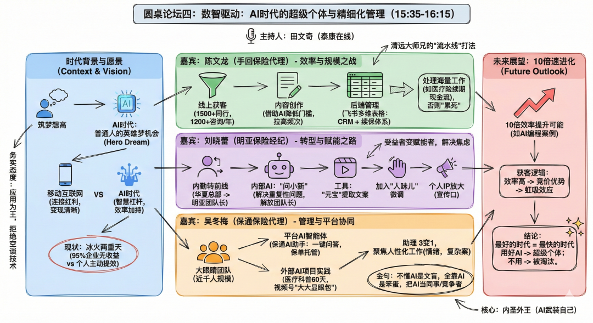

# AI时代的保险双向奔赴：保司战略如何精准接住“超级个体”的野心？

> **作者**：奇文天翔
> **發布時間**：未知
> **轉發時間**：2026-01-15 23:25（by ShawnCH）
> **原文連結**：[點擊查看原文](https://mp.weixin.qq.com/s?__biz=MzI4MzY0MjM0Mw==&mid=2247483729&idx=1&sn=23e2f23fc0808aecc7145300d8454d1e&chksm=ea60af4f5811ca237dcd7e301ba8d101c5ef1bc2ad4362fa95e094959b555399e649cbf3e897&mpshare=1&scene=1&srcid=0115Q5MO6YUu2AHVKWTtH9qg&sharer_shareinfo=187829e16b81591ad57f40bd142399e0&sharer_shareinfo_first=1b3f50db656bc0437e851df6028248af#rd)
> **標籤**：保險理賠, AI科技, 行業分析

---

在昨天结束的分子实验室保险论坛上，我主持了一场关于“AI时代超级个体”的圆桌。即便是在下午茶的休息时段，现场依然有很多参会人员热情参与。

作为一名保司AI应用的负责人，也是一名跨越互联网与保险行业、有着18年经验的“老产品人”，我能清晰感受到那种渴望。大家不再讨论AI会不会取代保险人，而是在问：“我如何才能借AI之力，实现产能的十倍跃迁？”

但现实却是冰火两重天，正如MIT去年8月出炉的AI商业报告中揭露的令人意外的情况：企业在生成式AI上的投入高达数百亿美元，其中95%没有产生任何投资回报。换言之，大多数公司并未从AI中看到降本增效的效果。这份报告也发现了另一个有趣现象：超过九成的员工在背地里使用个人AI工具来提高工作效率。

保险行业也难逃这个魔咒，一方面是保司豪掷千金的AI战略投入，另一方面却是绝大多数应用尚未产生实质收益。

# 一、 “超级个体”的觉醒：从自发应用到生产力重构

在圆桌环节，三位嘉宾展示了真正的“数智驱动”长什么样：

陈文龙（青云大师兄）利用AI内容矩阵实现千人级的获客引流；刘晓蕾通过AI工具极速拆解视频实现个人IP的高频输出；吴冬梅则通过AI助手将千人团队的管理助理从3人减至1人。

这些“超级个体”不再等待保司或机构的指令，他们自行在机构苦心设计的IT系统之外，构建了一套敏捷的“数字生产线”。这种觉醒，本质上是保险一线生产力对陈旧管理范式的倒逼。

# 二、 战略错位的根源：别用“移动互联网”的药方，解“AI”的题

为什么保司投入巨资，却往往“好心办了坏事”？我的观察是：大多数保司还在用移动互联网时代的思维方式做AI。

在移动互联网时代，逻辑是“找场景”：发现一个可以移动化的场景（如在线理赔、移动投保），实现后就能产生收益。但AI的逻辑是“生产力耦合”，它不仅仅是把业务搬到网上，而是深度重构作业流程。

要跑通AI业务闭环，必须在战略层面把握两个核心判断：

## 1. 复杂度 vs. 能力边界的动态博弈

我们需要精准评估AI的闭环解决能力与业务场景复杂度之间的分寸：

低复杂度场景（AI能力覆盖）：目标是“替代与降本”。例如基础客服，AI可以独立闭环。

高复杂度场景（高价值销售）：目标是“提效与赋能”。由于涉及到复杂的人格信任和方案博弈，AI无法独立闭环。这时候，要做好就得把握好AI和人协作的分寸。

## 2. 传统IT人才模型的失灵

这是很多保司无法逾越的“人才断层”。传统IT人才擅长的是“功能实现”，只要业务提需求，IT负责做到系统里。

但在AI时代，做好AI应用需要的是“AI业务架构师”：他既要懂AI的能力边界在哪里（不乱开空头支票），又要对业务场景有极深的理解，能设计出人机协作的最优路径。这种混合型的能力模型，显然是传统IT路径很难培养出来的。

# 三、 双向奔赴：保司如何精准接住个体的野心？

真正的数智驱动，应该是保司提供“肥沃土壤”，精准赋能那些有野心的超级个体。我认为保司战略需要实现三个转向：

1.从“场景迁移”转向“生产力耦合”

保司不再是机械地把AI塞进现有流程，而是要根据AI的能力重新定义流程。例如，不再是“AI辅助写文案”，而是构建“基于产品、核保、理赔等业务环节的AI内容生产中心”，直接为一线提供高价值素材。

2.构建“有分寸感”的人机协同闭环

保司的AI系统应成为超级个体的“Copilot（副驾驶）”。在高价值销售场景中，AI负责处理繁琐的条款对比、保单托管、初级核保；而将决定性的、有温度的成交环节留给超级个体。

#### **3. 重新定义 IT 与业务的边界：引入“前线工程师”模式**

保司需要意识到，AI 时代的 IT 不再是坐在后方办公室里等需求文档的支撑部门。

这里我特别想引入硅谷大数据巨头 **Palantir** 的做法。他们最核心的资产不是代码，而是 **FDE（Forward Deployed Engineer，前线部署工程师）**。这些工程师不坐在总部，而是直接“空投”到客户的业务一线，在最真实、最混乱的场景中发现问题并现场解决。

对于保险 AI 落地而言，我们也急需这种“前线化”的重构：

* **从“接单员”转向“战友”：** 传统的“业务提需求 -> IT 做功能”的瀑布流模式已经死在了移动互联网时代。AI 时代需要工程师像 FDE 一样，观察超级个体是如何用“土办法”在微信群里运营客户的，然后敏锐地判断：哪里该用大模型自动回复（降本），哪里该给业务员推送精准的业务分析（提效）。
* **弥补“分寸感”的缺口：** 只有像 FDE 这样深度沉浸在一线，才能把握好 AI 与人协作的微妙分寸。这种分寸感不是靠看 PPT 练出来的，而是靠在业务数据里滚出来的。
* **重塑能力模型：** 保司未来的 IT 领军人物，必须是具备“工科底色 + 产品思维 + 业务敏感度”的复合型物种。他们不是在做系统，而是在为超级个体打造一套贴合肉身的“机甲”。

# 四、 结语：超级个体是AI智能体最好的“产品经理”

通过这两年多的大量AI应用的实践，我始终认为：最好的AI应用，一定诞生在听得见炮火的一线。

那些正在崛起的“超级个体”，其实就是我们AI智能体最好的“产品经理”。保司需要做的，是放下傲慢，用更懂业务的逻辑、更具分寸感的协同，精准接住这些个体的野心。

作为一名曾经误打误撞进入互联网保险行业的人来说，一直期待有一天能深度参与到这个行业的变革中来。在这个 AI 时代，我却愈发深刻地意识到：**变革的答案往往不在高耸的战略云端，而在每一个个体借助 AI 进化为“超级个体”的微观瞬间。** 这种由内而外的重塑，才是行业最深刻、最不可逆的进化。

对于AI应用感兴趣的朋友可以添加我的微信，备注好“所在公司-岗位”，我希望可以毫无保留的分享我对于AI应用的实践和思考，也希望能同更多朋友交流各自的AI实践经验，分享帮助到更多的行业伙伴。

---

*本文由 ShawnCH（何智翔）轉發，透過微信聊天記錄自動提取並整理。*
*原文連結：https://mp.weixin.qq.com/s?__biz=MzI4MzY0MjM0Mw==&mid=2247483729&idx=1&sn=23e2f23fc0808aecc7145300d8454d1e&chksm=ea60af4f5811ca237dcd7e301ba8d101c5ef1bc2ad4362fa95e094959b555399e649cbf3e897&mpshare=1&scene=1&srcid=0115Q5MO6YUu2AHVKWTtH9qg&sharer_shareinfo=187829e16b81591ad57f40bd142399e0&sharer_shareinfo_first=1b3f50db656bc0437e851df6028248af#rd*
