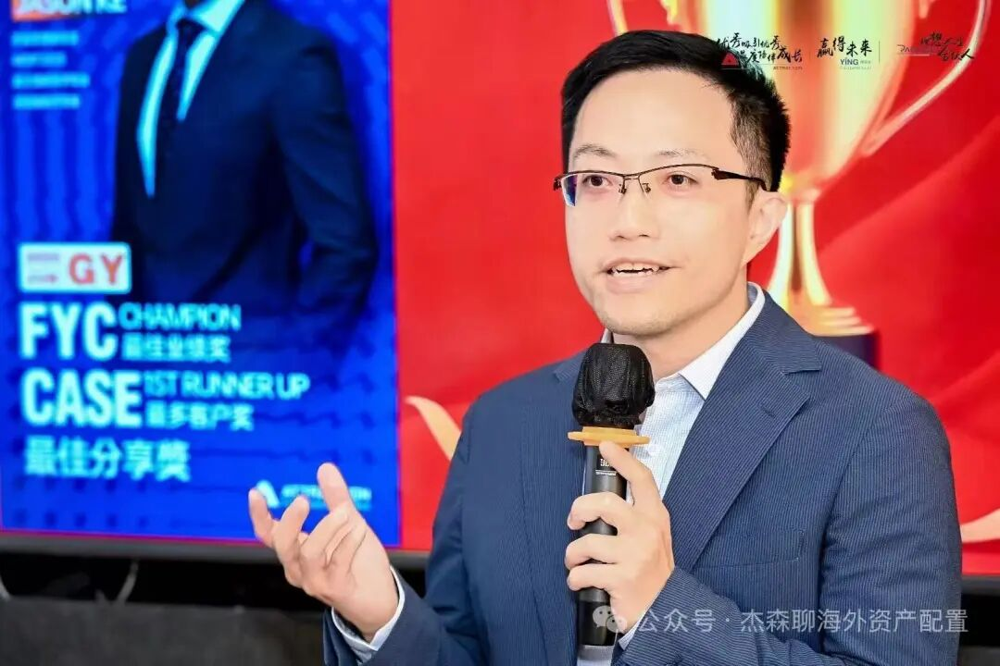
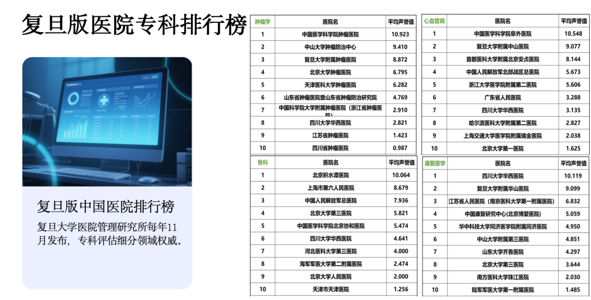
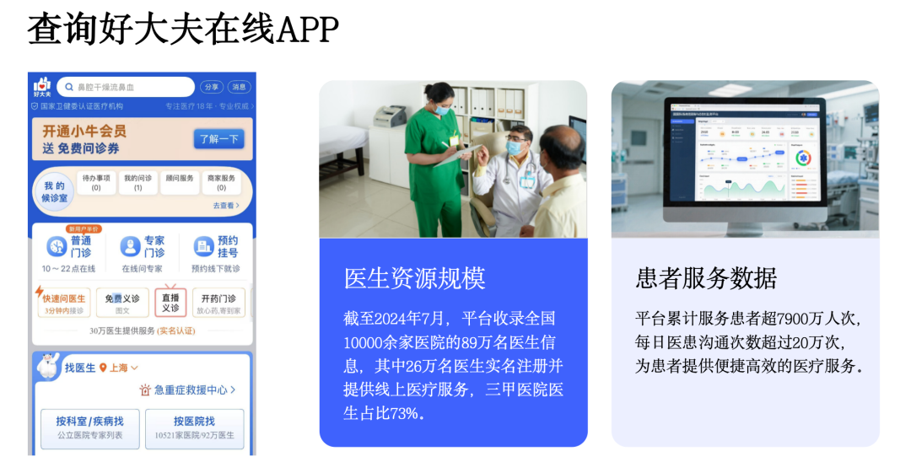
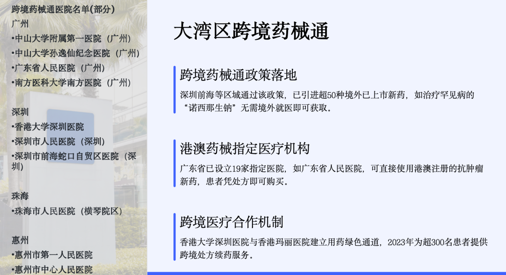

# 从药企总监到保险精英的分享，如何像内行一样，找到好医院和好医生

> **作者**：杰森
> **發布時間**：未知
> **轉發時間**：2026-01-22 10:47（by ShawnCH）
> **原文連結**：[點擊查看原文](https://mp.weixin.qq.com/s?__biz=Mzg5NTA4NTI5OQ==&mid=2247485132&idx=1&sn=9286148d79a104149dec96802341b17a&chksm=c14eae333132e129745ed7175422f436adb10dde564ea46a481d0504568df7af4bbe67bd08ce&mpshare=1&scene=1&srcid=0122PA9IabyBckH4uXmpq4Ei&sharer_shareinfo=fd2b5cb4bee0b01fe5fec43e5021db82&sharer_shareinfo_first=fd2b5cb4bee0b01fe5fec43e5021db82#rd)
> **標籤**：保險理賠, 醫療健康

---

昨天在公司内分享了我从医药行业转行香港保险的经历，以及如何像内行一样，找到好医院和好医生的心得，汇总一下也供大家参考

如何像内行一样，找到好医院和好医生？

生病了去哪家医院？挂谁的号？这是最让人头疼的两件事。别再盲目搜索或听信广告了，试试这几个内部人士常用的“地图”。

1. 找医院：认准“官方指南”和“民间榜单”

国家卫健委重点专科名单：这是最权威的“国家队”名单。比如内分泌科，北京协和、上海瑞金就是公认的“国家队”主力。查询路径：国家卫健委官网。

复旦版医院专科排行榜：这是我个人最推荐、使用频率最高的“就医神器”。你可以把它理解为 “医院界的米其林指南”。每年11月，复旦大学医院管理研究所会发布最新榜单，对全国几十个专科进行排名。

例如，最新排行榜显示：心血管病前三：北京阜外医院、上海中山医院、北京安贞医院。

肿瘤前列：中国医科院肿瘤医院、中山大学肿瘤中心、复旦大学附属肿瘤医院等。

骨科：北京积水潭医院、上海第六人民医院、解放军总医院（301）等。

核心建议：先查这个复旦版医院榜单，锁定你需要专科的全国Top医院，优先考虑本地上榜医院。如果治疗效果不佳或想听“第二诊疗意见”，再瞄准北上广的顶尖医院。

2. 找医生：好大夫APP，“医生版大众点评”

锁定医院后，如何在科室的几十位专家中找到最适合你的那一位？

我首推 “好大夫在线”APP。与其他问诊平台相比，它的核心优势是：三甲医院医生占比高（约73%），且与线下就医结合紧密。我自己的很多副主任医师的同学也都在上面注册。

使用攻略：

按病搜医生：在目标医院列表里，用疾病关键词（如“肺结节”、“肺癌”）搜索，找到该领域擅长的医生。

看“用户评价”：就像吃饭前看大众点评。医疗领域“刷单”相对较少，评价真实度较高，可参考。

看科普与问诊记录：医生发布的科普文章、直播，以及既往的线上问诊记录（已脱敏），能反映其诊疗思路和沟通风格。

先线上，后线下：建议在舟车劳顿面诊前，先花几十到几百元进行一次线上图文/电话问诊。尽量提前准备好当地的所有检查报告，线上提交给医生团队初步判断。

如果确需面诊，很多医生能直接提供线上加号途径，省去找黄牛的麻烦和费用。

3. 内地 vs. 香港，哪里看病更划算？

大多数情况下，建议先在内地就诊。

费用：内地医疗成本远低于香港。

技术：对于需要手术的患者来说，在内地，尤其是手术量巨大的顶级医院，医生处理复杂病例的经验往往更丰富。我的外科同学和我分享，很多手术的熟练度和技巧，内地医生明显更具优势。

药品：同一家公司的同种药物，在内地的定价通常是全球最低的，远低于香港。质量毫无区别。

新药差距在缩小：过去，国外新药上市比内地快6-8年。现在，药企的新药基本都是全球多中心临床试验同步开展，内地与香港、美国的上市时间差可能仅半年左右。

香港医疗的核心优势在于“人文关怀”与就医体验，服务更细致，流程更人性化。但若论“性价比”和“技术硬实力”，在药物和治疗方案相同的前提下，内地是优选。除非是某种药物只在香港上市而内地没有，那么赴港治疗的价值才凸显。

医院没有的药，去哪里找？

医生开了药，但医院药房没有，怎么办？别慌，按以下路径寻找

1. 第一站：大型电商自营药房

如 京东健康、阿里健康大药房。凭正规处方，可在平台搜索购买。它们自营药品保真，配送可靠。上次我一个朋友在上海药房买不到药，帮她搜索了一下，杭州或郑州的药方有货，直接网络订购快递到家。

2. 第二站：国内“医疗特区”——海南&大湾区

如果电商也没有，但这药已在国外上市，只是国内未批。那么，可以看看国内的“医疗特区”

粤港澳大湾区“跨境药械通”：已批准超50种境外新药，在19家定点医院（如广州中山一院、广东省人民医院、港大深圳医院等）可用。

海南博鳌乐城等“先行先试区”：不少国内顶级医院在海南有分院或合作中心，数十种新药能比内地提前1-2年使用。

例如，我老东家治疗银屑病的生物制剂和一年打两次的“降脂针”，都曾在海南先行使用。给一部分急需用药的患者，提供了更早治疗的通道。

医药行业的“航海家”们，下一个港口在哪？

过去二十年，医药行业是黄金航道；如今，却是风高浪急。我也和团队分享了我自己的转行心得。

1. 医药行业正在发生什么？

核心冲击来源于 “药品集采”。一种药可能从200元一盒，被砍到20元甚至几元，价格脚踝斩。这意味着传统营销模式利润骤减，大量销售团队成为“冗余成本”。我前几天和前同事聊天，她整个团队就在去年年底被整体裁撤。

医药行业增速从过去的20%+，降至个位数。中国有约300万医药代表，而市场是中国几倍的美国，只有约十几万医药代表。未来效率优化、人员精简是必然趋势。

2. 为什么医药人适合转型香港保险？

能力迁移顺滑：香港保险对专业性的要求较高，而我们既往的医学药学知识，能快速理解重疾、医疗险产品；也能快速学习金融保险领域的相关知识。另外从业多年的客户沟通与洞察能力，完全可以复用。

客户资源转化：医药从业者，尤其是中高层，过去享受了行业红利，具备一定的财富积累和海外配置需求（如子女留学、养老规划）。针对与有需求的人，香港保险是很好的全球资产配置的工具。

身份申请便利：很多人学历背景优秀，符合香港人才引进政策（如“高才通”计划），获取香港身份相对顺畅。

我自己团队目前的几位伙伴，大多数来自医药行业。当他们发现，自己的专业与资源能在香港保险这个新舞台上重新发光闪耀，开启职业生涯的下半场。

更详细分享可以看我既往的文章

[百万年薪的前医药外企总监，在香港保险行业重启“蛮好的人生”](https://mp.weixin.qq.com/s?__biz=Mzg5NTA4NTI5OQ==&mid=2247484790&idx=1&sn=c5ca0035abb8d7c6d215d017e2f86348&scene=21#wechat_redirect)

[中年危机 继续打工还是0成本创业](https://mp.weixin.qq.com/s?__biz=Mzg5NTA4NTI5OQ==&mid=2247484800&idx=1&sn=38551a17f07efc1b0defe3a7c572da88&scene=21#wechat_redirect)

总结一下：

关于求医问药，记住三个工具：复旦排行榜找医院，好大夫在线找医生，京东阿里和“医疗特区”找药。

关于职业转型，我想对医药同仁说：你们的专业不是枷锁，而是翅膀。从一个正在收缩的战场，飞向一个更能体现个人价值的广阔市场，需要的不是勇气，而是一张正确的地图。

希望这份分享，能切实地帮到你或你的朋友。无论是对健康，还是对事业。

**温馨提示：**本文旨在提供一般性信息参考，不构成任何具体的金融或财务建议，也不涉及具体产品。任何重大决策务必咨询专业的财富管理顾问。

扫描二维码关注

【我的背景】

复旦大学临床医学专业，香港高才，前五百强外资药企产品组总监，现香港财富管理副总监，连续MDRT百万圆桌精英&卓越保险顾问

【坐标】香港&上海

【我能提供的资源】

•全球资产配置

海外保险服务（包括养老金、教育金、健康保障等）

家族信托与财富传承

税务筹划咨询

•身份规划

香港高才、优才、投资移民

美国、欧盟、新加坡、日本、迪拜等各国身份规划

•医疗资源

香港、内地、美国、日本等全球高端医疗资源链接

香港健康体检与疫苗预约服务

•企业出海：香港、日本、新加坡、迪拜

延展阅读

财富管理

[富爸爸传下一座金山，穷爸爸只留下一张存单](https://mp.weixin.qq.com/s?__biz=Mzg5NTA4NTI5OQ==&mid=2247484880&idx=1&sn=18e2ccb718df86876ef98d01a5bcf21e&scene=21#wechat_redirect)

[给孩子存钱，别只会存银行！聪明爸妈都在用这个“终身印钞机”](https://mp.weixin.qq.com/s?__biz=Mzg5NTA4NTI5OQ==&mid=2247484855&idx=1&sn=aee129c70a3f92df127845d3928105ff&scene=21#wechat_redirect)

[养老，我们给未来的自己做了什么准备](https://mp.weixin.qq.com/s?__biz=Mzg5NTA4NTI5OQ==&mid=2247484845&idx=1&sn=281ac12e4d51ebf43a4ec74ae65f2148&scene=21#wechat_redirect)

[退休的真相：每月3万现金流，比坐拥千万资产更“值钱”](https://mp.weixin.qq.com/s?__biz=Mzg5NTA4NTI5OQ==&mid=2247485106&idx=1&sn=cdb677291bb0e70a08dad49c0066838e&scene=21#wechat_redirect)

[你给女儿准备的嫁妆，真的能陪她一辈子吗？一位上海父亲的焦虑](https://mp.weixin.qq.com/s?__biz=Mzg5NTA4NTI5OQ==&mid=2247484862&idx=1&sn=09f67f4411552f0b5417fcc8398845d6&scene=21#wechat_redirect)

[单身贵族，你未来的养老要依靠谁](https://mp.weixin.qq.com/s?__biz=Mzg5NTA4NTI5OQ==&mid=2247484872&idx=1&sn=ddcf9aa3404c8a5c831ff80ace386792&scene=21#wechat_redirect)

[离岸公司利润，“躺平”也可能挨罚！一位外贸老板的深夜焦虑，与一剂“要员保险”的良方](https://mp.weixin.qq.com/s?__biz=Mzg5NTA4NTI5OQ==&mid=2247484835&idx=1&sn=60341ecea83f9f79dfb84e8bfe7bb665&scene=21#wechat_redirect)

[隐形炸弹！家企财产混同的风险与防火墙设计](https://mp.weixin.qq.com/s?__biz=Mzg5NTA4NTI5OQ==&mid=2247485070&idx=1&sn=d3e6ccc7159fcdd629e60daf59b2942d&scene=21#wechat_redirect)

[5年期存款下架，降息的“鬼故事”还要讲多久？普通人该怎么守住钱袋子？](https://mp.weixin.qq.com/s?__biz=Mzg5NTA4NTI5OQ==&mid=2247484981&idx=1&sn=d58f71a6f30c510870f4a5e9a1c45be6&scene=21#wechat_redirect)

[人民币破7，美元走弱，我还需要配置美元资产么](https://mp.weixin.qq.com/s?__biz=Mzg5NTA4NTI5OQ==&mid=2247485075&idx=1&sn=b85d89b58ac06abca5eda845ce211a0d&scene=21#wechat_redirect)

[别再瞎想“财富自由”了，先搞懂这4件事你才能真自由](https://mp.weixin.qq.com/s?__biz=Mzg5NTA4NTI5OQ==&mid=2247484955&idx=1&sn=9095096ef2870c108e5d4940859bf018&scene=21#wechat_redirect)

[如何合理配置资产，实现财富保值增值](https://mp.weixin.qq.com/s?__biz=Mzg5NTA4NTI5OQ==&mid=2247483912&idx=1&sn=6fdc90cf4144146372816e464af89c3c&scene=21#wechat_redirect)

[2025年政府工作报告对家庭财富管理的启示](https://mp.weixin.qq.com/s?__biz=Mzg5NTA4NTI5OQ==&mid=2247484606&idx=1&sn=74326e9dc0e89521364a8daa4c4d9ac3&scene=21#wechat_redirect)

税务合规

[钱藏海外也不安全了？税务局用CRS盯上你的境外账户！](https://mp.weixin.qq.com/s?__biz=Mzg5NTA4NTI5OQ==&mid=2247484826&idx=1&sn=dd8237b93304a97191645b0daaf09599&scene=21#wechat_redirect)

[CRS下的海外收入纳税：你的钱还能"藏"多久？](https://mp.weixin.qq.com/s?__biz=Mzg5NTA4NTI5OQ==&mid=2247484913&idx=1&sn=c5442af0d33066f02a3ae2a747ba7679&scene=21#wechat_redirect)

[拿了绿卡还是中国税务居民身份么？这两个硬标准你必须知道](https://mp.weixin.qq.com/s?__biz=Mzg5NTA4NTI5OQ==&mid=2247484919&idx=1&sn=1e03a487abaf16c76a0e94cbc78233a6&scene=21#wechat_redirect)

[你的海外账户正在“裸奔”？CRS这双“天眼”看到了啥，看不到啥](https://mp.weixin.qq.com/s?__biz=Mzg5NTA4NTI5OQ==&mid=2247484946&idx=1&sn=591f7d9c5b2f0e9dd64ee304daccbccc&scene=21#wechat_redirect)

香港身份

[最新香港身份申请之高才计划](https://mp.weixin.qq.com/s?__biz=Mzg5NTA4NTI5OQ==&mid=2247484330&idx=1&sn=6a27d94919465ed52fde7af189efaf92&scene=21#wechat_redirect)

[12月最新香港身份申请之优才计划](https://mp.weixin.qq.com/s?__biz=Mzg5NTA4NTI5OQ==&mid=2247484067&idx=1&sn=fef8e169d31487d638b3852e13a23e4d&scene=21#wechat_redirect)

[香港高才续签港府审核要点+常见问题](https://mp.weixin.qq.com/s?__biz=Mzg5NTA4NTI5OQ==&mid=2247484622&idx=1&sn=0019da16544717779e478d425ef88f44&scene=21#wechat_redirect)

香港银行开户

[如何办理香港银行账户](https://mp.weixin.qq.com/s?__biz=Mzg5NTA4NTI5OQ==&mid=2247483923&idx=1&sn=d5889de206fd2f9ccda3b4ffd9d1a728&scene=21#wechat_redirect)

[香港银行中银、汇丰、众安线上开户攻略](https://mp.weixin.qq.com/s?__biz=Mzg5NTA4NTI5OQ==&mid=2247484707&idx=1&sn=3393bb697a7b0f5ffacb1225e97318d4&scene=21#wechat_redirect)

---

*本文由 ShawnCH（何智翔）轉發，透過微信聊天記錄自動提取並整理。*
*原文連結：https://mp.weixin.qq.com/s?__biz=Mzg5NTA4NTI5OQ==&mid=2247485132&idx=1&sn=9286148d79a104149dec96802341b17a&chksm=c14eae333132e129745ed7175422f436adb10dde564ea46a481d0504568df7af4bbe67bd08ce&mpshare=1&scene=1&srcid=0122PA9IabyBckH4uXmpq4Ei&sharer_shareinfo=fd2b5cb4bee0b01fe5fec43e5021db82&sharer_shareinfo_first=fd2b5cb4bee0b01fe5fec43e5021db82#rd*
