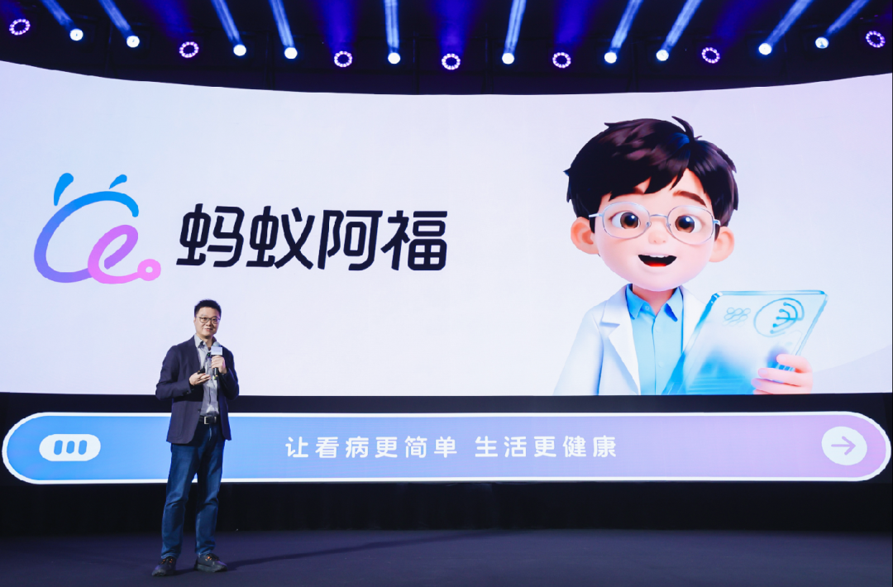
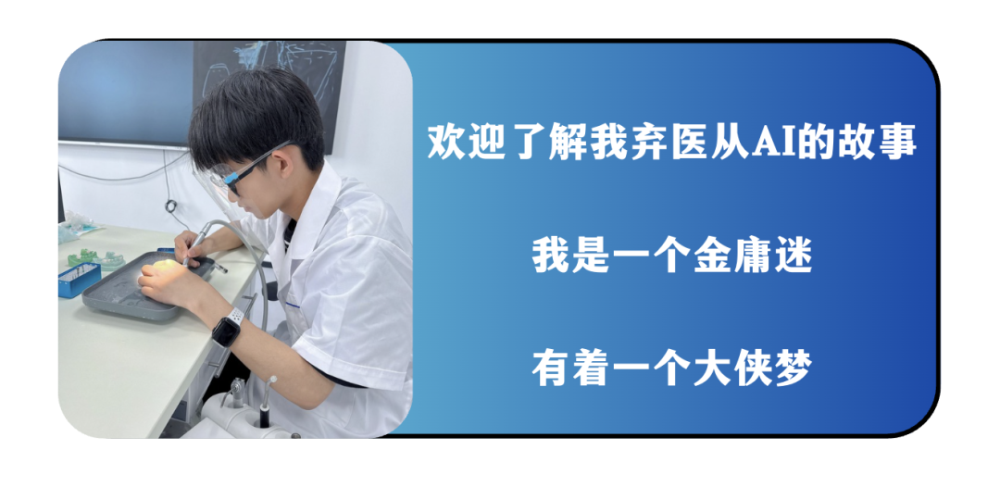
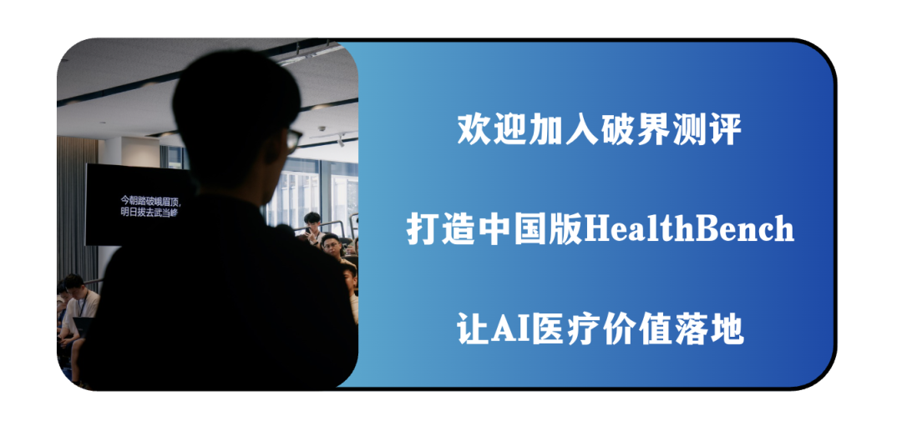

# 为什么蚂蚁阿福做不到高频的健康？

> **作者**：破界的坤总
> **發布時間**：未知
> **轉發時間**：2026-02-02 14:35（by ShawnCH）
> **原文連結**：[點擊查看原文](https://mp.weixin.qq.com/s/I72FZPo8_TYYMfEZaO-zjQ)
> **標籤**：醫療健康

---

吕坤日更AI医疗的第27天

老感觉阿福用健康的高频打医疗的低频是错的。

这是我和几位医疗从业者交流得出的一个观点，这不是产品问题，而是战略认知问题。

坐拥支付宝10亿用户的一级入口，月活1500万，日咨询量突破500万。

这些数据看上去很耀眼，但一个尴尬的现实是：

当烧掉几亿广告费和大众好奇心消退后，阿福的日活并没有如预期般攀升，甚至十分惨淡。

在移动互联网的逻辑里，高频就是一切。

支付能做到高频，社交能做到高频，为什么健康就做不到？

这不是产品设计的失败，而是一场对人性本质的误判，我们必须认清一个本质：

健康是低频的需求，而医疗才是高频的痛点。

---

01 

先厘清什么是真正的高频？

海陆空轰炸的阿福广告 来源：PingWest

阿福的理念是：我用高频带动医疗的低频？那什么才叫健康的高频？

这是指没有新的症状、没有新的体检报告、没有任何外部强刺激时，用户仍然会自发、持续地产生健康管理行为与记录。

这个定义，剔除了被动响应的部分，直指主动习惯的核心。

阿福拥有支付宝的十亿级入口、完善的医疗支付生态、乃至顶级的AI模型能力。

它如果都绕不开这个难题，恰恰说明问题不在某一家公司，而在整个行业的底层逻辑里。

健康产品难以实现真正的高频，不是产品机制不够聪明，而是因为它触犯了人性激励结构的底层逻辑：

第一，触发弱：健康的启动依赖虚无的自驱动力，而医疗咨询依赖实在的恐惧心理。

健康管理的触发，多数是我要变得更好，是一个美好但模糊、远期且非紧急的目标。

而医疗咨询的触发，则是我害怕出事：

体检报告上的箭头、孩子半夜的发烧、胸口莫名的疼痛。

这是明确、具象、且带有不确定性与风险的强刺激。

行为科学告诉我们，人类行为最稳定、最强大的驱动力，往往来自对损失的规避和对不确定性的恐惧，而不是对远期收益的向往。

自律是稀缺品，焦虑才是日用品。

第二，回报慢：健康的收益延迟且不可见，导致习惯无法形成正向循环。

你今天多走了5000步，并不会立刻感觉更健康；

你坚持了一周低盐饮食，血压计上的数字可能纹丝不动。

健康管理的收益，总是延迟的、累积的、且不易被感知的。

相反，你今天刷一段搞笑视频，立刻获得多巴胺；你点一份外卖，立刻满足口腹之欲。

人对未来收益天生会打折扣，尤其在当下忙碌、疲惫时，未来的健康在眼前的快乐面前不堪一击。

第三，替代强：健康咨询的切换成本趋近于零。

"我这两天有点头晕，可能是什么原因？"

这个问题，你可以同时问阿福、问ChatGPT、问DeepSeek、问任何一个你能找到的医疗AI。

你可以在1分钟内比较它们的回答，然后选择那个看起来最靠谱的。

健康知识问答，几乎没有品牌忠诚度可言。

输出质量只要好上一点点，用户就可能立刻迁移。

因为这里不涉及金钱支付、不涉及服务预约、不承担任何责任后果。

纯粹的信息本身，无法构筑真正的护城河。

健康要达成真正的高频，必须同时、系统地解决触发弱、回报慢、替代强这三个难题。

---

02

阿福困在宏大的战略叙事

蚂蚁集团副总裁、蚂蚁健康事业群总裁张俊杰 来源：经济观察网

理解了人性底层的规律，我们再来解剖阿福的战略路径。

阿福给自己的定位从来不是医疗APP，而是健康生活操作系统。

我把它拆解成三级模型里：

第一级是用免费、准确的轻医疗咨询引流；

第二级是用健康陪伴功能留存——打卡、健康小目标、每日数据记录；

第三级是基于信任和数据，自然导向问诊、购药、保险服务。

蚂蚁CEO韩歆毅坚持健康是高频需求，这个论断在战略宣传上是成功的，却也形成了认知偏差。

为了支撑健康操作系统这个宏大叙事，团队必须先相信健康可以高频，否则整个商业故事就讲不下去。

将**心智倾向**误判为**执行刚需**，认为对健康的关注会自动转化为对产品的操作

将**搜索高频**误读为**交互高频**，忽视了健康资讯的易得性与健康管理的高门槛。

更糟糕的是，阿里系的基因决定了阿福必须追求日活。

在互联网平台的语境里，没有日活就没有估值。

于是，让用户每天打开成了必须完成的任务，哪怕这个任务本身违背了健康行为的本质规律。

这种错位的本质在于：试图用互联网的日活**逻辑**去强行套用医疗的**托付逻辑**，导致了战略重心从**解决确定性问题**偏移到了**营造活跃假象**。

我们认真来想想，阿福真正的用户是谁？

答案藏在轻医疗焦虑里。

阿福的真正用户，不是健康爱好者，而是焦虑缓解者。

他们不是来管理健康的，而是来消除没大病但不对劲的不安。

这构成了四类真实的高频场景：

第一类，下沉市场的夜间急诊。

三四线城市医疗资源匮乏，当孩子夜间发烧、老人血压波动时，阿福成了弥补当地医疗空白的即时指导。

他们的大病可能需要千里迢迢去省城医院，但眼前的头痛脑热、报告异常，是持续不断的焦虑源。

第二类，都市白领的体检恐慌。

大厂牛马每年最焦虑的时刻，不是KPI考核，而是体检报告出来那天。

看到报告上的箭头，必须立刻知道严不严重、要不要去医院、挂什么科。

这种对健康信号的极高关注度，容易因小异常产生高频咨询。

第三类，新手父母的育儿焦虑。

孩子起疹子、吐奶、睡不好，问题本身通常不严重，但关怀对象的特殊性让任何小异常都被放大为高频咨询需求。

新手父母需要的不是健康管理建议，而是这会不会有事的即时确认。

第四类，慢病患者的日常波动。

糖尿病患者今天血糖高了0.5，高血压患者今早头晕了一下。

他们需要每日监测指标，但真正的痛点不是管理，而是这个波动要不要紧。

这类日常管理中的轻医疗疑问，才构成了真正的高频咨询。

这些数据强有力地证明：阿福的MAU和每日500万+提问，不应被简单理解为普通C端医疗用户的活跃。

阿福的成功，恰恰是它精准地捕捉并服务于这个焦虑但没大病的庞大中间地带，将他们忍忍就过去了的被动忍耐，转化为了问问阿福的主动高频咨询。

但这里有一个危险的断裂。

阿福卡在第二级：用户来了，问完焦虑缓解了，就走了。

他们无法被引导至日常陪伴互动，因为那就意味着要从被动响应转向主动管理——而这是反人性的。

讽刺的是，阿福越是成功解决第一级的轻医疗焦虑，越是难以实现第二级的高频健康管理。

当用户只把阿福当作更好的搜索引擎，而非懂我的健康管家时，那个关于健康操作系统的宏大愿景，就永远只能是愿景。

---

03

给阿福的破局建议

马云现身蚂蚁20周年 来源：风口财经

批判是为了更好的建设，在此我也提出下自己的破界思考。

如果日日健康打卡是个伪命题，那么AI医疗健康产品的真实破局点在哪里？

策略一：放弃每日高频，拥抱事件驱动的准高频

健康不一定需要天天打开，但可以做到关键人生节点，你必然第一个想到我。

这些节点，天然具备强触发、高价值、行动明确的特点：

年度体检报告出来后的一周、慢病指标发生异常波动时、医生调整用药方案后的适应期、育儿过程中的每一个关键月龄节点。

在这些节点上，用户的焦虑感、求知欲、行动意愿都处于峰值。

产品若能精准捕捉、深度服务好这些关键时刻，其留存价值和用户依赖度，将远高于追求不切实际的日活。

这叫做低频接触，高价值互动。

策略二：以服务确定性对冲信息内卷。

真正的用户黏性，不是来自你的回答比竞品多5%的准确率，而源于产品能否针对复杂的医疗决策，交付极致的**确定性**与**路径简化能力**。”

这意味着产品价值的核心，必须从提供更好的信息，转向提供更确定的下一步和完成更复杂的任务：

从解释报告转向生成一份可行动的清单+代办事项；

从分析症状转向一键连通最适合的科室/医生，并预填我的症状描述；

从推荐药品转向医保报销比例实时计算+附近药房比价+配送到家。

把理解问题的价值，无缝升级为解决问题的效率。

策略三：重构人机协同，让真人专家真正坐镇

AI与真人医生的角色不是竞争，而是需要和谐的协同。

目前仅仅是在模型层面微调出了一个具有专家语料的名医分身，

而非在业务底层逻辑上，构建出一个具备临床决策逻辑与责任闭环的数字医生。

理想的模式是：AI负责前置的、标准化的整理与解释，真人负责最终的、非标的决策与托付。

AI的角色是症状结构化梳理、报告多维度解读、生成面向医生的精准提问清单；

真人专家的角色是进行最终的风险分层判断、确认个性化的诊疗路径、给出带有责任背书的关键建议。

这种结构化的协作，能把虚无缥缈的信任感，变成清晰可靠的服务流程。

---

写在最后：

阿福做不到高频的健康，不是因为技术不够，而是因为健康本就是人类最不愿直面的低频修行。

但这并不意味着阿福没有价值。

恰恰相反，它找到了[小病没需求，大病信不着](https://mp.weixin.qq.com/s?__biz=MzkwODUwMzc3Mg==&mid=2247484636&idx=1&sn=b2fa84891d5a89bd6a4020100194c821&scene=21#wechat_redirect)的中间地带，验证了轻医疗焦虑是真实且高频的。

它拥有的不只是用户健康画像数据，这个我详细通用大模型也能得到。

更有价值的是行为链数据：你挂了哪个科室、买了什么药、花了多少钱、走了医保还是自费。

知道一个人血糖高有价值，但知道他因此挂了内分泌科、买了某款降糖药并完成医保支付，这个商业转化路径是直接且可量化的。

医疗AI的真正壁垒，从来不是算法多精准，而是谁能担责、谁能闭环、谁能在用户焦虑的瞬间成为第一选择。

未来的医疗AI，不应再执念于让用户每天打开，而应诚实地承认：

用户不愿为变得健康每天打卡，但愿意为缓解焦虑每天付费。

健康产品要追求的高频，从来不是指每日打开的频次，而是在人生健康关键节点上被优先选择的频次。

所以，留给所有行业从业者的一句终极追问是：

我们做的，到底是提供自认为更多、更好、更准确的健康解释？

还是实实在在地，能够为患者兜底，把他们从焦虑和困惑中，带到安全、确定的下一步？

**如果觉得文章内容不错，可以随手点赞、喜爱、转发，想要第一时间推送，**也可以给我个星标⭐～****

**关注我，和我一起做医疗圈最懂AI的破界者，AI圈最懂医疗的实战派。**

---

*本文由 ShawnCH（何智翔）轉發，透過微信聊天記錄自動提取並整理。*
*原文連結：https://mp.weixin.qq.com/s/I72FZPo8_TYYMfEZaO-zjQ*
