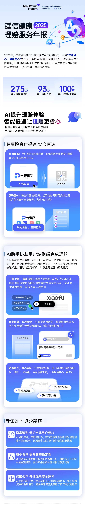
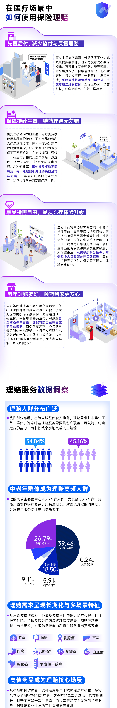
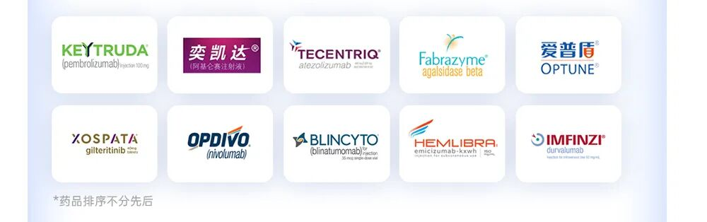
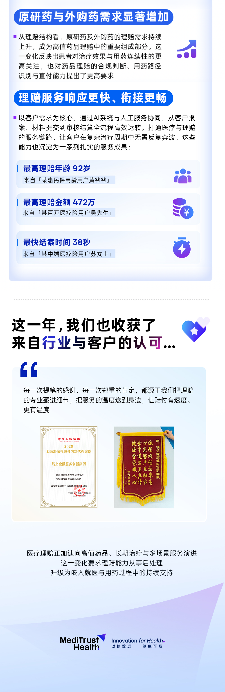

# AI加速度 理赔更省心 | 镁信健康2025理赔服务年报

> **作者**：未知
> **發布時間**：未知
> **轉發時間**：2026-02-03 14:46（by ShawnCH）
> **原文連結**：[點擊查看原文](https://mp.weixin.qq.com/s/zOm9kcWp4B5mNPHbvkNpyg?from=groupmessage&scene=1&subscene=10000&sessionid=1770096664&clicktime=1770101016&enterid=1770101016&ascene=1&fasttmpl_type=0&fasttmpl_fullversion=8111995-zh_CN-zip&fasttmpl_flag=0&realreporttime=1770101016753)
> **標籤**：保險理賠, 醫療健康, AI科技, 行業分析

---

---

*本文由 ShawnCH（何智翔）轉發，透過微信聊天記錄自動提取並整理。*
*原文連結：https://mp.weixin.qq.com/s/zOm9kcWp4B5mNPHbvkNpyg?from=groupmessage&scene=1&subscene=10000&sessionid=1770096664&clicktime=1770101016&enterid=1770101016&ascene=1&fasttmpl_type=0&fasttmpl_fullversion=8111995-zh_CN-zip&fasttmpl_flag=0&realreporttime=1770101016753*
