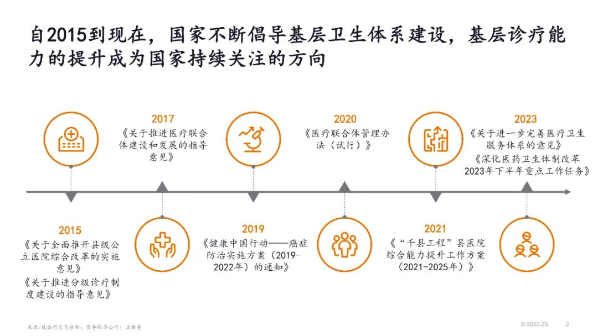
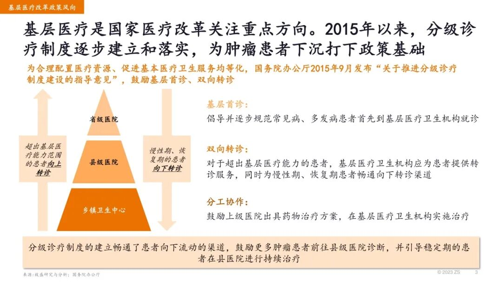
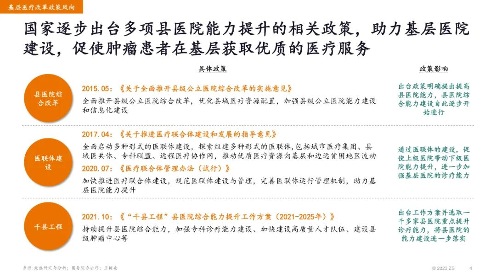
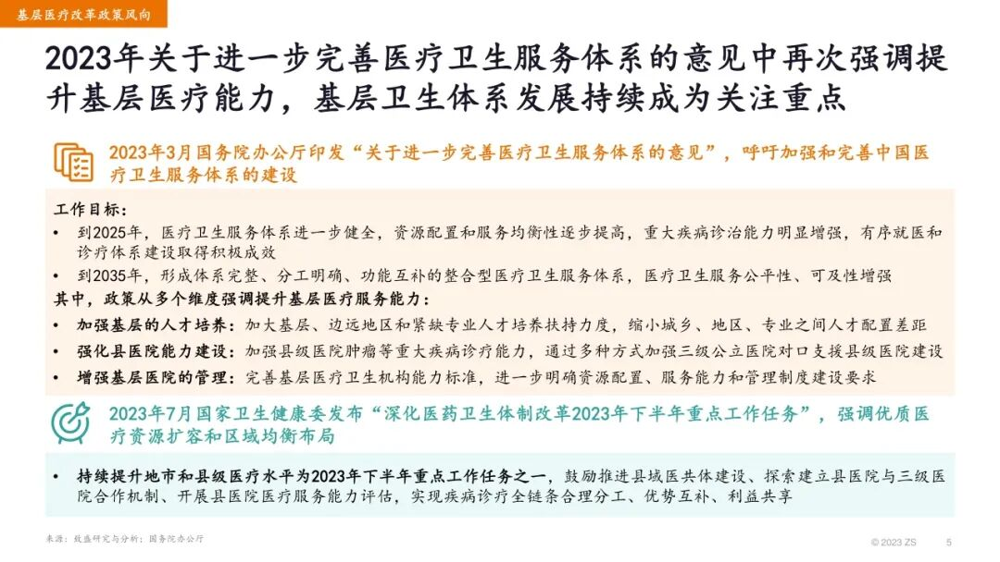
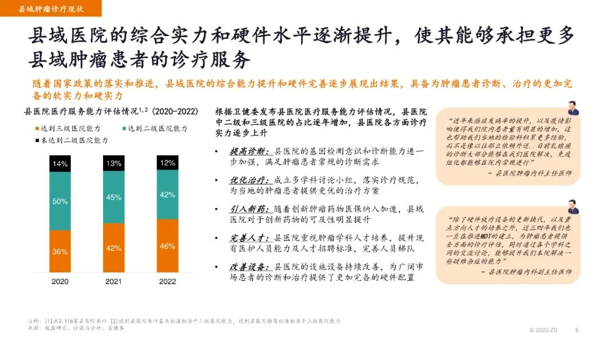
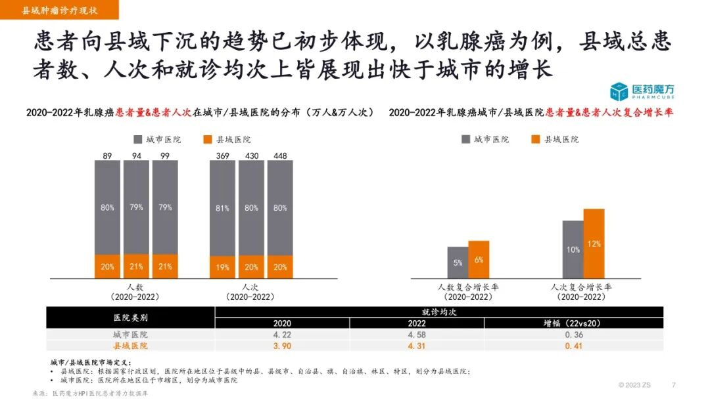
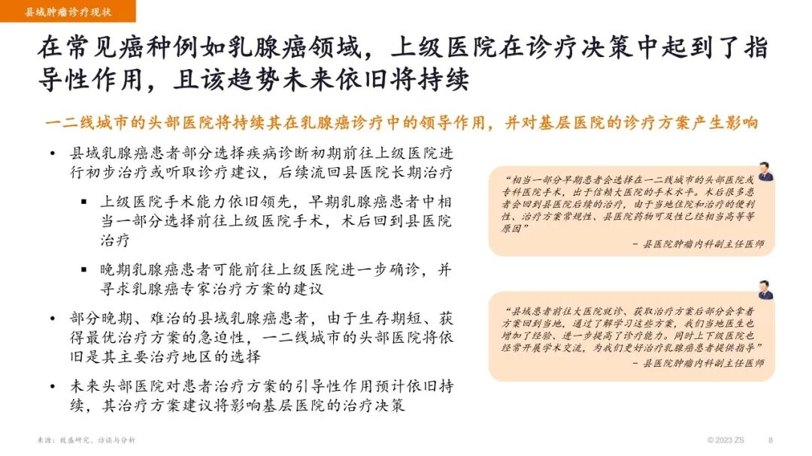
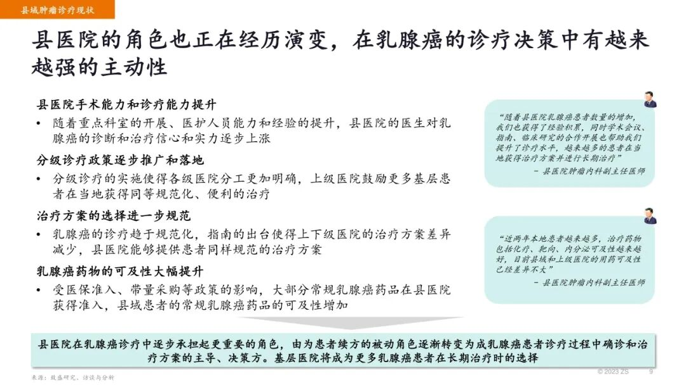
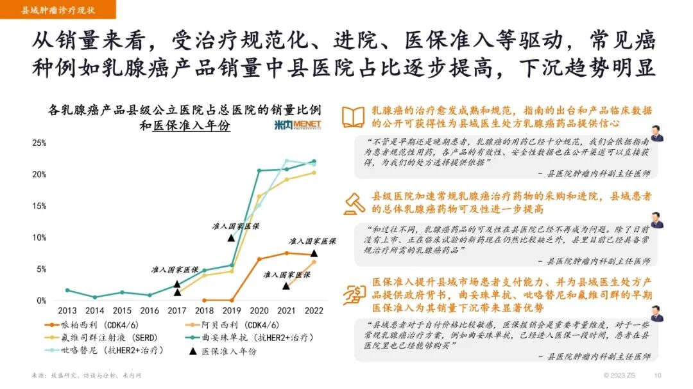
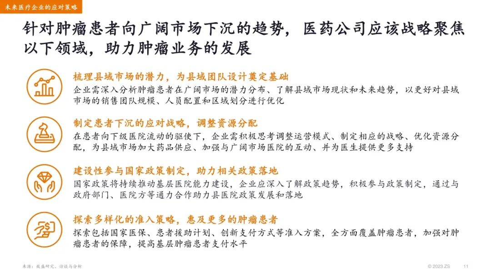

# ZS致盛咨询：洞悉趋势，顺风而行 ⸺ 以乳腺癌为例，看中国县域肿瘤市场发展

> **作者**：ZS致盛咨询
> **發布時間**：未知
> **轉發時間**：2026-02-04 23:10（by ShawnCH）
> **原文連結**：[點擊查看原文](https://mp.weixin.qq.com/s?__biz=Mzg4ODYzNDE4NQ==&mid=2247512042&idx=6&sn=717025b5c10c1f3106b5288ff1cf5f13&chksm=ce2ea77ce157e53945f6dfd0b4b82ab950d91a6c6cc677b2c0fa1fe8521862dd8cc712eadd85&mpshare=1&scene=1&srcid=0204M07TeY5tvht4eerLdxtN&sharer_shareinfo=911cbb29c0dbdd65c8117246c930d04c&sharer_shareinfo_first=911cbb29c0dbdd65c8117246c930d04c#rd)
> **標籤**：醫療健康

---

**点击蓝字 关注我们**

**洞悉趋势，顺风而行**

**⸺ 以乳腺癌为例，看中国县域肿瘤市场发展**

2023年7月，国家卫健委印发《深化医药卫生体制改革2023年下半年重点工作任务》，强调持续提升基层医疗水平是下半年的医改重点之一。在中国医疗体制改革中，建立基层的诊疗能力一直是重要的一环。近年来，国家持续出台政策以促进基层卫生体系建设。分级诊疗制度的逐步推行以及县级医院能力的提升等多项政策的实施，进一步增强了县域在中国医疗市场中的潜力。

在“大病不出县”的宗旨下，县域在中国医疗市场的发展现状如何？县域诊疗能力提升情况如何？患者在县域就医的情况有怎样的改变？医疗企业在该趋势下有哪些应对策略？针对以上问题，**ZS发布“以乳腺癌为例，看中国县域肿瘤市场发展”主题报告**，通过聚焦政策趋势、县域市场现状，与医药魔方合作解读患者就诊数据，并参考米内网数据分析县域用药情况，对中国县域肿瘤医疗市场的发展进行了探讨和展望。

**如有相关需求或欲进一步了解信息，欢迎联系我们**

**Sonia Yan 殷之晨**

全球执行董事

sonia.yan@zs.com

**Jessie Chen 陈葭**

战略洞察与规划经理

jia.chen@zs.com

同时致谢为本文撰写提供支持的ZS团队成员Eva Gu, Chloe Zhang, Shelly Chen, Winney Wei等同事。

**关注ZS Associates上海官方账号，获取前沿商业信息和管理理念**

**关于ZS Associates**

ZS Associates是一家全球性的管理咨询公司。30多年来，我们与客户并肩合作，开发和交付能够推动客户商业价值和提升公司业绩的产品和服务。业务范围覆盖：药品研发、市场定价策略、客户洞察、药品和医疗器械的营销和品牌战略等。

ZS的数字与科技团队正推动跨国药企的数字化转型，通过人工智能、机器学习、数据分析、云解决方案支持客户的数据驱动决策，帮助客户实现数字化转型。

**点击“阅读原文”**

访问致盛咨询官网，查阅更多行业观点

---

*本文由 ShawnCH（何智翔）轉發，透過微信聊天記錄自動提取並整理。*
*原文連結：https://mp.weixin.qq.com/s?__biz=Mzg4ODYzNDE4NQ==&mid=2247512042&idx=6&sn=717025b5c10c1f3106b5288ff1cf5f13&chksm=ce2ea77ce157e53945f6dfd0b4b82ab950d91a6c6cc677b2c0fa1fe8521862dd8cc712eadd85&mpshare=1&scene=1&srcid=0204M07TeY5tvht4eerLdxtN&sharer_shareinfo=911cbb29c0dbdd65c8117246c930d04c&sharer_shareinfo_first=911cbb29c0dbdd65c8117246c930d04c#rd*
