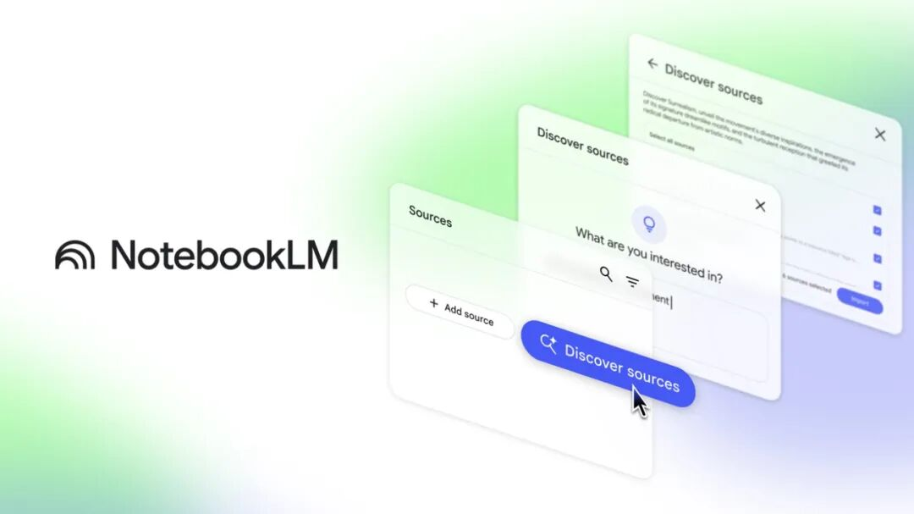
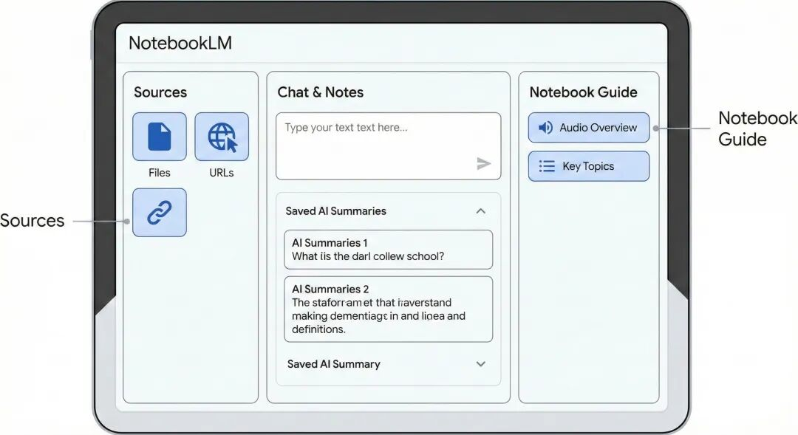
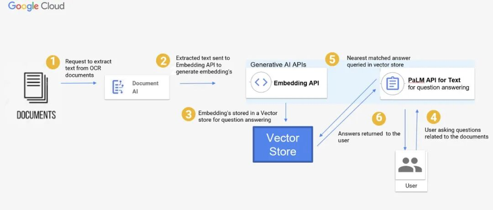
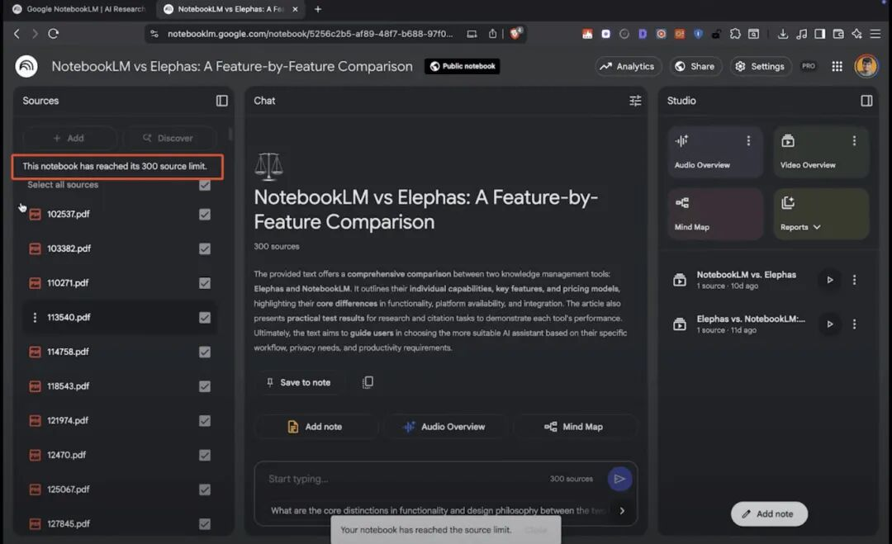
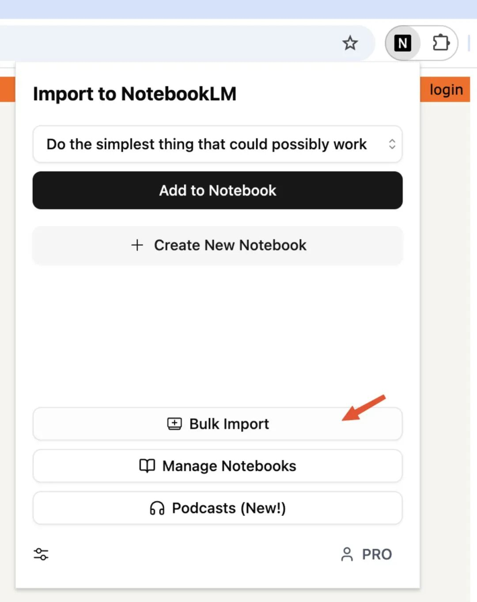
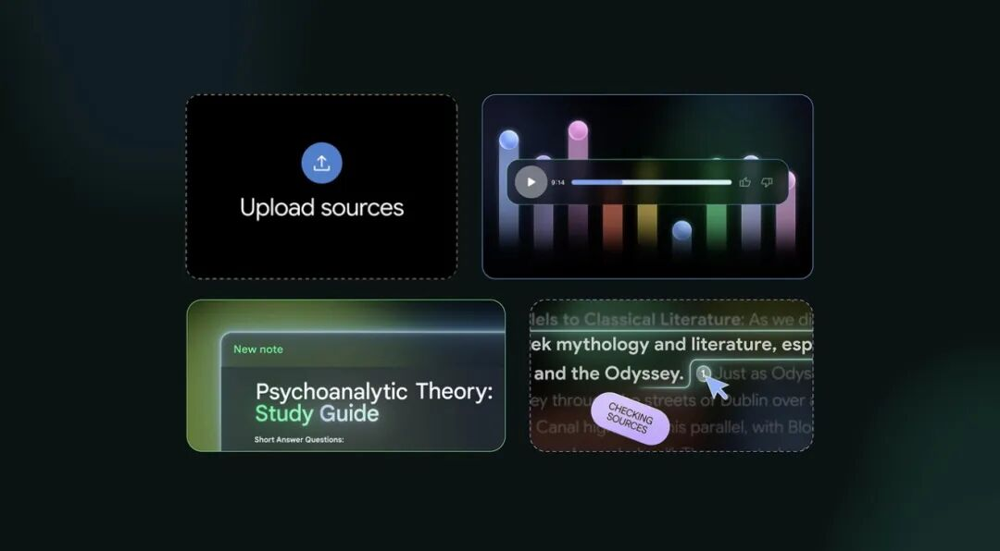
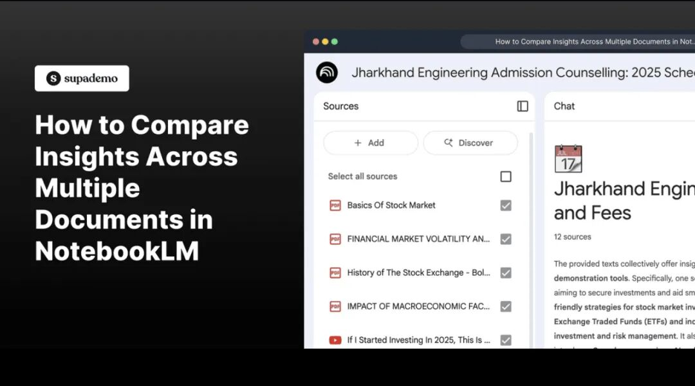
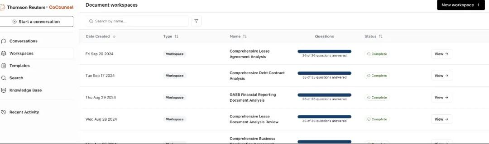

# 拒绝幻觉，这可能是我今年用过最强大的打工人AI 笔记工具

> **作者**：海魂酒酿
> **發布時間**：未知
> **轉發時間**：2026-02-09 11:33（by ShawnCH）
> **原文連結**：[點擊查看原文](https://mp.weixin.qq.com/s?__biz=MzIyMTUxNDA2Ng==&mid=2247485546&idx=1&sn=6bbac33d9dd19a418d1a6f54e238a0ee&chksm=e9f4c4d2400d9f8c45b44b3ede845a2722cd93a282a69b063c99674b69e918c4d729cd656988&mpshare=1&scene=1&srcid=0209BBqV2HWEOFytblBbv5Lp&sharer_shareinfo=58090b72ac9202e809eadc43d394ab44&sharer_shareinfo_first=58090b72ac9202e809eadc43d394ab44#rd)
> **標籤**：AI科技

---

如果你经常需要面对几十页报告、论文、内部资料、网页链接，那你大概率也遇到过这些问题：

AI 总结看起来很顺，但一核对原文就发现不对，问细一点的问题，AI 开始一本正经胡说八道，多个文档放在一起，AI 根本分不清来源。

这些问题直到我开始使用 NotebookLM，都得到了妥善解决。

---

## NotebookLM 不一样在哪？

NotebookLM 是 Google 基于 Gemini Pro 模型推出的一款 AI 笔记与研究助手，但它的底层逻辑和常见的通用型 AI 完全不同。

它的核心理念只有一句话：源驱动 AI（Source-grounding）

也就是说：AI 只能基于你提供的文档内容进行回答，而不是依赖自身“常识”或推测。

这件事带来的直接结果是，AI 胡说八道的概率被显著降低。

---

## 一、核心功能与操作流程

### 1. 创建笔记本并导入资料源

操作步骤非常简单：

1. 打开 NotebookLM 官网

2.创建一个新的 Notebook（相当于一个项目或研究主题）

3.向 Notebook 中添加资料源

支持的资料类型包括：

PDF 文件/文本文件/Google Docs/网页链接/直接粘贴的纯文本内容

需要注意的限制：

1）单个 Notebook 最多支持 50 个资料源

2）每个资料源字数上限为 50 万字

对于绝大多数学习、研究和工作场景来说，这个容量已经完全足够。

---

### 2. 交互式学习与精准提问

资料上传完成后，NotebookLM 会自动生成：

1）所有资料的简要概述

2）文档的核心主题与重点内容

在此基础上，你可以直接向 AI 提问。

它与普通 AI 最大的不同在于：

- 每一个回答都会标注引用来源

-点击引用编号，可以直接跳转到对应文档的原文位置

此外，你还可以让 AI 同时关联多份文档，例如：

“请对比 A 方案和 B 方案在成本、周期和风险方面的差异。”

NotebookLM 会分别查阅不同资料，再给出整合后的答案。

---

### 3. 内容创作与系统化整理

NotebookLM 不只是用来“问问题”，它更像是一个知识加工工具。

你可以将 AI 的回答直接保存为 Notes，逐步形成自己的知识库。

同时，你还可以基于选定的资料或笔记，要求 AI 自动生成：

1）常见问题解答（FAQ）

2）学习指南（Study Guide）

3）简报或汇报用的大纲（Outline）

这在制作培训材料、内部汇报、知识型内容时非常高效。

---

### 4. 播客化音频生成（Audio Overview）

这是一个很容易被忽略，但实际体验非常惊喜的功能。

使用路径：

在右侧 “Notebook guide” 面板中，点击 “Audio Overview”，再选择 “Generate”。

NotebookLM 会基于你的文档内容，生成一段英文音频，由两个虚拟角色以对话形式进行深入讨论。

这种形式非常适合：通勤途中、做家务或运动时，或快速理解复杂资料。

相比单纯阅读摘要，音频更容易被大脑吸收。

---

## 二、几个非常实用的使用技巧

### 1. 主动控制 AI 的阅读范围

在侧边栏中，你可以勾选或取消勾选特定资料源，让 AI 只在指定文档中寻找答案。这对资料量很大的项目尤为重要。

### 2. 提示词要具体、有指向

不要只问“这份资料讲了什么”，而是尽量使用类似这样的指令：

“请根据文档第三章内容，总结三个核心结论，并标注原文依据。”

NotebookLM 对指令清晰度非常敏感，问得越具体，结果越好。

---

## 三、适用场景总结

NotebookLM 特别适合以下几类场景：

- 学术研究：快速梳理大量论文，并保证引用准确

- 复杂项目：整理公司内部手册、制度文件、产品规格书

- 学习与备考：将课程资料转化为测试题、总结或结构化笔记

---

## 如果你想要的是一个陪你聊天、自由发挥、给灵感的 AI，NotebookLM 并不是最合适的选择。

但如果你需要的是一个可溯源、可核对、可复用的严肃知识助手，NotebookLM 非常值得尝试。

---

*本文由 ShawnCH（何智翔）轉發，透過微信聊天記錄自動提取並整理。*
*原文連結：https://mp.weixin.qq.com/s?__biz=MzIyMTUxNDA2Ng==&mid=2247485546&idx=1&sn=6bbac33d9dd19a418d1a6f54e238a0ee&chksm=e9f4c4d2400d9f8c45b44b3ede845a2722cd93a282a69b063c99674b69e918c4d729cd656988&mpshare=1&scene=1&srcid=0209BBqV2HWEOFytblBbv5Lp&sharer_shareinfo=58090b72ac9202e809eadc43d394ab44&sharer_shareinfo_first=58090b72ac9202e809eadc43d394ab44#rd*
